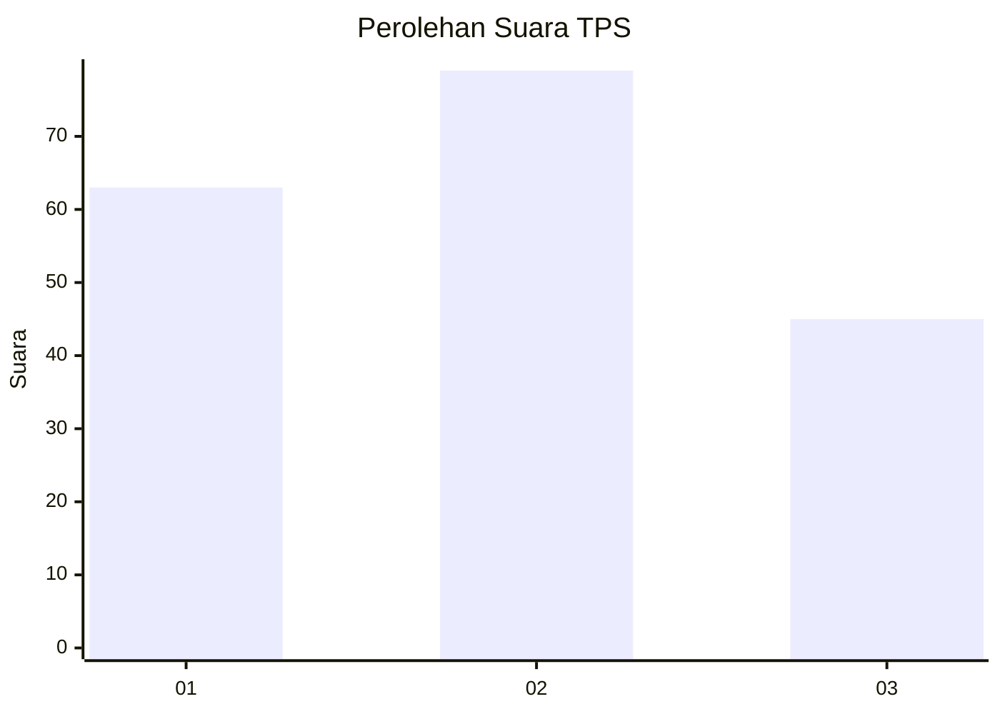
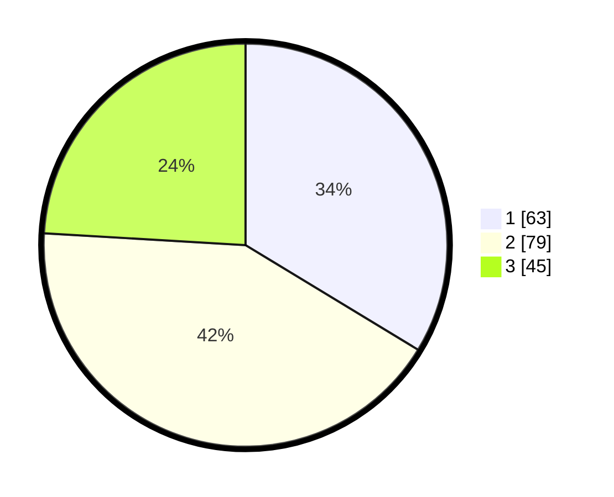

# Hasil

## Grafik

## Tabel

| No. | Nama Paslon    | Suara | Suara (raw) | Persentase |
|:--- |:-------------- | -----:| -----------:| ----------:|
| 1   | ANIES MUHAIMIN | 63    | [63][p-1]   | 33,69      |
| 2   | PRABOWO GIBRAN | 79    | [79][p-2]   | 42,25      |
| 3   | GANJAR MAHFUD  | 45    | [45][p-3]   | 24,06      |

[p-1]: https://github.com/gigit-pemilu/pemilu-2024-33-jawa-tengah/blob/main/pilpres/hitung-suara/sub/33-jawa-tengah/sub/02-banyumas/sub/19-sokaraja/sub/2018-karangrau/sub/001-tps/sub/paslon-1.txt
[p-2]: https://github.com/gigit-pemilu/pemilu-2024-33-jawa-tengah/blob/main/pilpres/hitung-suara/sub/33-jawa-tengah/sub/02-banyumas/sub/19-sokaraja/sub/2018-karangrau/sub/001-tps/sub/paslon-2.txt
[p-3]: https://github.com/gigit-pemilu/pemilu-2024-33-jawa-tengah/blob/main/pilpres/hitung-suara/sub/33-jawa-tengah/sub/02-banyumas/sub/19-sokaraja/sub/2018-karangrau/sub/001-tps/sub/paslon-3.txt

## Foto C Plano

https://sirekap-obj-formc.kpu.go.id/1de5/pemilu/ppwp/33/02/19/20/18/3302192018001-20240217-204005--83a49871-7229-4c02-8f35-6c90a3c75685.jpg

https://sirekap-obj-formc.kpu.go.id/1de5/pemilu/ppwp/33/02/19/20/18/3302192018001-20240217-204313--e31ead18-b0a3-4c66-8f08-41343f03d5e1.jpg

https://sirekap-obj-formc.kpu.go.id/1de5/pemilu/ppwp/33/02/19/20/18/3302192018001-20240217-204444--5c3c83c9-bd5e-434e-8fe0-ef65d623af0e.jpg

## Metadata

| Key        | Value               |
| ---------- | ------------------- |
| Time Stamp | 2024-02-19 06:16:00 |

## DATA PEMILIH TETAP

Jumlah pemilih dalam DPT: **243**.
 * L: **108**.
 * P: **135**.

## DATA PENGGUNA HAK PILIH

Jumlah pengguna hak pilih dalam DPT: **486**.
 * L: **84**.
 * P: **492**.

Jumlah pengguna hak pilih dalam DPTb: **802**.
 * L: **4**.
 * P: **800**.

Jumlah pengguna hak pilih dalam DPK: **82**.
 * L: **81**.
 * P: **1**.

Jumlah pengguna hak pilih: **190**.
 * L: **86**.
 * P: **104**.

## JUMLAH SUARA SAH DAN TIDAK SAH

JUMLAH SELURUH SUARA SAH: **187**.

JUMLAH SUARA TIDAK SAH: **3**.

JUMLAH SELURUH SUARA SAH DAN SUARA TIDAK SAH: **190**.

