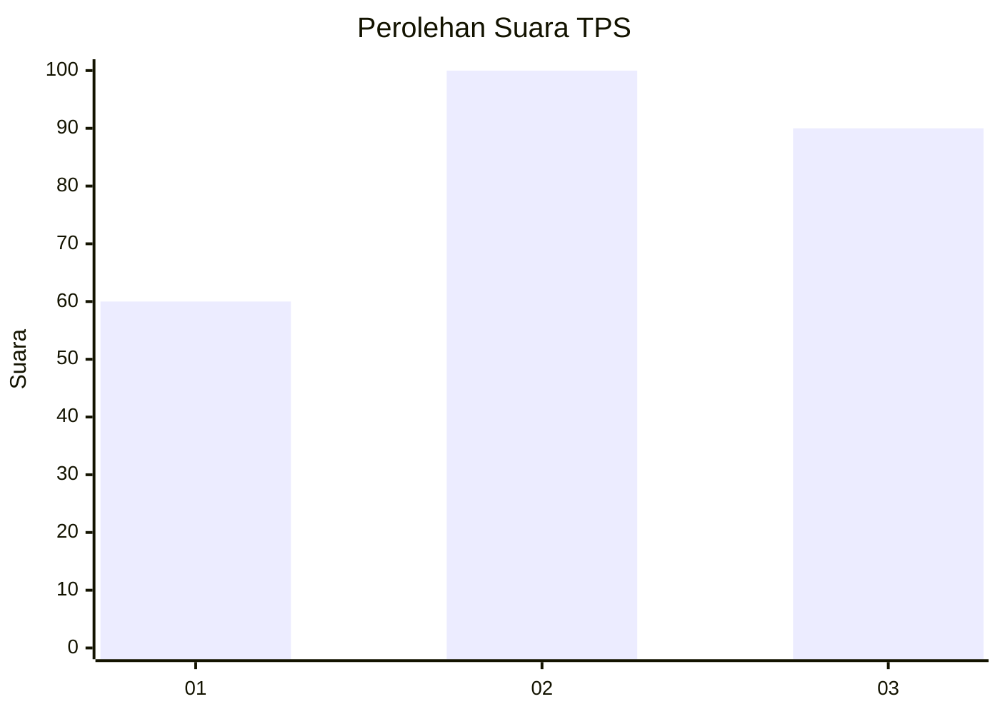
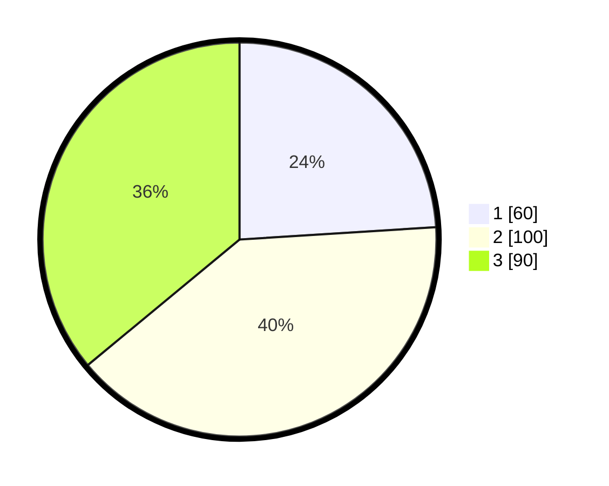

# Hasil

## Grafik

## Tabel

| No. | Nama Paslon    | Suara | Suara (raw) | Persentase |
|:--- |:-------------- | -----:| -----------:| ----------:|
| 1   | ANIES MUHAIMIN | 60    | [60][p-1]   | 24,00      |
| 2   | PRABOWO GIBRAN | 100   | [100][p-2]  | 40,00      |
| 3   | GANJAR MAHFUD  | 90    | [90][p-3]   | 36,00      |

[p-1]: https://github.com/gigit-pemilu/pemilu-2024-33-jawa-tengah/blob/main/pilpres/hitung-suara/sub/33-jawa-tengah/sub/02-banyumas/sub/19-sokaraja/sub/2018-karangrau/sub/005-tps/sub/paslon-1.txt
[p-2]: https://github.com/gigit-pemilu/pemilu-2024-33-jawa-tengah/blob/main/pilpres/hitung-suara/sub/33-jawa-tengah/sub/02-banyumas/sub/19-sokaraja/sub/2018-karangrau/sub/005-tps/sub/paslon-2.txt
[p-3]: https://github.com/gigit-pemilu/pemilu-2024-33-jawa-tengah/blob/main/pilpres/hitung-suara/sub/33-jawa-tengah/sub/02-banyumas/sub/19-sokaraja/sub/2018-karangrau/sub/005-tps/sub/paslon-3.txt

## Foto C Plano

https://sirekap-obj-formc.kpu.go.id/57b7/pemilu/ppwp/33/02/19/20/18/3302192018005-20240214-210525--85cd0953-7600-4212-8831-e54689df9e4d.jpg

https://sirekap-obj-formc.kpu.go.id/57b7/pemilu/ppwp/33/02/19/20/18/3302192018005-20240214-211931--d8da1e59-8f95-4af7-81c9-19300e5c2162.jpg

https://sirekap-obj-formc.kpu.go.id/57b7/pemilu/ppwp/33/02/19/20/18/3302192018005-20240214-212049--ad5e64ba-38ec-4933-9471-619d9c5d0bcd.jpg

## Metadata

| Key        | Value               |
| ---------- | ------------------- |
| Time Stamp | 2024-02-25 13:00:00 |

