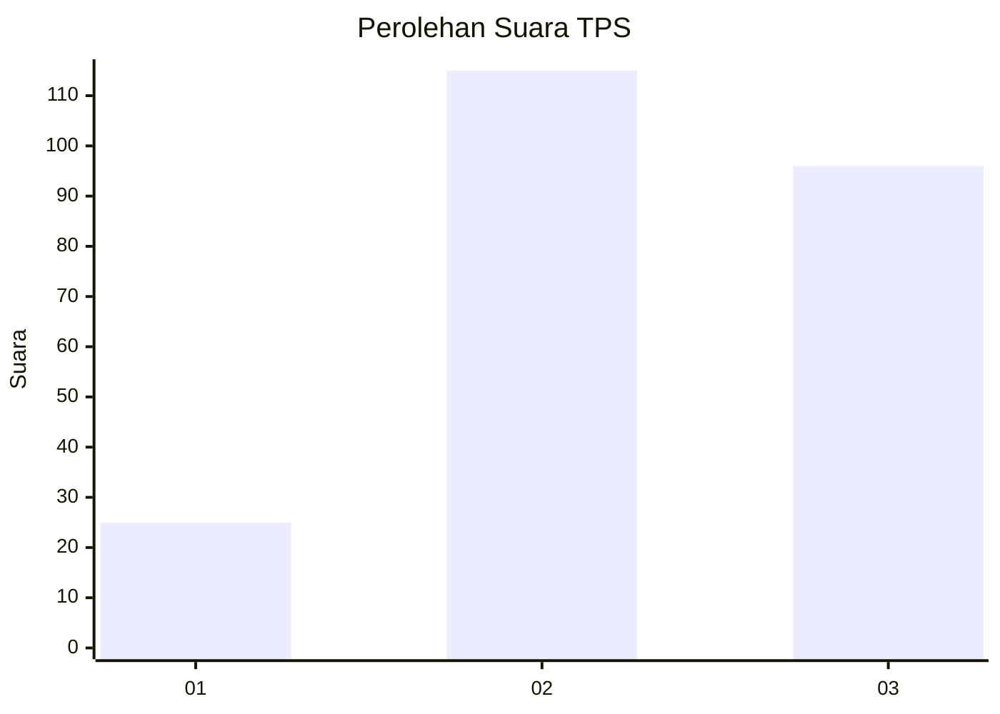
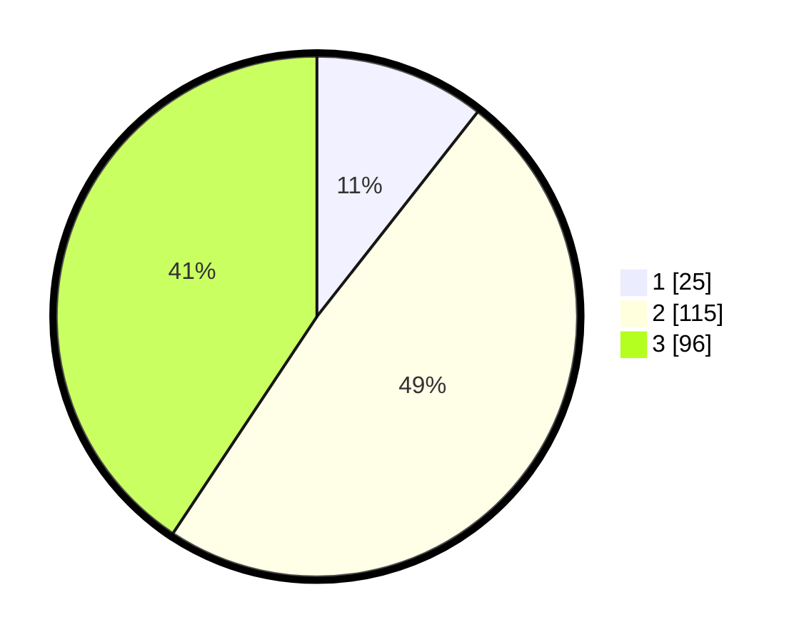

# Hasil

## Grafik

## Tabel

| No. | Nama Paslon    | Suara | Suara (raw) | Persentase |
|:--- |:-------------- | -----:| -----------:| ----------:|
| 1   | ANIES MUHAIMIN | 25    | [25][p-1]   | 10,59      |
| 2   | PRABOWO GIBRAN | 115   | [115][p-2]  | 48,73      |
| 3   | GANJAR MAHFUD  | 96    | [96][p-3]   | 40,68      |

[p-1]: https://github.com/gigit-pemilu/pemilu-2024/blob/main/pilpres/hitung-suara/sub/33-jawa-tengah/sub/02-banyumas/sub/20-kembaran/sub/2001-ledug/sub/007-tps/sub/paslon-1.txt
[p-2]: https://github.com/gigit-pemilu/pemilu-2024/blob/main/pilpres/hitung-suara/sub/33-jawa-tengah/sub/02-banyumas/sub/20-kembaran/sub/2001-ledug/sub/007-tps/sub/paslon-2.txt
[p-3]: https://github.com/gigit-pemilu/pemilu-2024/blob/main/pilpres/hitung-suara/sub/33-jawa-tengah/sub/02-banyumas/sub/20-kembaran/sub/2001-ledug/sub/007-tps/sub/paslon-3.txt

## Foto C Plano

https://sirekap-obj-formc.kpu.go.id/a0a7/pemilu/ppwp/33/02/20/20/01/3302202001007-20240215-080927--8d0275b4-9eb6-4727-854d-e3bd93ad5f4b.jpg

https://sirekap-obj-formc.kpu.go.id/a0a7/pemilu/ppwp/33/02/20/20/01/3302202001007-20240215-081257--7f9bbf55-8fd9-4405-a4a7-9042fc5e10f1.jpg

https://sirekap-obj-formc.kpu.go.id/a0a7/pemilu/ppwp/33/02/20/20/01/3302202001007-20240215-081436--68fd6e2f-713b-4eab-9833-60862c231519.jpg

## Metadata

| Key        | Value               |
| ---------- | ------------------- |
| Time Stamp | 2024-02-16 23:30:00 |

