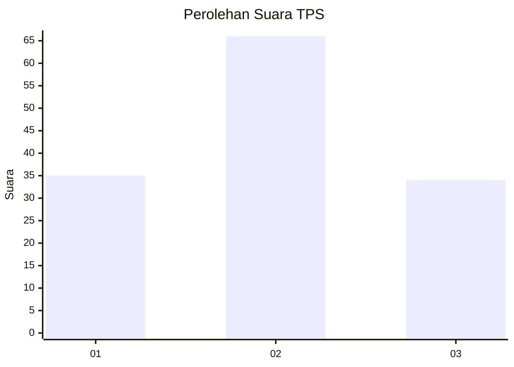
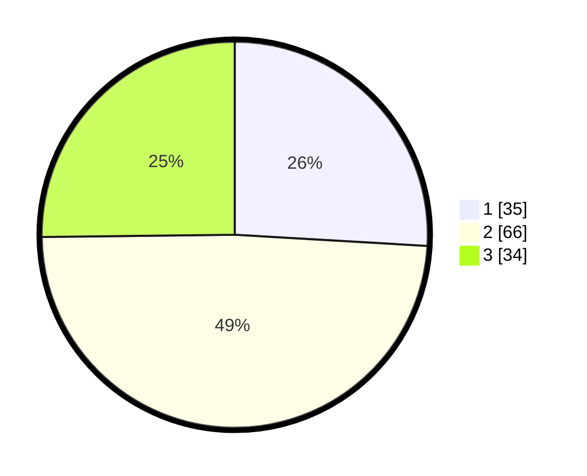

# Hasil

## Grafik

## Tabel

| No. | Nama Paslon    | Suara | Suara (raw) | Persentase |
|:--- |:-------------- | -----:| -----------:| ----------:|
| 1   | ANIES MUHAIMIN | 35    | [35][p-1]   | 25,93      |
| 2   | PRABOWO GIBRAN | 66    | [66][p-2]   | 48,89      |
| 3   | GANJAR MAHFUD  | 34    | [34][p-3]   | 25,19      |

[p-1]: https://github.com/gigit-pemilu/pemilu-2024/blob/main/pilpres/hitung-suara/sub/33-jawa-tengah/sub/02-banyumas/sub/20-kembaran/sub/2001-ledug/sub/032-tps/sub/paslon-1.txt
[p-2]: https://github.com/gigit-pemilu/pemilu-2024/blob/main/pilpres/hitung-suara/sub/33-jawa-tengah/sub/02-banyumas/sub/20-kembaran/sub/2001-ledug/sub/032-tps/sub/paslon-2.txt
[p-3]: https://github.com/gigit-pemilu/pemilu-2024/blob/main/pilpres/hitung-suara/sub/33-jawa-tengah/sub/02-banyumas/sub/20-kembaran/sub/2001-ledug/sub/032-tps/sub/paslon-3.txt

## Foto C Plano

https://sirekap-obj-formc.kpu.go.id/a202/pemilu/ppwp/33/02/20/20/01/3302202001032-20240214-224526--eb87e407-ef56-4aca-b2d7-30d57b950715.jpg

https://sirekap-obj-formc.kpu.go.id/a202/pemilu/ppwp/33/02/20/20/01/3302202001032-20240214-230116--ca5471cc-0473-444b-9ada-59a3f533d27c.jpg

https://sirekap-obj-formc.kpu.go.id/a202/pemilu/ppwp/33/02/20/20/01/3302202001032-20240214-230300--63bfa05b-ced2-4166-a186-a7c43884dbe0.jpg

## Metadata

| Key        | Value               |
| ---------- | ------------------- |
| Time Stamp | 2024-02-16 23:30:00 |

