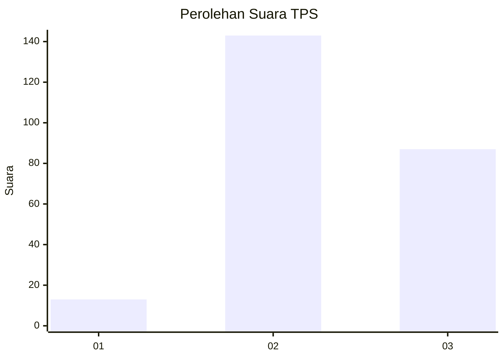
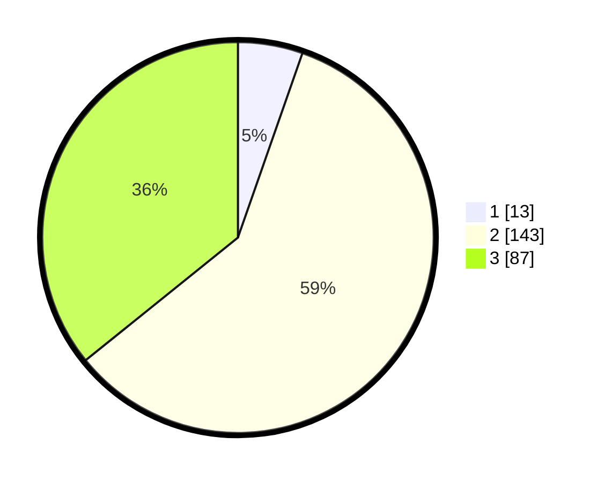

# Hasil

## Grafik

## Tabel

| No. | Nama Paslon    | Suara | Suara (raw) | Persentase |
|:--- |:-------------- | -----:| -----------:| ----------:|
| 1   | ANIES MUHAIMIN | 13    | [13][p-1]   | 5,35       |
| 2   | PRABOWO GIBRAN | 143   | [143][p-2]  | 58,85      |
| 3   | GANJAR MAHFUD  | 87    | [87][p-3]   | 35,80      |

[p-1]: https://github.com/gigit-pemilu/pemilu-2024/blob/main/pilpres/hitung-suara/sub/33-jawa-tengah/sub/02-banyumas/sub/20-kembaran/sub/2002-pliken/sub/006-tps/sub/paslon-1.txt
[p-2]: https://github.com/gigit-pemilu/pemilu-2024/blob/main/pilpres/hitung-suara/sub/33-jawa-tengah/sub/02-banyumas/sub/20-kembaran/sub/2002-pliken/sub/006-tps/sub/paslon-2.txt
[p-3]: https://github.com/gigit-pemilu/pemilu-2024/blob/main/pilpres/hitung-suara/sub/33-jawa-tengah/sub/02-banyumas/sub/20-kembaran/sub/2002-pliken/sub/006-tps/sub/paslon-3.txt

## Foto C Plano

https://sirekap-obj-formc.kpu.go.id/e09b/pemilu/ppwp/33/02/20/20/02/3302202002006-20240215-033346--f3d7e2d6-a8a7-4563-9dda-ba862dd4ac3d.jpg

https://sirekap-obj-formc.kpu.go.id/e09b/pemilu/ppwp/33/02/20/20/02/3302202002006-20240215-033530--9511325e-e75d-4fbd-8af3-1f5fb051c08d.jpg

https://sirekap-obj-formc.kpu.go.id/e09b/pemilu/ppwp/33/02/20/20/02/3302202002006-20240215-033727--b4a7709f-0720-4dca-84a3-e6773dc8f9f2.jpg

## Metadata

| Key        | Value               |
| ---------- | ------------------- |
| Time Stamp | 2024-02-16 23:00:00 |

