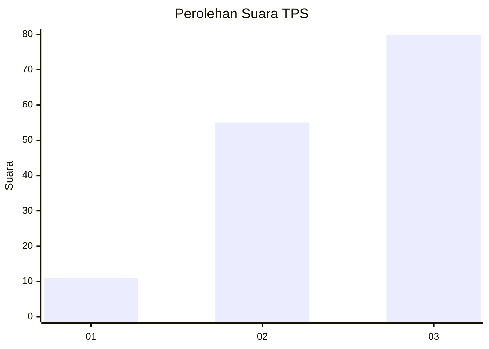
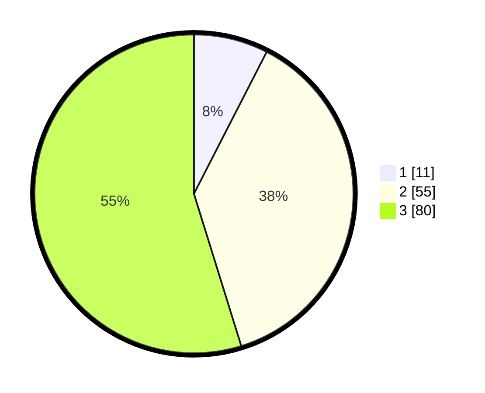

# Hasil

## Grafik

## Tabel

| No. | Nama Paslon    | Suara | Suara (raw) | Persentase |
|:--- |:-------------- | -----:| -----------:| ----------:|
| 1   | ANIES MUHAIMIN | 11    | [11][p-1]   | 7,53       |
| 2   | PRABOWO GIBRAN | 55    | [55][p-2]   | 37,67      |
| 3   | GANJAR MAHFUD  | 80    | [80][p-3]   | 54,79      |

[p-1]: https://github.com/gigit-pemilu/pemilu-2024/blob/main/pilpres/hitung-suara/sub/33-jawa-tengah/sub/02-banyumas/sub/20-kembaran/sub/2002-pliken/sub/014-tps/sub/paslon-1.txt
[p-2]: https://github.com/gigit-pemilu/pemilu-2024/blob/main/pilpres/hitung-suara/sub/33-jawa-tengah/sub/02-banyumas/sub/20-kembaran/sub/2002-pliken/sub/014-tps/sub/paslon-2.txt
[p-3]: https://github.com/gigit-pemilu/pemilu-2024/blob/main/pilpres/hitung-suara/sub/33-jawa-tengah/sub/02-banyumas/sub/20-kembaran/sub/2002-pliken/sub/014-tps/sub/paslon-3.txt

## Foto C Plano

https://sirekap-obj-formc.kpu.go.id/f0e1/pemilu/ppwp/33/02/20/20/02/3302202002014-20240214-232941--f83dfcf6-b80e-41ad-b63e-84d9b63c5d52.jpg

https://sirekap-obj-formc.kpu.go.id/f0e1/pemilu/ppwp/33/02/20/20/02/3302202002014-20240214-233030--2bee84ee-7f0a-49fe-a548-5e35c3e5c42d.jpg

https://sirekap-obj-formc.kpu.go.id/f0e1/pemilu/ppwp/33/02/20/20/02/3302202002014-20240214-233111--60d958a6-3239-42f9-ac58-84b5c3628b0d.jpg

## Metadata

| Key        | Value               |
| ---------- | ------------------- |
| Time Stamp | 2024-02-16 23:00:00 |

