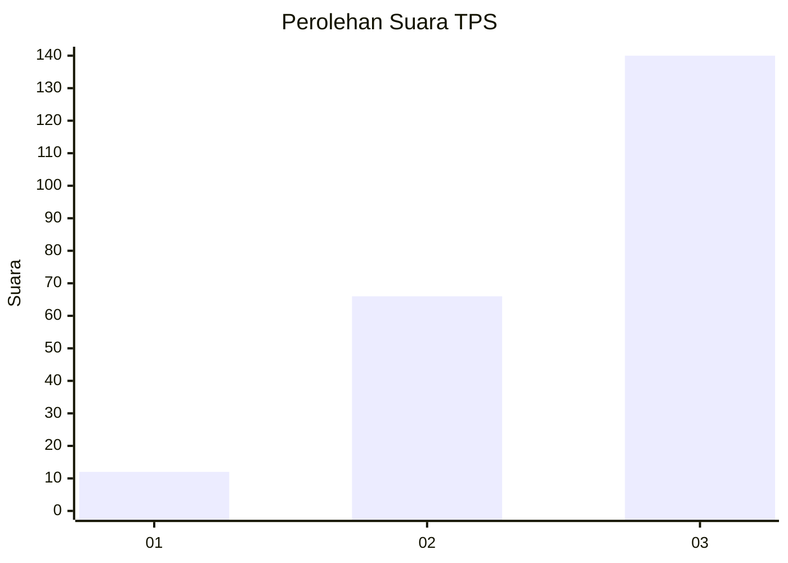
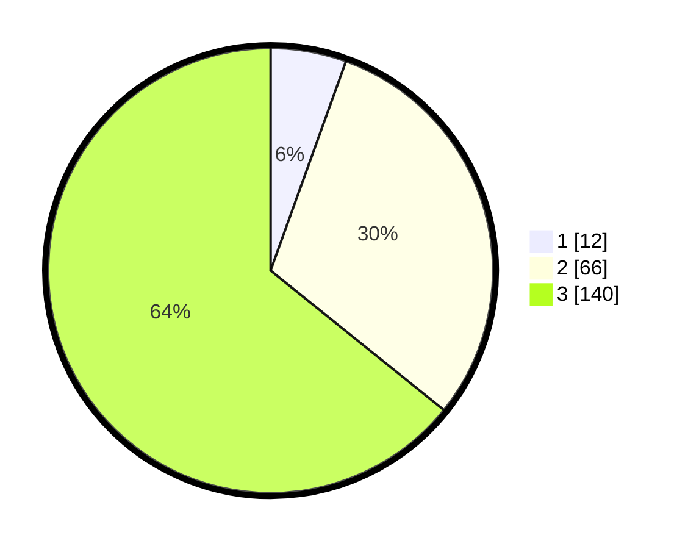

# Hasil

## Grafik

## Tabel

| No. | Nama Paslon    | Suara | Suara (raw) | Persentase |
|:--- |:-------------- | -----:| -----------:| ----------:|
| 1   | ANIES MUHAIMIN | 12    | [12][p-1]   | 5,50       |
| 2   | PRABOWO GIBRAN | 66    | [66][p-2]   | 30,28      |
| 3   | GANJAR MAHFUD  | 140   | [140][p-3]  | 64,22      |

[p-1]: https://github.com/gigit-pemilu/pemilu-2024-33-jawa-tengah/blob/main/pilpres/hitung-suara/sub/33-jawa-tengah/sub/02-banyumas/sub/20-kembaran/sub/2002-pliken/sub/016-tps/sub/paslon-1.txt
[p-2]: https://github.com/gigit-pemilu/pemilu-2024-33-jawa-tengah/blob/main/pilpres/hitung-suara/sub/33-jawa-tengah/sub/02-banyumas/sub/20-kembaran/sub/2002-pliken/sub/016-tps/sub/paslon-2.txt
[p-3]: https://github.com/gigit-pemilu/pemilu-2024-33-jawa-tengah/blob/main/pilpres/hitung-suara/sub/33-jawa-tengah/sub/02-banyumas/sub/20-kembaran/sub/2002-pliken/sub/016-tps/sub/paslon-3.txt

## Foto C Plano

https://sirekap-obj-formc.kpu.go.id/a7f1/pemilu/ppwp/33/02/20/20/02/3302202002016-20240214-220320--571ff45d-cd52-46a6-921d-573c77599af1.jpg

https://sirekap-obj-formc.kpu.go.id/a7f1/pemilu/ppwp/33/02/20/20/02/3302202002016-20240214-220327--514963d2-0131-471a-b7d4-b5133309380d.jpg

https://sirekap-obj-formc.kpu.go.id/a7f1/pemilu/ppwp/33/02/20/20/02/3302202002016-20240214-220335--f404ef0f-beef-4b07-a853-49bb18235563.jpg

## Metadata

| Key        | Value               |
| ---------- | ------------------- |
| Time Stamp | 2024-02-16 23:30:00 |

