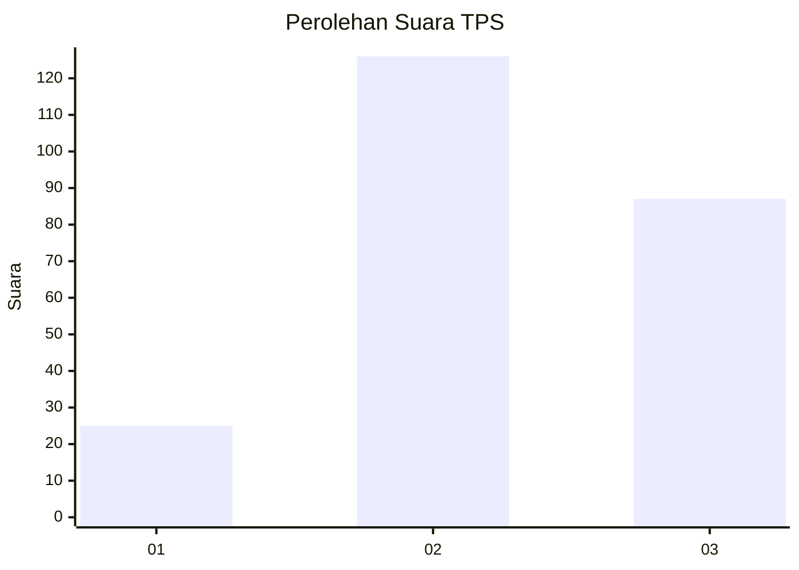
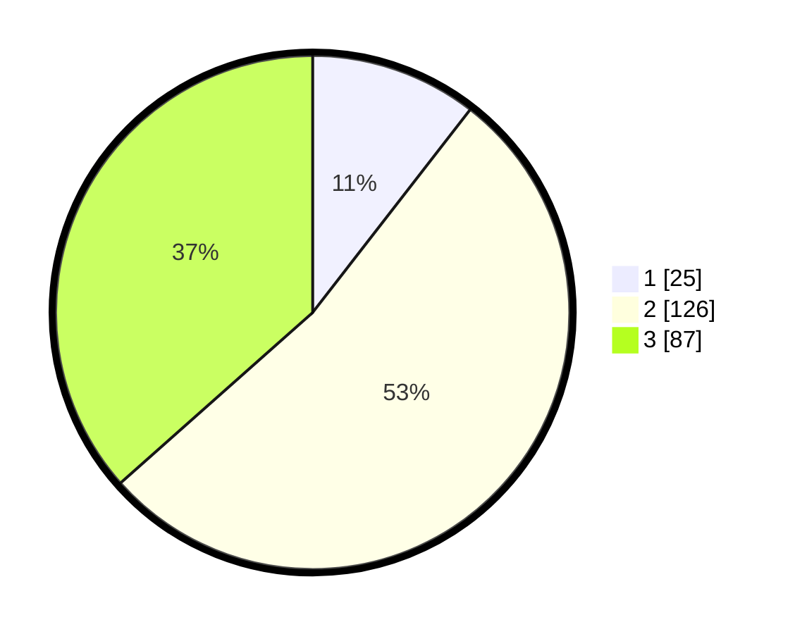

# Hasil

## Grafik

## Tabel

| No. | Nama Paslon    | Suara | Suara (raw) | Persentase |
|:--- |:-------------- | -----:| -----------:| ----------:|
| 1   | ANIES MUHAIMIN | 25    | [25][p-1]   | 10,50      |
| 2   | PRABOWO GIBRAN | 126   | [126][p-2]  | 52,94      |
| 3   | GANJAR MAHFUD  | 87    | [87][p-3]   | 36,55      |

[p-1]: https://github.com/gigit-pemilu/pemilu-2024/blob/main/pilpres/hitung-suara/sub/33-jawa-tengah/sub/02-banyumas/sub/20-kembaran/sub/2002-pliken/sub/021-tps/sub/paslon-1.txt
[p-2]: https://github.com/gigit-pemilu/pemilu-2024/blob/main/pilpres/hitung-suara/sub/33-jawa-tengah/sub/02-banyumas/sub/20-kembaran/sub/2002-pliken/sub/021-tps/sub/paslon-2.txt
[p-3]: https://github.com/gigit-pemilu/pemilu-2024/blob/main/pilpres/hitung-suara/sub/33-jawa-tengah/sub/02-banyumas/sub/20-kembaran/sub/2002-pliken/sub/021-tps/sub/paslon-3.txt

## Foto C Plano

https://sirekap-obj-formc.kpu.go.id/e573/pemilu/ppwp/33/02/20/20/02/3302202002021-20240215-015510--45b31aa1-0796-4894-a040-5b3a1d4e4173.jpg

https://sirekap-obj-formc.kpu.go.id/e573/pemilu/ppwp/33/02/20/20/02/3302202002021-20240215-015634--f3f7e9ad-9de7-4fa6-8464-fff5c2779c06.jpg

https://sirekap-obj-formc.kpu.go.id/e573/pemilu/ppwp/33/02/20/20/02/3302202002021-20240215-015815--56417a0c-4586-4957-a773-d044500e679d.jpg

## Metadata

| Key        | Value               |
| ---------- | ------------------- |
| Time Stamp | 2024-02-19 06:16:00 |

