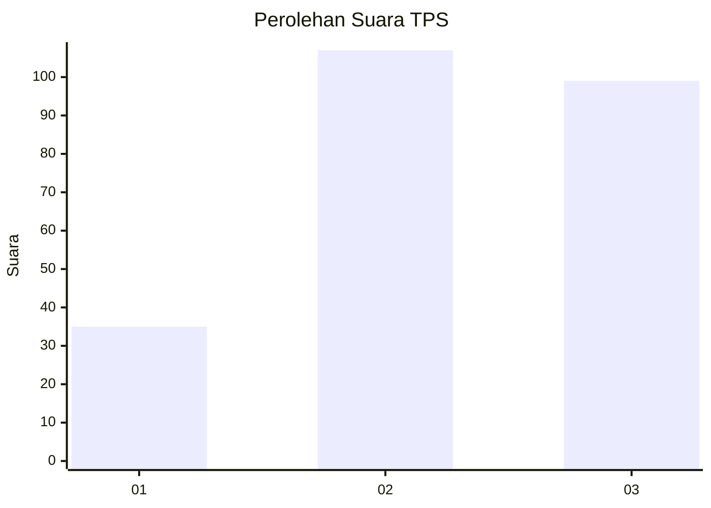
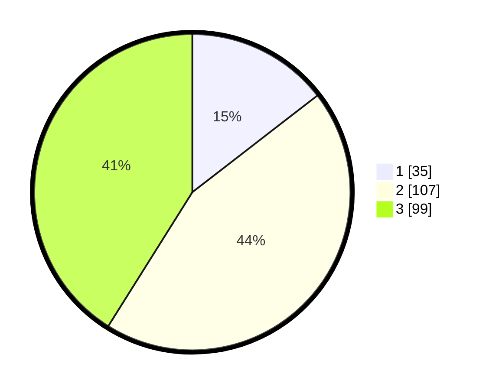

# Hasil

## Grafik

## Tabel

| No. | Nama Paslon    | Suara | Suara (raw) | Persentase |
|:--- |:-------------- | -----:| -----------:| ----------:|
| 1   | ANIES MUHAIMIN | 35    | [35][p-1]   | 14,52      |
| 2   | PRABOWO GIBRAN | 107   | [107][p-2]  | 44,40      |
| 3   | GANJAR MAHFUD  | 99    | [99][p-3]   | 41,08      |

[p-1]: https://github.com/gigit-pemilu/pemilu-2024/blob/main/pilpres/hitung-suara/sub/33-jawa-tengah/sub/02-banyumas/sub/20-kembaran/sub/2002-pliken/sub/025-tps/sub/paslon-1.txt
[p-2]: https://github.com/gigit-pemilu/pemilu-2024/blob/main/pilpres/hitung-suara/sub/33-jawa-tengah/sub/02-banyumas/sub/20-kembaran/sub/2002-pliken/sub/025-tps/sub/paslon-2.txt
[p-3]: https://github.com/gigit-pemilu/pemilu-2024/blob/main/pilpres/hitung-suara/sub/33-jawa-tengah/sub/02-banyumas/sub/20-kembaran/sub/2002-pliken/sub/025-tps/sub/paslon-3.txt

## Foto C Plano

https://sirekap-obj-formc.kpu.go.id/04b4/pemilu/ppwp/33/02/20/20/02/3302202002025-20240214-231737--12c6f735-81ae-4dea-be6f-2e01d6107eab.jpg

https://sirekap-obj-formc.kpu.go.id/04b4/pemilu/ppwp/33/02/20/20/02/3302202002025-20240214-223136--e7654b18-dfd2-437a-af6c-15782350782d.jpg

https://sirekap-obj-formc.kpu.go.id/04b4/pemilu/ppwp/33/02/20/20/02/3302202002025-20240214-223444--e9c67d77-b83b-48da-ad03-a664306769c1.jpg

## Metadata

| Key        | Value               |
| ---------- | ------------------- |
| Time Stamp | 2024-02-16 21:01:00 |

