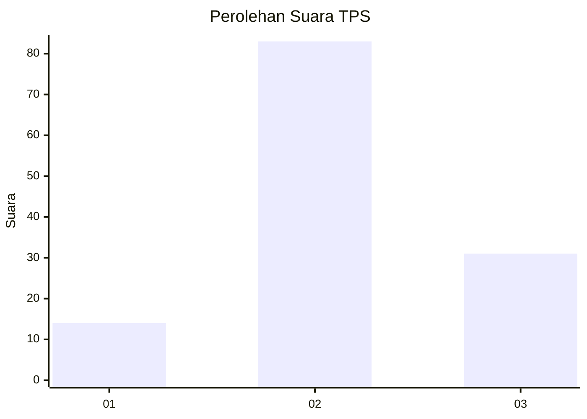
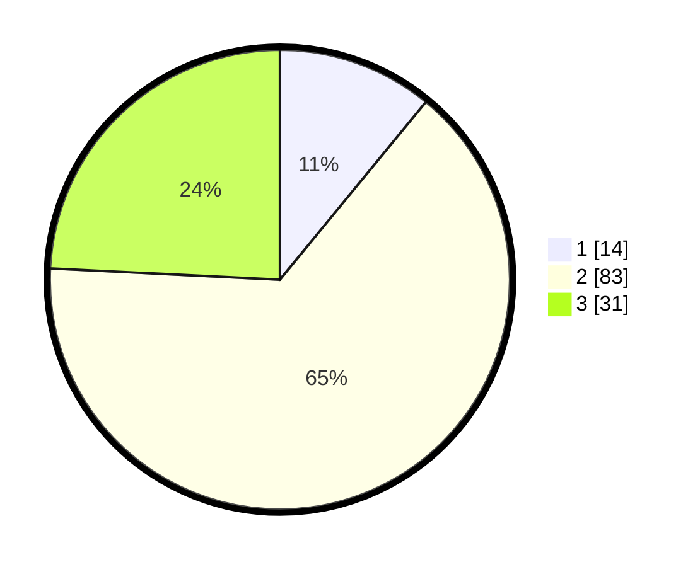

# Hasil

## Grafik

## Tabel

| No. | Nama Paslon    | Suara | Suara (raw) | Persentase |
|:--- |:-------------- | -----:| -----------:| ----------:|
| 1   | ANIES MUHAIMIN | 14    | [14][p-1]   | 10,94      |
| 2   | PRABOWO GIBRAN | 83    | [83][p-2]   | 64,84      |
| 3   | GANJAR MAHFUD  | 31    | [31][p-3]   | 24,22      |

[p-1]: https://github.com/gigit-pemilu/pemilu-2024-33-jawa-tengah/blob/main/pilpres/hitung-suara/sub/33-jawa-tengah/sub/02-banyumas/sub/20-kembaran/sub/2008-purbadana/sub/011-tps/sub/paslon-1.txt
[p-2]: https://github.com/gigit-pemilu/pemilu-2024-33-jawa-tengah/blob/main/pilpres/hitung-suara/sub/33-jawa-tengah/sub/02-banyumas/sub/20-kembaran/sub/2008-purbadana/sub/011-tps/sub/paslon-2.txt
[p-3]: https://github.com/gigit-pemilu/pemilu-2024-33-jawa-tengah/blob/main/pilpres/hitung-suara/sub/33-jawa-tengah/sub/02-banyumas/sub/20-kembaran/sub/2008-purbadana/sub/011-tps/sub/paslon-3.txt

## Foto C Plano

https://sirekap-obj-formc.kpu.go.id/8044/pemilu/ppwp/33/02/20/20/08/3302202008011-20240215-000720--db3d7ace-4666-4022-9509-76d6865be298.jpg

https://sirekap-obj-formc.kpu.go.id/8044/pemilu/ppwp/33/02/20/20/08/3302202008011-20240215-000908--fe5653cf-cb35-428d-882e-cf136ccc298e.jpg

https://sirekap-obj-formc.kpu.go.id/8044/pemilu/ppwp/33/02/20/20/08/3302202008011-20240215-001336--9d0978f9-5013-40d0-97c7-48fca7c10ca9.jpg

## Metadata

| Key        | Value               |
| ---------- | ------------------- |
| Time Stamp | 2024-02-16 23:30:00 |

