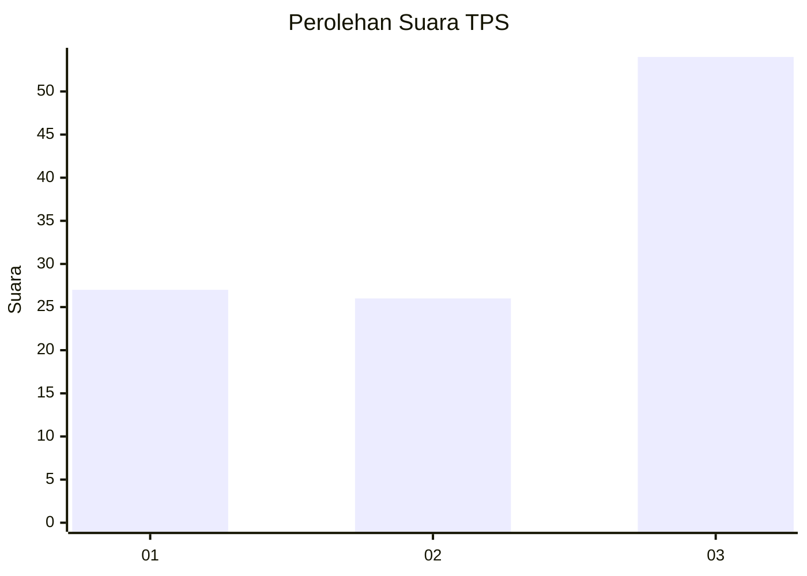
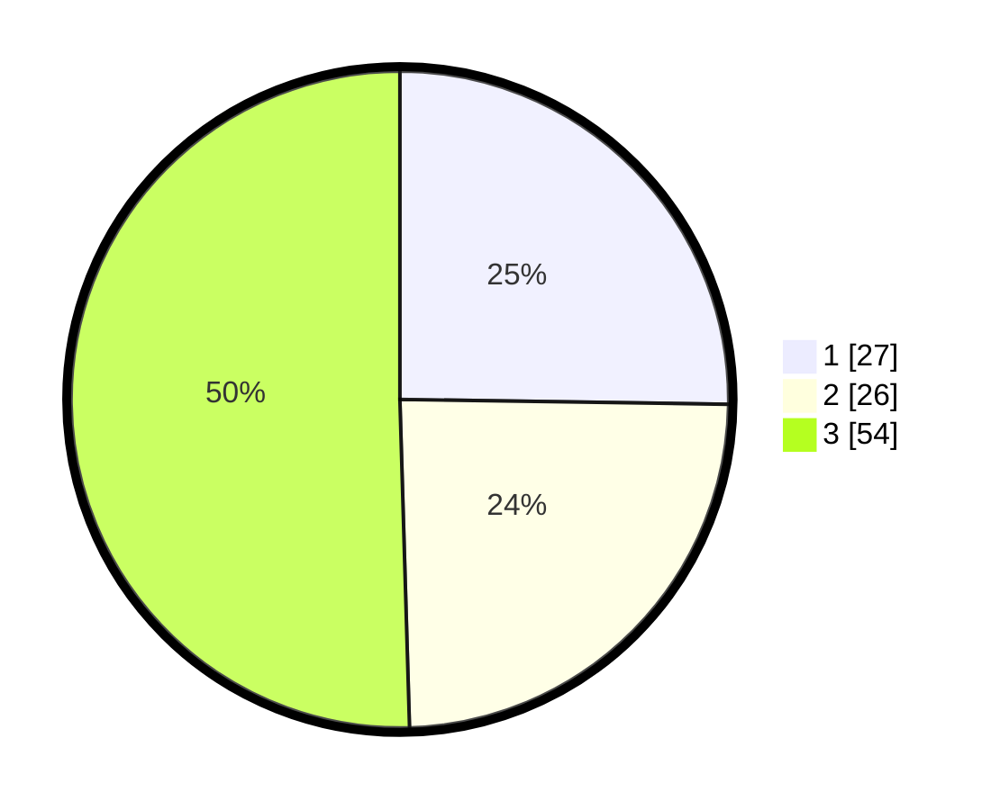

# Hasil

## Grafik

## Tabel

| No. | Nama Paslon    | Suara | Suara (raw) | Persentase |
|:--- |:-------------- | -----:| -----------:| ----------:|
| 1   | ANIES MUHAIMIN | 27    | [27][p-1]   | 25,23      |
| 2   | PRABOWO GIBRAN | 26    | [26][p-2]   | 24,30      |
| 3   | GANJAR MAHFUD  | 54    | [54][p-3]   | 50,47      |

[p-1]: https://github.com/gigit-pemilu/pemilu-2024/blob/main/pilpres/hitung-suara/sub/33-jawa-tengah/sub/02-banyumas/sub/20-kembaran/sub/2009-kembaran/sub/003-tps/sub/paslon-1.txt
[p-2]: https://github.com/gigit-pemilu/pemilu-2024/blob/main/pilpres/hitung-suara/sub/33-jawa-tengah/sub/02-banyumas/sub/20-kembaran/sub/2009-kembaran/sub/003-tps/sub/paslon-2.txt
[p-3]: https://github.com/gigit-pemilu/pemilu-2024/blob/main/pilpres/hitung-suara/sub/33-jawa-tengah/sub/02-banyumas/sub/20-kembaran/sub/2009-kembaran/sub/003-tps/sub/paslon-3.txt

## Foto C Plano

https://sirekap-obj-formc.kpu.go.id/cde1/pemilu/ppwp/33/02/20/20/09/3302202009003-20240215-001507--95c0d3e5-d217-4d23-b1aa-2b566b5e0454.jpg

https://sirekap-obj-formc.kpu.go.id/cde1/pemilu/ppwp/33/02/20/20/09/3302202009003-20240220-112751--fb18bb5b-98b2-4793-bf7c-73715dc20196.jpg

https://sirekap-obj-formc.kpu.go.id/cde1/pemilu/ppwp/33/02/20/20/09/3302202009003-20240220-112756--0e0e2341-6725-4d71-a512-d673a1533992.jpg

## Metadata

| Key        | Value               |
| ---------- | ------------------- |
| Time Stamp | 2024-02-21 10:00:00 |

