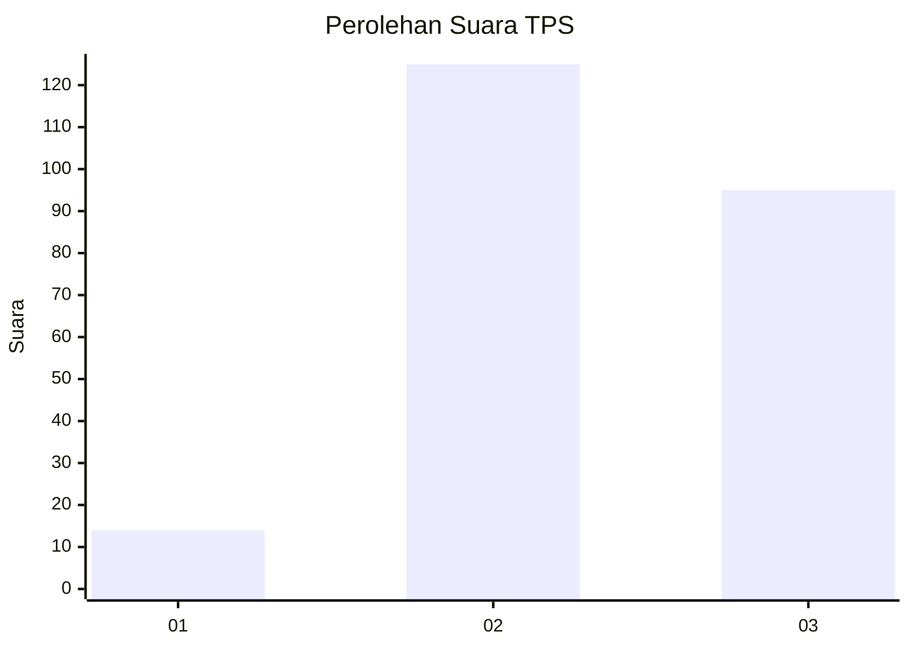
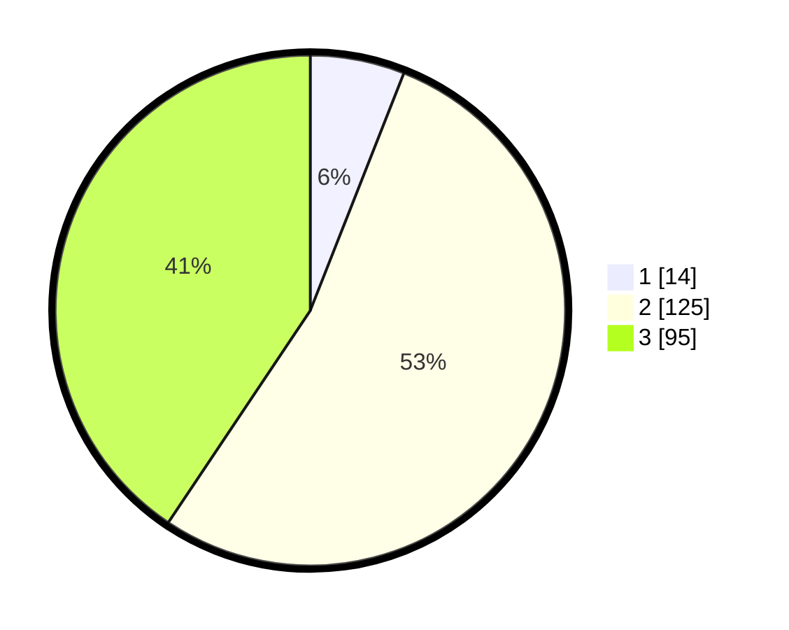

# Hasil

## Grafik

## Tabel

| No. | Nama Paslon    | Suara | Suara (raw) | Persentase |
|:--- |:-------------- | -----:| -----------:| ----------:|
| 1   | ANIES MUHAIMIN | 14    | [14][p-1]   | 5,98       |
| 2   | PRABOWO GIBRAN | 125   | [125][p-2]  | 53,42      |
| 3   | GANJAR MAHFUD  | 95    | [95][p-3]   | 40,60      |

[p-1]: https://github.com/gigit-pemilu/pemilu-2024/blob/main/pilpres/hitung-suara/sub/33-jawa-tengah/sub/02-banyumas/sub/20-kembaran/sub/2011-karangsoka/sub/006-tps/sub/paslon-1.txt
[p-2]: https://github.com/gigit-pemilu/pemilu-2024/blob/main/pilpres/hitung-suara/sub/33-jawa-tengah/sub/02-banyumas/sub/20-kembaran/sub/2011-karangsoka/sub/006-tps/sub/paslon-2.txt
[p-3]: https://github.com/gigit-pemilu/pemilu-2024/blob/main/pilpres/hitung-suara/sub/33-jawa-tengah/sub/02-banyumas/sub/20-kembaran/sub/2011-karangsoka/sub/006-tps/sub/paslon-3.txt

## Foto C Plano

https://sirekap-obj-formc.kpu.go.id/a0a5/pemilu/ppwp/33/02/20/20/11/3302202011006-20240215-001509--407a1909-ab8d-48f2-afd4-a15540b23e10.jpg

https://sirekap-obj-formc.kpu.go.id/a0a5/pemilu/ppwp/33/02/20/20/11/3302202011006-20240214-194833--f3ebc763-c807-4541-880e-49942ad9e449.jpg

https://sirekap-obj-formc.kpu.go.id/a0a5/pemilu/ppwp/33/02/20/20/11/3302202011006-20240214-195130--b3239f97-77ea-40a3-8e04-5fbc68558f67.jpg

## Metadata

| Key        | Value               |
| ---------- | ------------------- |
| Time Stamp | 2024-02-15 09:00:24 |

