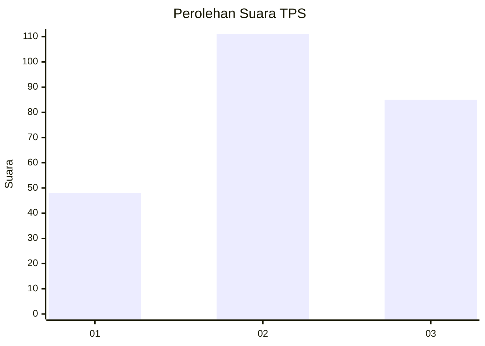
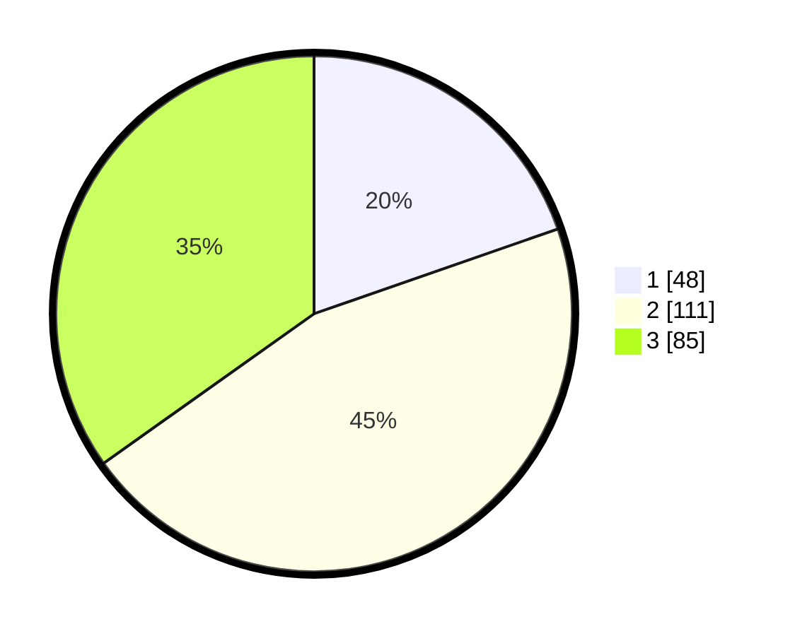

# Hasil

## Grafik

## Tabel

| No. | Nama Paslon    | Suara | Suara (raw) | Persentase |
|:--- |:-------------- | -----:| -----------:| ----------:|
| 1   | ANIES MUHAIMIN | 48    | [48][p-1]   | 19,67      |
| 2   | PRABOWO GIBRAN | 111   | [111][p-2]  | 45,49      |
| 3   | GANJAR MAHFUD  | 85    | [85][p-3]   | 34,84      |

[p-1]: https://github.com/gigit-pemilu/pemilu-2024/blob/main/pilpres/hitung-suara/sub/33-jawa-tengah/sub/02-banyumas/sub/20-kembaran/sub/2012-dukuhwaluh/sub/014-tps/sub/paslon-1.txt
[p-2]: https://github.com/gigit-pemilu/pemilu-2024/blob/main/pilpres/hitung-suara/sub/33-jawa-tengah/sub/02-banyumas/sub/20-kembaran/sub/2012-dukuhwaluh/sub/014-tps/sub/paslon-2.txt
[p-3]: https://github.com/gigit-pemilu/pemilu-2024/blob/main/pilpres/hitung-suara/sub/33-jawa-tengah/sub/02-banyumas/sub/20-kembaran/sub/2012-dukuhwaluh/sub/014-tps/sub/paslon-3.txt

## Foto C Plano

https://sirekap-obj-formc.kpu.go.id/bd26/pemilu/ppwp/33/02/20/20/12/3302202012014-20240215-031404--7efddb01-e72b-4c0d-9acc-b65810218fa4.jpg

https://sirekap-obj-formc.kpu.go.id/bd26/pemilu/ppwp/33/02/20/20/12/3302202012014-20240215-031719--6147ca48-48d0-4c3b-862e-c573fe8e93c8.jpg

https://sirekap-obj-formc.kpu.go.id/bd26/pemilu/ppwp/33/02/20/20/12/3302202012014-20240215-031538--33aaf345-8db3-458b-b7ab-f94c71b94edf.jpg

## Metadata

| Key        | Value               |
| ---------- | ------------------- |
| Time Stamp | 2024-02-19 06:16:00 |

