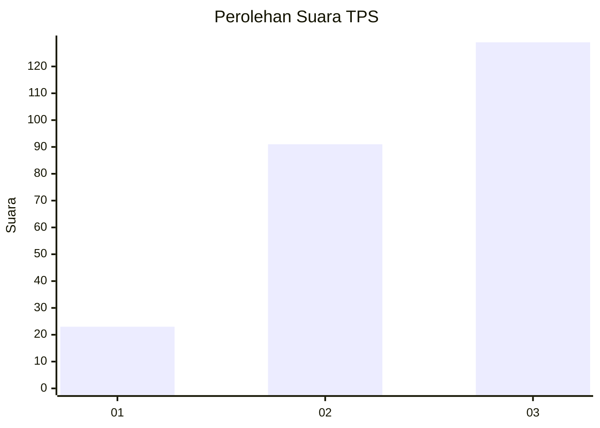
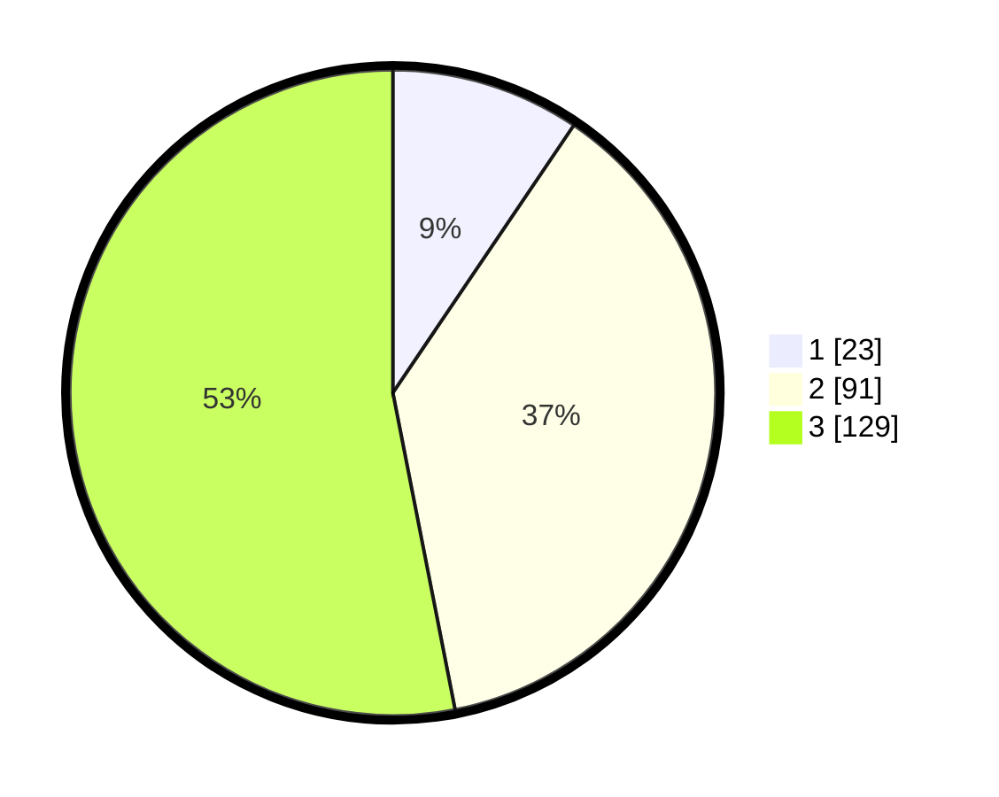

# Hasil

## Grafik

## Tabel

| No. | Nama Paslon    | Suara | Suara (raw) | Persentase |
|:--- |:-------------- | -----:| -----------:| ----------:|
| 1   | ANIES MUHAIMIN | 23    | [23][p-1]   | 9,47       |
| 2   | PRABOWO GIBRAN | 91    | [91][p-2]   | 37,45      |
| 3   | GANJAR MAHFUD  | 129   | [129][p-3]  | 53,09      |

[p-1]: https://github.com/gigit-pemilu/pemilu-2024-33-jawa-tengah/blob/main/pilpres/hitung-suara/sub/33-jawa-tengah/sub/02-banyumas/sub/20-kembaran/sub/2013-tambaksari-kidul/sub/001-tps/sub/paslon-1.txt
[p-2]: https://github.com/gigit-pemilu/pemilu-2024-33-jawa-tengah/blob/main/pilpres/hitung-suara/sub/33-jawa-tengah/sub/02-banyumas/sub/20-kembaran/sub/2013-tambaksari-kidul/sub/001-tps/sub/paslon-2.txt
[p-3]: https://github.com/gigit-pemilu/pemilu-2024-33-jawa-tengah/blob/main/pilpres/hitung-suara/sub/33-jawa-tengah/sub/02-banyumas/sub/20-kembaran/sub/2013-tambaksari-kidul/sub/001-tps/sub/paslon-3.txt

## Foto C Plano

https://sirekap-obj-formc.kpu.go.id/b0fc/pemilu/ppwp/33/02/20/20/13/3302202013001-20240215-042307--cc286cfd-a8d8-4339-83f7-fc19195efde7.jpg

https://sirekap-obj-formc.kpu.go.id/b0fc/pemilu/ppwp/33/02/20/20/13/3302202013001-20240215-042324--359f8768-cfe2-4f41-acc9-60d7f3984bea.jpg

https://sirekap-obj-formc.kpu.go.id/b0fc/pemilu/ppwp/33/02/20/20/13/3302202013001-20240215-042341--b08340ae-3e82-4cba-8c7b-b83f9b116ca5.jpg

## Metadata

| Key        | Value               |
| ---------- | ------------------- |
| Time Stamp | 2024-02-16 23:30:00 |

