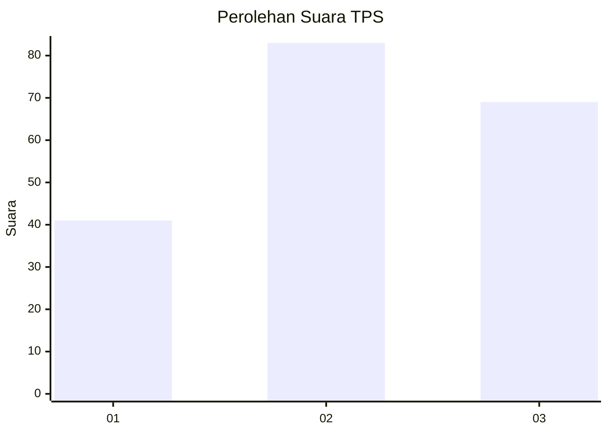
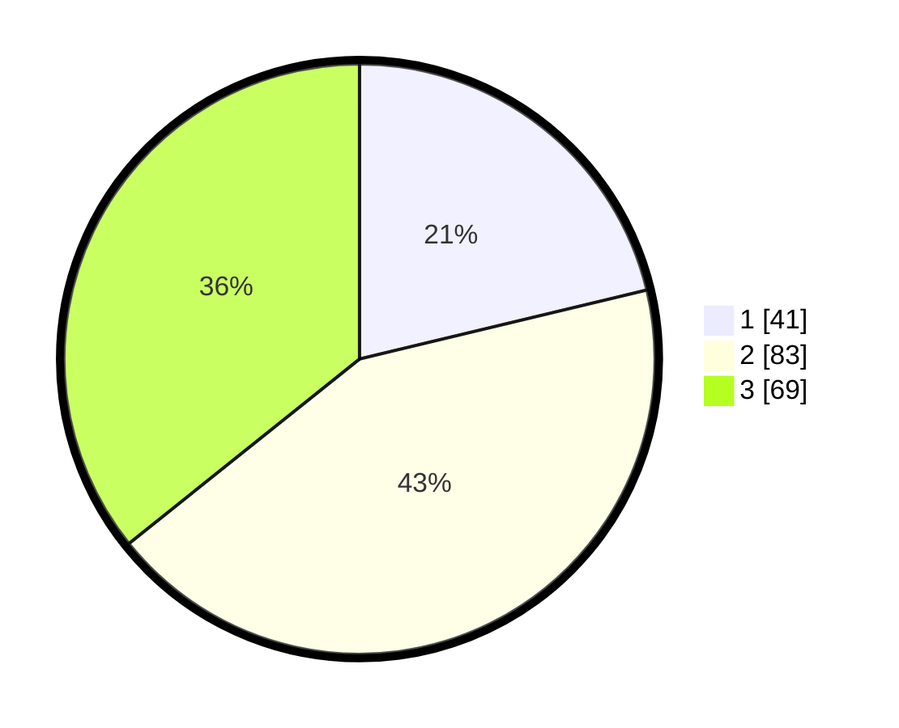

# Hasil

## Grafik

## Tabel

| No. | Nama Paslon    | Suara | Suara (raw) | Persentase |
|:--- |:-------------- | -----:| -----------:| ----------:|
| 1   | ANIES MUHAIMIN | 41    | [41][p-1]   | 21,24      |
| 2   | PRABOWO GIBRAN | 83    | [83][p-2]   | 43,01      |
| 3   | GANJAR MAHFUD  | 69    | [69][p-3]   | 35,75      |

[p-1]: https://github.com/gigit-pemilu/pemilu-2024-33-jawa-tengah/blob/main/pilpres/hitung-suara/sub/33-jawa-tengah/sub/02-banyumas/sub/20-kembaran/sub/2013-tambaksari-kidul/sub/005-tps/sub/paslon-1.txt
[p-2]: https://github.com/gigit-pemilu/pemilu-2024-33-jawa-tengah/blob/main/pilpres/hitung-suara/sub/33-jawa-tengah/sub/02-banyumas/sub/20-kembaran/sub/2013-tambaksari-kidul/sub/005-tps/sub/paslon-2.txt
[p-3]: https://github.com/gigit-pemilu/pemilu-2024-33-jawa-tengah/blob/main/pilpres/hitung-suara/sub/33-jawa-tengah/sub/02-banyumas/sub/20-kembaran/sub/2013-tambaksari-kidul/sub/005-tps/sub/paslon-3.txt

## Foto C Plano

https://sirekap-obj-formc.kpu.go.id/4554/pemilu/ppwp/33/02/20/20/13/3302202013005-20240215-015017--7e79e246-6dc9-4766-a830-3dccb6826709.jpg

https://sirekap-obj-formc.kpu.go.id/4554/pemilu/ppwp/33/02/20/20/13/3302202013005-20240215-015120--ddd6e83a-b6be-4363-9d80-c29d671c6956.jpg

https://sirekap-obj-formc.kpu.go.id/4554/pemilu/ppwp/33/02/20/20/13/3302202013005-20240215-053745--fd761950-26a9-464d-9e51-8456d838efed.jpg

## Metadata

| Key        | Value               |
| ---------- | ------------------- |
| Time Stamp | 2024-02-24 22:31:28 |

