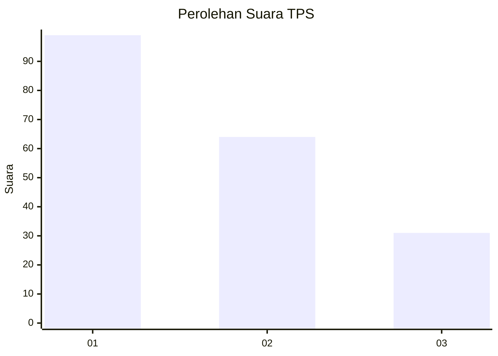
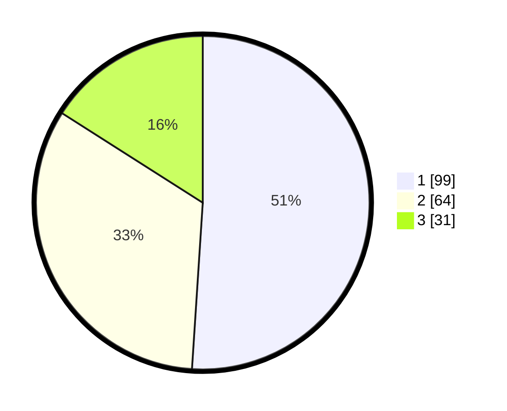

# Hasil

## Grafik

## Tabel

| No. | Nama Paslon    | Suara | Suara (raw) | Persentase |
|:--- |:-------------- | -----:| -----------:| ----------:|
| 1   | ANIES MUHAIMIN | 99    | [99][p-1]   | 51,03      |
| 2   | PRABOWO GIBRAN | 64    | [64][p-2]   | 32,99      |
| 3   | GANJAR MAHFUD  | 31    | [31][p-3]   | 15,98      |

[p-1]: https://github.com/gigit-pemilu/pemilu-2024/blob/main/pilpres/hitung-suara/sub/33-jawa-tengah/sub/02-banyumas/sub/20-kembaran/sub/2013-tambaksari-kidul/sub/016-tps/sub/paslon-1.txt
[p-2]: https://github.com/gigit-pemilu/pemilu-2024/blob/main/pilpres/hitung-suara/sub/33-jawa-tengah/sub/02-banyumas/sub/20-kembaran/sub/2013-tambaksari-kidul/sub/016-tps/sub/paslon-2.txt
[p-3]: https://github.com/gigit-pemilu/pemilu-2024/blob/main/pilpres/hitung-suara/sub/33-jawa-tengah/sub/02-banyumas/sub/20-kembaran/sub/2013-tambaksari-kidul/sub/016-tps/sub/paslon-3.txt

## Foto C Plano

https://sirekap-obj-formc.kpu.go.id/98df/pemilu/ppwp/33/02/20/20/13/3302202013016-20240214-230154--7fb10934-dfd6-4222-8639-00caf860fbfd.jpg

https://sirekap-obj-formc.kpu.go.id/98df/pemilu/ppwp/33/02/20/20/13/3302202013016-20240219-204129--50ee736f-6b27-422e-b1bd-c4e34c1942ed.jpg

https://sirekap-obj-formc.kpu.go.id/98df/pemilu/ppwp/33/02/20/20/13/3302202013016-20240214-212757--a43adad6-5784-4b4c-a762-db48c040b3b2.jpg

## Metadata

| Key        | Value               |
| ---------- | ------------------- |
| Time Stamp | 2024-02-25 11:00:00 |

