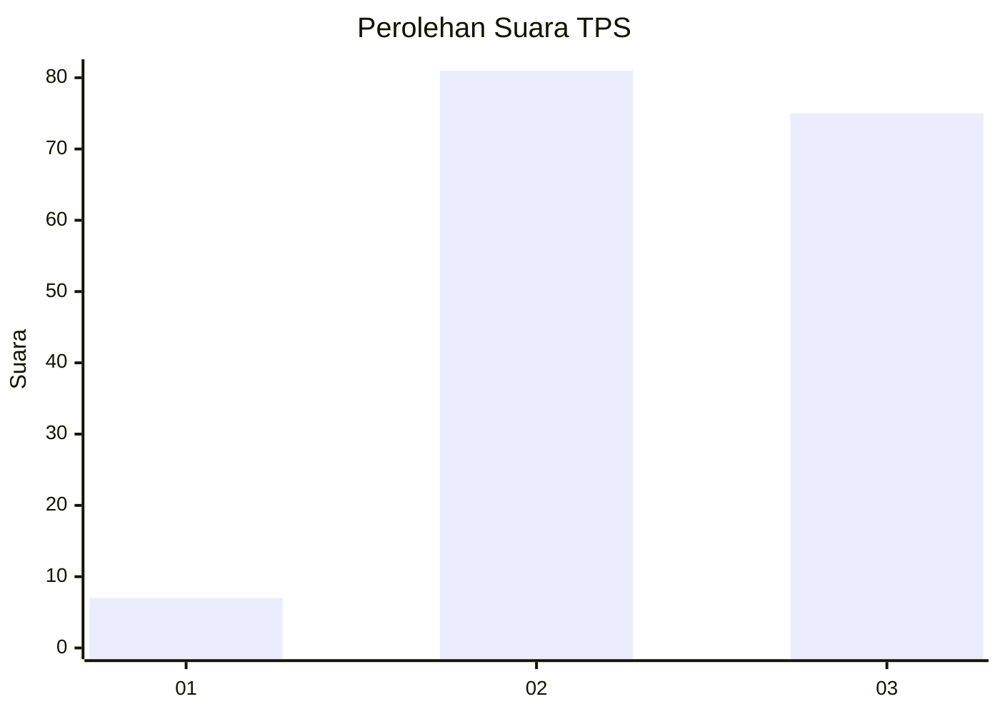
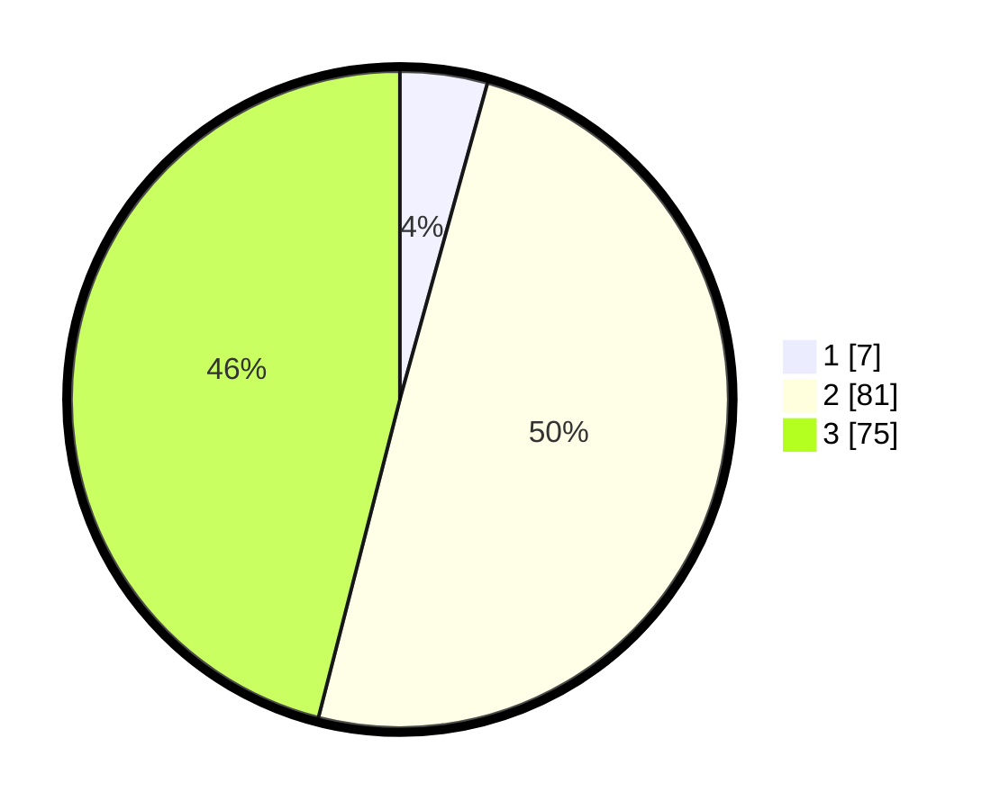

# Hasil

## Grafik

## Tabel

| No. | Nama Paslon    | Suara | Suara (raw) | Persentase |
|:--- |:-------------- | -----:| -----------:| ----------:|
| 1   | ANIES MUHAIMIN | 7     | [7][p-1]    | 4,29       |
| 2   | PRABOWO GIBRAN | 81    | [81][p-2]   | 49,69      |
| 3   | GANJAR MAHFUD  | 75    | [75][p-3]   | 46,01      |

[p-1]: https://github.com/gigit-pemilu/pemilu-2024-33-jawa-tengah/blob/main/pilpres/hitung-suara/sub/33-jawa-tengah/sub/02-banyumas/sub/20-kembaran/sub/2014-bantarwuni/sub/011-tps/sub/paslon-1.txt
[p-2]: https://github.com/gigit-pemilu/pemilu-2024-33-jawa-tengah/blob/main/pilpres/hitung-suara/sub/33-jawa-tengah/sub/02-banyumas/sub/20-kembaran/sub/2014-bantarwuni/sub/011-tps/sub/paslon-2.txt
[p-3]: https://github.com/gigit-pemilu/pemilu-2024-33-jawa-tengah/blob/main/pilpres/hitung-suara/sub/33-jawa-tengah/sub/02-banyumas/sub/20-kembaran/sub/2014-bantarwuni/sub/011-tps/sub/paslon-3.txt

## Foto C Plano

https://sirekap-obj-formc.kpu.go.id/85f6/pemilu/ppwp/33/02/20/20/14/3302202014011-20240215-011351--3daf2d52-1ee4-4e8f-b81d-5986a85bee17.jpg

https://sirekap-obj-formc.kpu.go.id/85f6/pemilu/ppwp/33/02/20/20/14/3302202014011-20240215-011454--6883550a-f0c6-4e42-ba09-c397470b46a7.jpg

https://sirekap-obj-formc.kpu.go.id/85f6/pemilu/ppwp/33/02/20/20/14/3302202014011-20240215-011536--0c80163a-0d32-4830-b006-b697cd82e890.jpg

## Metadata

| Key        | Value               |
| ---------- | ------------------- |
| Time Stamp | 2024-02-16 21:01:00 |

