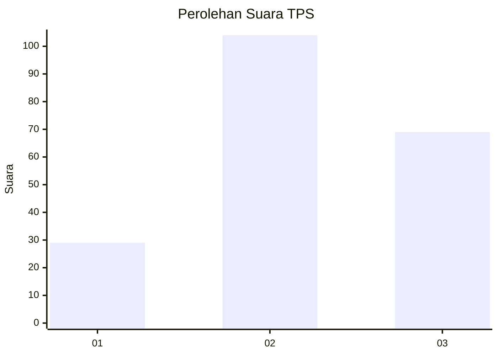
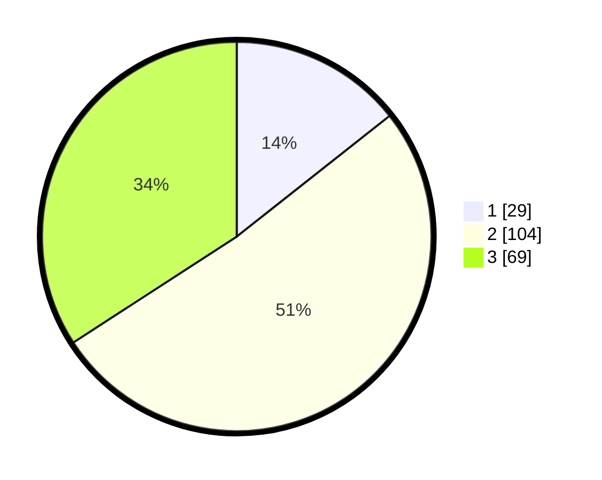

# Hasil

## Grafik

## Tabel

| No. | Nama Paslon    | Suara | Suara (raw) | Persentase |
|:--- |:-------------- | -----:| -----------:| ----------:|
| 1   | ANIES MUHAIMIN | 29    | [29][p-1]   | 14,36      |
| 2   | PRABOWO GIBRAN | 104   | [104][p-2]  | 51,49      |
| 3   | GANJAR MAHFUD  | 69    | [69][p-3]   | 34,16      |

[p-1]: https://github.com/gigit-pemilu/pemilu-2024/blob/main/pilpres/hitung-suara/sub/33-jawa-tengah/sub/02-banyumas/sub/21-sumbang/sub/2003-karangcegak/sub/006-tps/sub/paslon-1.txt
[p-2]: https://github.com/gigit-pemilu/pemilu-2024/blob/main/pilpres/hitung-suara/sub/33-jawa-tengah/sub/02-banyumas/sub/21-sumbang/sub/2003-karangcegak/sub/006-tps/sub/paslon-2.txt
[p-3]: https://github.com/gigit-pemilu/pemilu-2024/blob/main/pilpres/hitung-suara/sub/33-jawa-tengah/sub/02-banyumas/sub/21-sumbang/sub/2003-karangcegak/sub/006-tps/sub/paslon-3.txt

## Foto C Plano

https://sirekap-obj-formc.kpu.go.id/f935/pemilu/ppwp/33/02/21/20/03/3302212003006-20240214-214920--164aba3b-a4ce-4a2d-8815-9fa3ec5f4f1f.jpg

https://sirekap-obj-formc.kpu.go.id/f935/pemilu/ppwp/33/02/21/20/03/3302212003006-20240214-215034--c1bd8953-bb99-4b19-aafa-1703414a6641.jpg

https://sirekap-obj-formc.kpu.go.id/f935/pemilu/ppwp/33/02/21/20/03/3302212003006-20240214-215156--73bcb7a2-62c5-4e7b-b79b-4d0704e05c6a.jpg

## Metadata

| Key        | Value               |
| ---------- | ------------------- |
| Time Stamp | 2024-02-16 23:00:00 |

