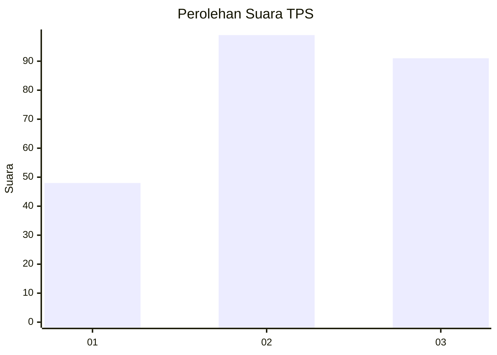
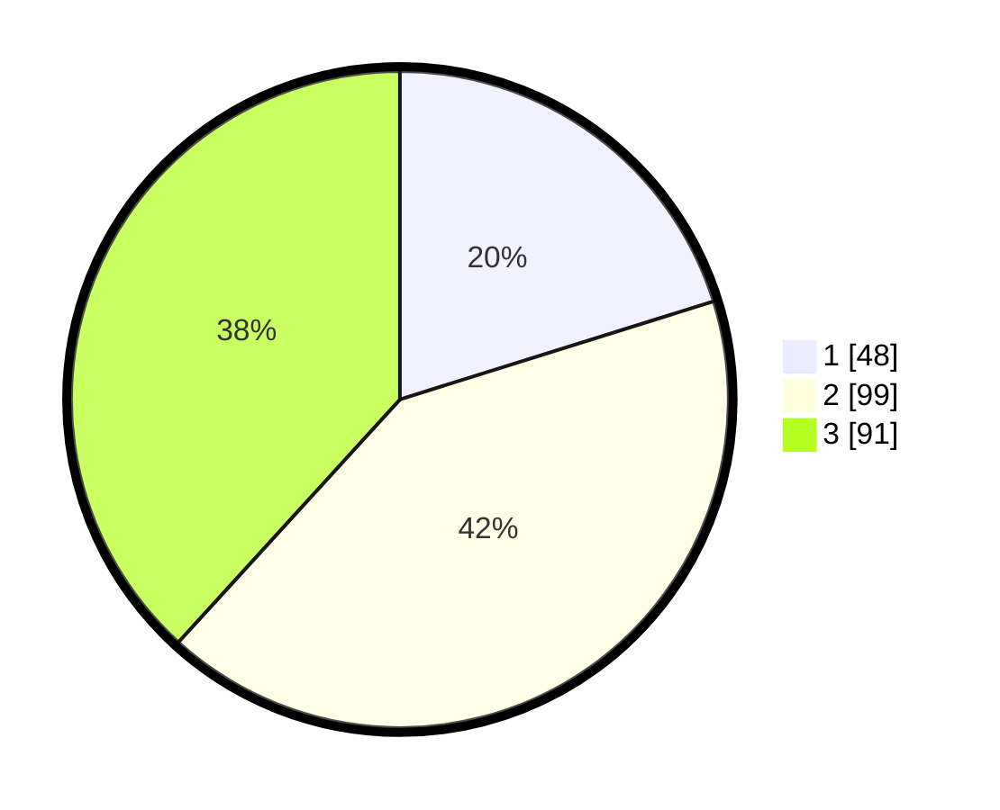

# Hasil

## Grafik

## Tabel

| No. | Nama Paslon    | Suara | Suara (raw) | Persentase |
|:--- |:-------------- | -----:| -----------:| ----------:|
| 1   | ANIES MUHAIMIN | 48    | [48][p-1]   | 20,17      |
| 2   | PRABOWO GIBRAN | 99    | [99][p-2]   | 41,60      |
| 3   | GANJAR MAHFUD  | 91    | [91][p-3]   | 38,24      |

[p-1]: https://github.com/gigit-pemilu/pemilu-2024-33-jawa-tengah/blob/main/pilpres/hitung-suara/sub/33-jawa-tengah/sub/02-banyumas/sub/21-sumbang/sub/2004-sumbang/sub/016-tps/sub/paslon-1.txt
[p-2]: https://github.com/gigit-pemilu/pemilu-2024-33-jawa-tengah/blob/main/pilpres/hitung-suara/sub/33-jawa-tengah/sub/02-banyumas/sub/21-sumbang/sub/2004-sumbang/sub/016-tps/sub/paslon-2.txt
[p-3]: https://github.com/gigit-pemilu/pemilu-2024-33-jawa-tengah/blob/main/pilpres/hitung-suara/sub/33-jawa-tengah/sub/02-banyumas/sub/21-sumbang/sub/2004-sumbang/sub/016-tps/sub/paslon-3.txt

## Foto C Plano

https://sirekap-obj-formc.kpu.go.id/5645/pemilu/ppwp/33/02/21/20/04/3302212004016-20240215-091130--8cac7cc8-cfa3-4078-92ce-3a053b2056eb.jpg

https://sirekap-obj-formc.kpu.go.id/5645/pemilu/ppwp/33/02/21/20/04/3302212004016-20240215-091243--4be6f425-7e15-4074-960c-09beb67f4b26.jpg

https://sirekap-obj-formc.kpu.go.id/5645/pemilu/ppwp/33/02/21/20/04/3302212004016-20240215-091632--d9adeb5a-d1cb-4fe3-a4c5-f0b04b1c356d.jpg

## Metadata

| Key        | Value               |
| ---------- | ------------------- |
| Time Stamp | 2024-02-22 11:00:00 |

