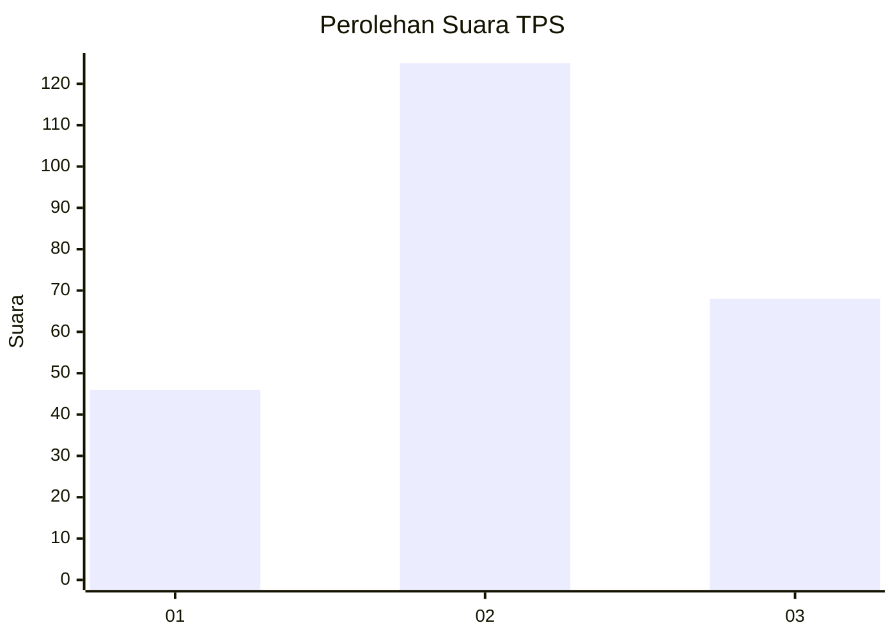
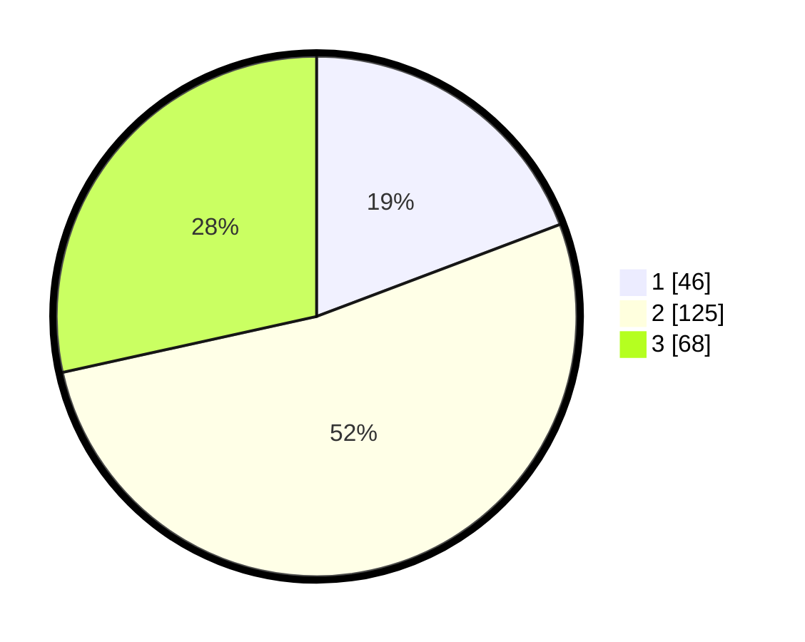

# Hasil

## Grafik

## Tabel

| No. | Nama Paslon    | Suara | Suara (raw) | Persentase |
|:--- |:-------------- | -----:| -----------:| ----------:|
| 1   | ANIES MUHAIMIN | 46    | [46][p-1]   | 19,25      |
| 2   | PRABOWO GIBRAN | 125   | [125][p-2]  | 52,30      |
| 3   | GANJAR MAHFUD  | 68    | [68][p-3]   | 28,45      |

[p-1]: https://github.com/gigit-pemilu/pemilu-2024/blob/main/pilpres/hitung-suara/sub/33-jawa-tengah/sub/02-banyumas/sub/21-sumbang/sub/2005-tambaksogra/sub/003-tps/sub/paslon-1.txt
[p-2]: https://github.com/gigit-pemilu/pemilu-2024/blob/main/pilpres/hitung-suara/sub/33-jawa-tengah/sub/02-banyumas/sub/21-sumbang/sub/2005-tambaksogra/sub/003-tps/sub/paslon-2.txt
[p-3]: https://github.com/gigit-pemilu/pemilu-2024/blob/main/pilpres/hitung-suara/sub/33-jawa-tengah/sub/02-banyumas/sub/21-sumbang/sub/2005-tambaksogra/sub/003-tps/sub/paslon-3.txt

## Foto C Plano

https://sirekap-obj-formc.kpu.go.id/18b7/pemilu/ppwp/33/02/21/20/05/3302212005003-20240214-225125--b2c42da7-5cee-4dc7-a7ca-194034f4cf47.jpg

https://sirekap-obj-formc.kpu.go.id/18b7/pemilu/ppwp/33/02/21/20/05/3302212005003-20240214-225233--f906c5d0-0004-46f0-8217-917b1ac2f490.jpg

https://sirekap-obj-formc.kpu.go.id/18b7/pemilu/ppwp/33/02/21/20/05/3302212005003-20240214-225312--a54591f6-6b4f-4624-9d93-ad864bd324c9.jpg

## Metadata

| Key        | Value               |
| ---------- | ------------------- |
| Time Stamp | 2024-02-16 23:00:00 |

