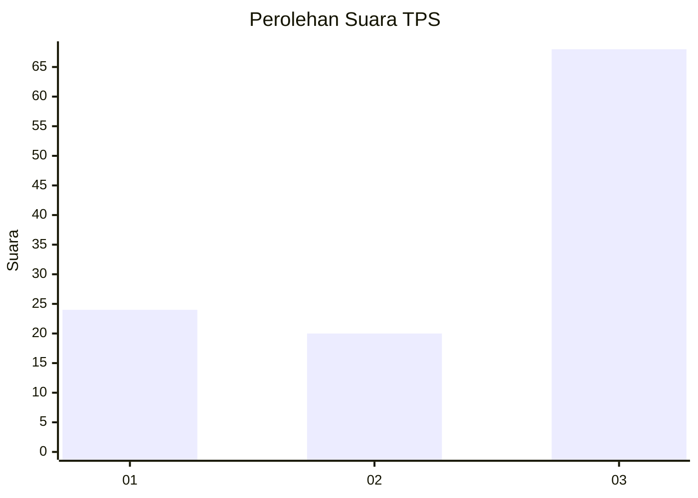
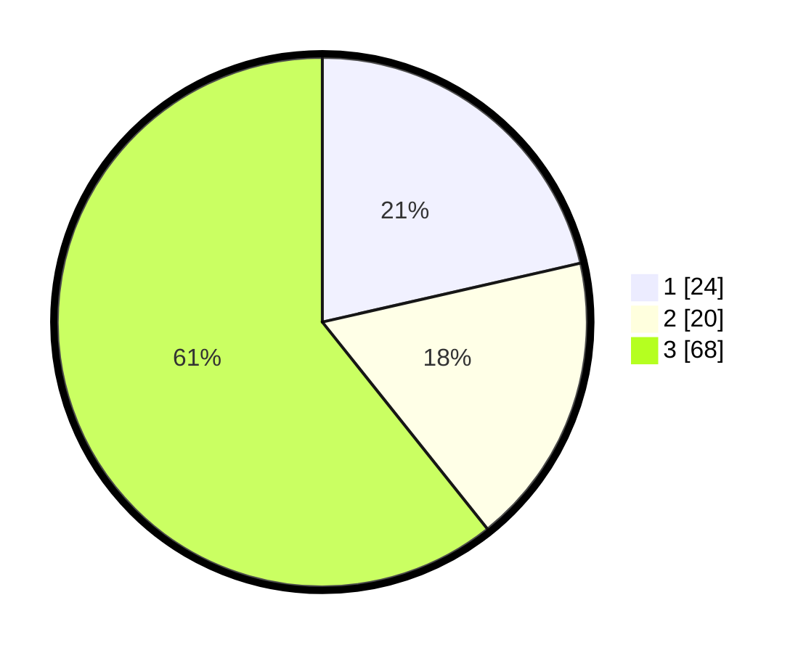

# Hasil

## Grafik

## Tabel

| No. | Nama Paslon    | Suara | Suara (raw) | Persentase |
|:--- |:-------------- | -----:| -----------:| ----------:|
| 1   | ANIES MUHAIMIN | 24    | [24][p-1]   | 21,43      |
| 2   | PRABOWO GIBRAN | 20    | [20][p-2]   | 17,86      |
| 3   | GANJAR MAHFUD  | 68    | [68][p-3]   | 60,71      |

[p-1]: https://github.com/gigit-pemilu/pemilu-2024/blob/main/pilpres/hitung-suara/sub/33-jawa-tengah/sub/02-banyumas/sub/21-sumbang/sub/2005-tambaksogra/sub/008-tps/sub/paslon-1.txt
[p-2]: https://github.com/gigit-pemilu/pemilu-2024/blob/main/pilpres/hitung-suara/sub/33-jawa-tengah/sub/02-banyumas/sub/21-sumbang/sub/2005-tambaksogra/sub/008-tps/sub/paslon-2.txt
[p-3]: https://github.com/gigit-pemilu/pemilu-2024/blob/main/pilpres/hitung-suara/sub/33-jawa-tengah/sub/02-banyumas/sub/21-sumbang/sub/2005-tambaksogra/sub/008-tps/sub/paslon-3.txt

## Foto C Plano

https://sirekap-obj-formc.kpu.go.id/345d/pemilu/ppwp/33/02/21/20/05/3302212005008-20240214-155814--c413e1ba-6db1-4ada-9d8b-c625311ac447.jpg

https://sirekap-obj-formc.kpu.go.id/345d/pemilu/ppwp/33/02/21/20/05/3302212005008-20240214-234804--5bfe19c1-4efd-4649-9858-1f6d9582e973.jpg

https://sirekap-obj-formc.kpu.go.id/345d/pemilu/ppwp/33/02/21/20/05/3302212005008-20240214-234808--a88dd866-5c60-444a-b32a-4d139b368452.jpg

## Metadata

| Key        | Value               |
| ---------- | ------------------- |
| Time Stamp | 2024-02-22 13:00:00 |

