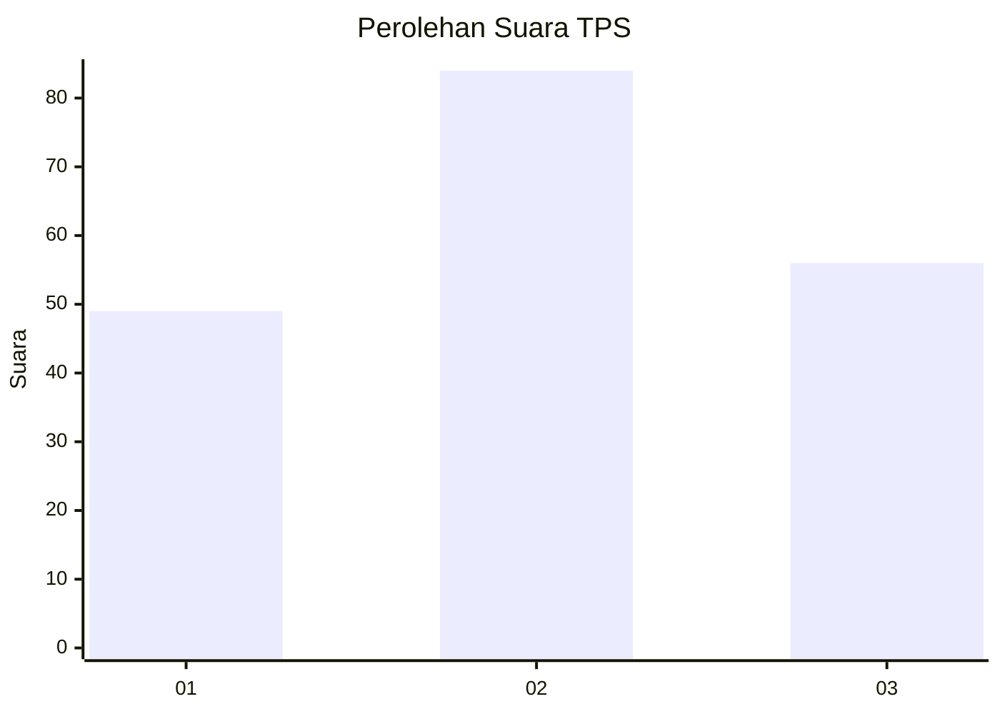
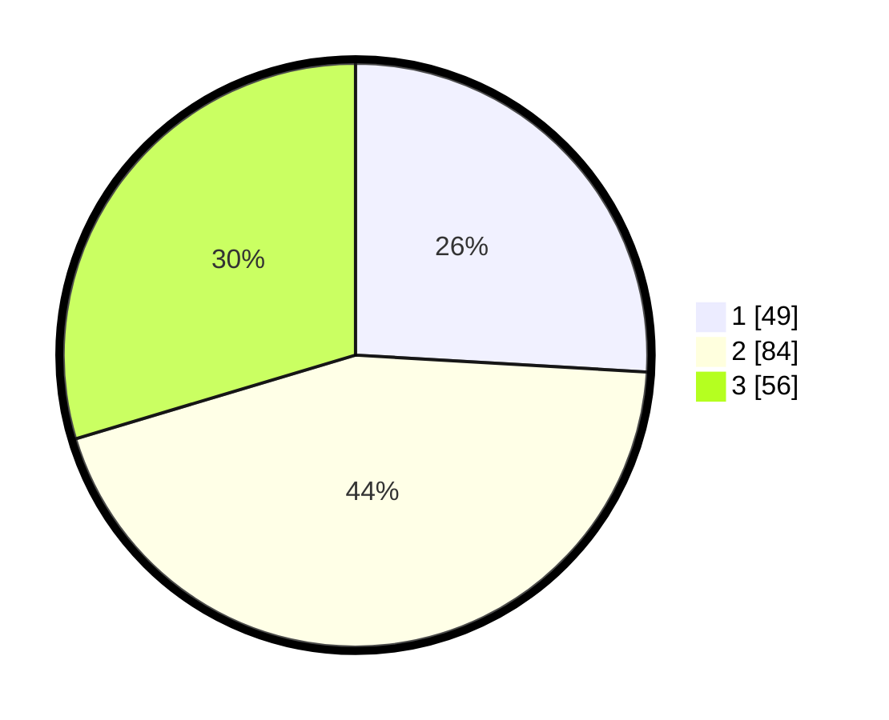

# Hasil

## Grafik

## Tabel

| No. | Nama Paslon    | Suara | Suara (raw) | Persentase |
|:--- |:-------------- | -----:| -----------:| ----------:|
| 1   | ANIES MUHAIMIN | 49    | [49][p-1]   | 25,93      |
| 2   | PRABOWO GIBRAN | 84    | [84][p-2]   | 44,44      |
| 3   | GANJAR MAHFUD  | 56    | [56][p-3]   | 29,63      |

[p-1]: https://github.com/gigit-pemilu/pemilu-2024/blob/main/pilpres/hitung-suara/sub/33-jawa-tengah/sub/02-banyumas/sub/21-sumbang/sub/2008-karanggintung/sub/005-tps/sub/paslon-1.txt
[p-2]: https://github.com/gigit-pemilu/pemilu-2024/blob/main/pilpres/hitung-suara/sub/33-jawa-tengah/sub/02-banyumas/sub/21-sumbang/sub/2008-karanggintung/sub/005-tps/sub/paslon-2.txt
[p-3]: https://github.com/gigit-pemilu/pemilu-2024/blob/main/pilpres/hitung-suara/sub/33-jawa-tengah/sub/02-banyumas/sub/21-sumbang/sub/2008-karanggintung/sub/005-tps/sub/paslon-3.txt

## Foto C Plano

https://sirekap-obj-formc.kpu.go.id/0fae/pemilu/ppwp/33/02/21/20/08/3302212008005-20240214-234425--05a3a306-ed68-4348-9cd4-91f23e1b1fa7.jpg

https://sirekap-obj-formc.kpu.go.id/0fae/pemilu/ppwp/33/02/21/20/08/3302212008005-20240214-211212--9eb73d92-be72-4a5e-ab84-fdf0a6545258.jpg

https://sirekap-obj-formc.kpu.go.id/0fae/pemilu/ppwp/33/02/21/20/08/3302212008005-20240214-211228--0c377839-4ecb-4209-809e-21ce3b90aa8c.jpg

## Metadata

| Key        | Value               |
| ---------- | ------------------- |
| Time Stamp | 2024-02-16 23:00:00 |

