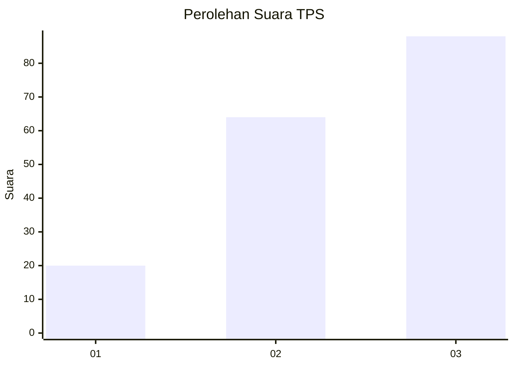
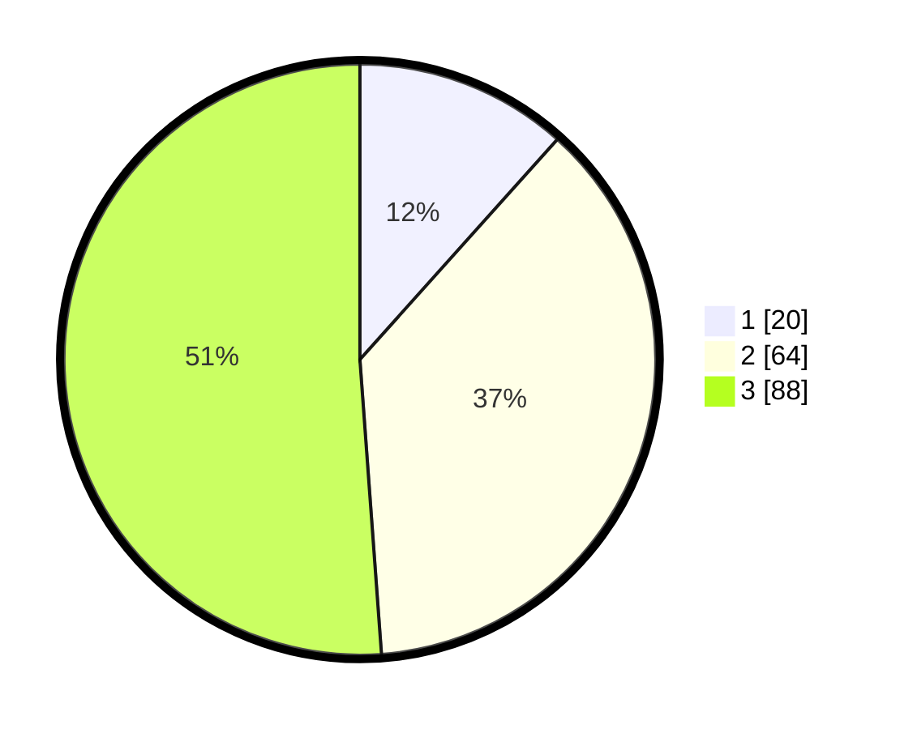

# Hasil

## Grafik

## Tabel

| No. | Nama Paslon    | Suara | Suara (raw) | Persentase |
|:--- |:-------------- | -----:| -----------:| ----------:|
| 1   | ANIES MUHAIMIN | 20    | [20][p-1]   | 11,63      |
| 2   | PRABOWO GIBRAN | 64    | [64][p-2]   | 37,21      |
| 3   | GANJAR MAHFUD  | 88    | [88][p-3]   | 51,16      |

[p-1]: https://github.com/gigit-pemilu/pemilu-2024/blob/main/pilpres/hitung-suara/sub/33-jawa-tengah/sub/02-banyumas/sub/21-sumbang/sub/2008-karanggintung/sub/012-tps/sub/paslon-1.txt
[p-2]: https://github.com/gigit-pemilu/pemilu-2024/blob/main/pilpres/hitung-suara/sub/33-jawa-tengah/sub/02-banyumas/sub/21-sumbang/sub/2008-karanggintung/sub/012-tps/sub/paslon-2.txt
[p-3]: https://github.com/gigit-pemilu/pemilu-2024/blob/main/pilpres/hitung-suara/sub/33-jawa-tengah/sub/02-banyumas/sub/21-sumbang/sub/2008-karanggintung/sub/012-tps/sub/paslon-3.txt

## Foto C Plano

https://sirekap-obj-formc.kpu.go.id/f9b8/pemilu/ppwp/33/02/21/20/08/3302212008012-20240214-210400--d2dd7cb1-2188-4b87-9cfa-a1d84bf96d72.jpg

https://sirekap-obj-formc.kpu.go.id/f9b8/pemilu/ppwp/33/02/21/20/08/3302212008012-20240214-210506--a72d322e-a728-424f-bc72-681561f3b6c3.jpg

https://sirekap-obj-formc.kpu.go.id/f9b8/pemilu/ppwp/33/02/21/20/08/3302212008012-20240214-210602--18df81b4-5d58-45e3-96fc-569ec432ec50.jpg

## Metadata

| Key        | Value               |
| ---------- | ------------------- |
| Time Stamp | 2024-02-16 23:00:00 |

