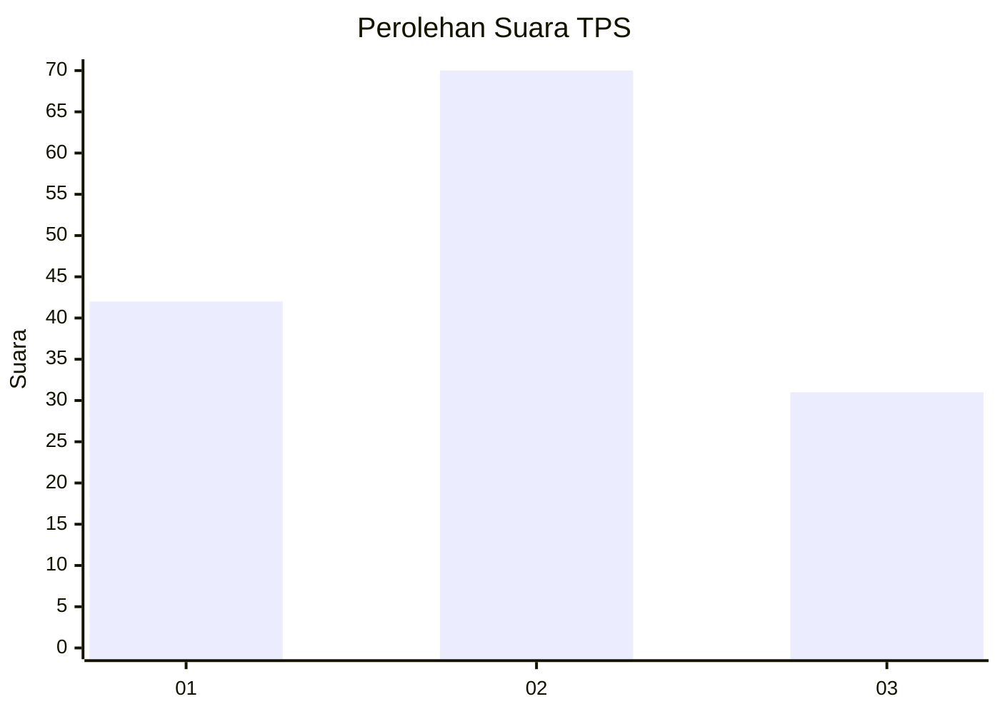
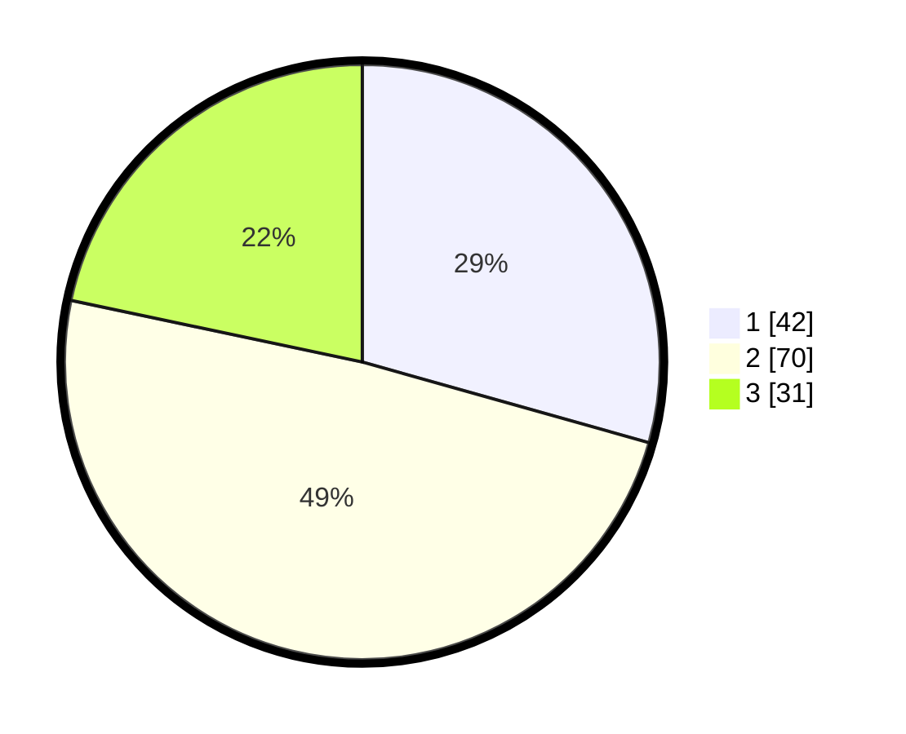

# Hasil

## Grafik

## Tabel

| No. | Nama Paslon    | Suara | Suara (raw) | Persentase |
|:--- |:-------------- | -----:| -----------:| ----------:|
| 1   | ANIES MUHAIMIN | 42    | [42][p-1]   | 29,37      |
| 2   | PRABOWO GIBRAN | 70    | [70][p-2]   | 48,95      |
| 3   | GANJAR MAHFUD  | 31    | [31][p-3]   | 21,68      |

[p-1]: https://github.com/gigit-pemilu/pemilu-2024/blob/main/pilpres/hitung-suara/sub/33-jawa-tengah/sub/02-banyumas/sub/21-sumbang/sub/2008-karanggintung/sub/013-tps/sub/paslon-1.txt
[p-2]: https://github.com/gigit-pemilu/pemilu-2024/blob/main/pilpres/hitung-suara/sub/33-jawa-tengah/sub/02-banyumas/sub/21-sumbang/sub/2008-karanggintung/sub/013-tps/sub/paslon-2.txt
[p-3]: https://github.com/gigit-pemilu/pemilu-2024/blob/main/pilpres/hitung-suara/sub/33-jawa-tengah/sub/02-banyumas/sub/21-sumbang/sub/2008-karanggintung/sub/013-tps/sub/paslon-3.txt

## Foto C Plano

https://sirekap-obj-formc.kpu.go.id/a027/pemilu/ppwp/33/02/21/20/08/3302212008013-20240215-003524--3e81115b-f298-4d09-bba5-22cb2b3dd1b6.jpg

https://sirekap-obj-formc.kpu.go.id/a027/pemilu/ppwp/33/02/21/20/08/3302212008013-20240215-003351--9b6915d1-d428-4e80-9908-c1473cf349ff.jpg

https://sirekap-obj-formc.kpu.go.id/a027/pemilu/ppwp/33/02/21/20/08/3302212008013-20240215-031452--f35d4440-9f50-43b0-bd21-1b080c98ad2e.jpg

## Metadata

| Key        | Value               |
| ---------- | ------------------- |
| Time Stamp | 2024-02-16 23:00:00 |

