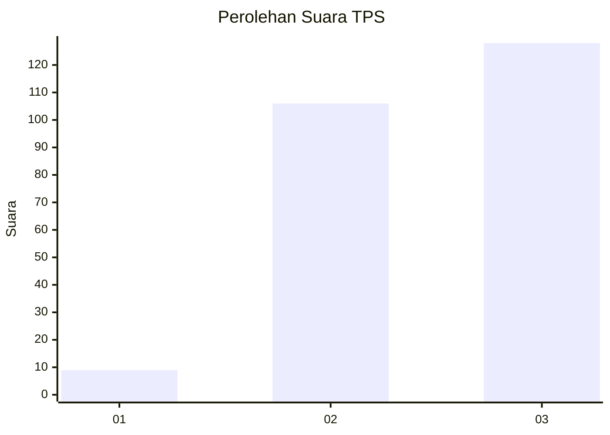
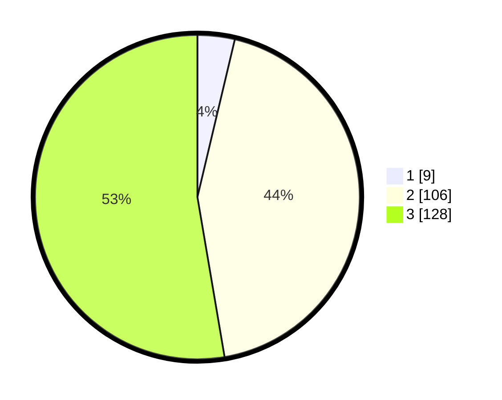

# Hasil

## Grafik

## Tabel

| No. | Nama Paslon    | Suara | Suara (raw) | Persentase |
|:--- |:-------------- | -----:| -----------:| ----------:|
| 1   | ANIES MUHAIMIN | 9     | [9][p-1]    | 3,70       |
| 2   | PRABOWO GIBRAN | 106   | [106][p-2]  | 43,62      |
| 3   | GANJAR MAHFUD  | 128   | [128][p-3]  | 52,67      |

[p-1]: https://github.com/gigit-pemilu/pemilu-2024/blob/main/pilpres/hitung-suara/sub/33-jawa-tengah/sub/02-banyumas/sub/21-sumbang/sub/2010-banjarsari-kulon/sub/003-tps/sub/paslon-1.txt
[p-2]: https://github.com/gigit-pemilu/pemilu-2024/blob/main/pilpres/hitung-suara/sub/33-jawa-tengah/sub/02-banyumas/sub/21-sumbang/sub/2010-banjarsari-kulon/sub/003-tps/sub/paslon-2.txt
[p-3]: https://github.com/gigit-pemilu/pemilu-2024/blob/main/pilpres/hitung-suara/sub/33-jawa-tengah/sub/02-banyumas/sub/21-sumbang/sub/2010-banjarsari-kulon/sub/003-tps/sub/paslon-3.txt

## Foto C Plano

https://sirekap-obj-formc.kpu.go.id/b1f6/pemilu/ppwp/33/02/21/20/10/3302212010003-20240214-203511--7f7ca0ee-511c-4ecc-96fa-6ed77c1dfa6b.jpg

https://sirekap-obj-formc.kpu.go.id/b1f6/pemilu/ppwp/33/02/21/20/10/3302212010003-20240214-203523--b6929e26-7087-47a9-8839-48cc1ce418a0.jpg

https://sirekap-obj-formc.kpu.go.id/b1f6/pemilu/ppwp/33/02/21/20/10/3302212010003-20240214-203556--712e37f6-543f-40bc-b463-02ab486c5ee6.jpg

## Metadata

| Key        | Value               |
| ---------- | ------------------- |
| Time Stamp | 2024-02-22 13:00:00 |

