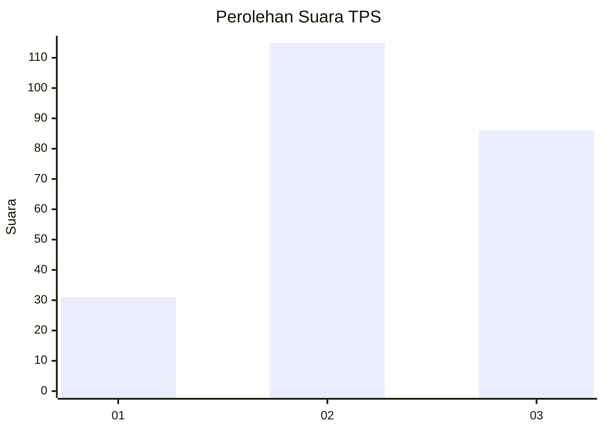
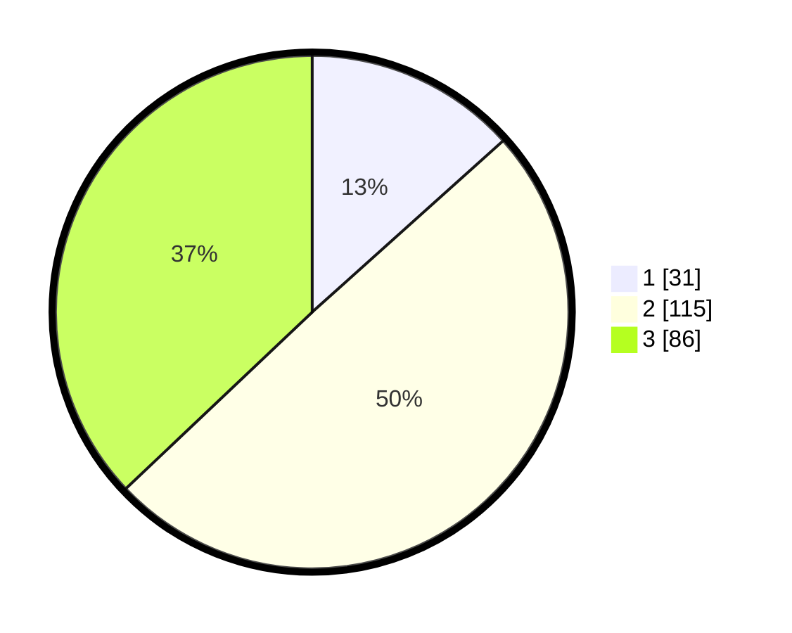

# Hasil

## Grafik

## Tabel

| No. | Nama Paslon    | Suara | Suara (raw) | Persentase |
|:--- |:-------------- | -----:| -----------:| ----------:|
| 1   | ANIES MUHAIMIN | 31    | [31][p-1]   | 13,36      |
| 2   | PRABOWO GIBRAN | 115   | [115][p-2]  | 49,57      |
| 3   | GANJAR MAHFUD  | 86    | [86][p-3]   | 37,07      |

[p-1]: https://github.com/gigit-pemilu/pemilu-2024/blob/main/pilpres/hitung-suara/sub/33-jawa-tengah/sub/02-banyumas/sub/21-sumbang/sub/2012-banteran/sub/017-tps/sub/paslon-1.txt
[p-2]: https://github.com/gigit-pemilu/pemilu-2024/blob/main/pilpres/hitung-suara/sub/33-jawa-tengah/sub/02-banyumas/sub/21-sumbang/sub/2012-banteran/sub/017-tps/sub/paslon-2.txt
[p-3]: https://github.com/gigit-pemilu/pemilu-2024/blob/main/pilpres/hitung-suara/sub/33-jawa-tengah/sub/02-banyumas/sub/21-sumbang/sub/2012-banteran/sub/017-tps/sub/paslon-3.txt

## Foto C Plano

https://sirekap-obj-formc.kpu.go.id/fecf/pemilu/ppwp/33/02/21/20/12/3302212012017-20240215-010034--9c1eba76-5ce9-4f4d-bc5f-b3ecfb81ea25.jpg

https://sirekap-obj-formc.kpu.go.id/fecf/pemilu/ppwp/33/02/21/20/12/3302212012017-20240215-010219--6f0d2e6c-2189-4d56-813d-ec454ac88397.jpg

https://sirekap-obj-formc.kpu.go.id/fecf/pemilu/ppwp/33/02/21/20/12/3302212012017-20240215-010704--62ec5bf9-ae27-45e0-a58c-eba70ae76cb0.jpg

## Metadata

| Key        | Value               |
| ---------- | ------------------- |
| Time Stamp | 2024-02-16 23:00:00 |

