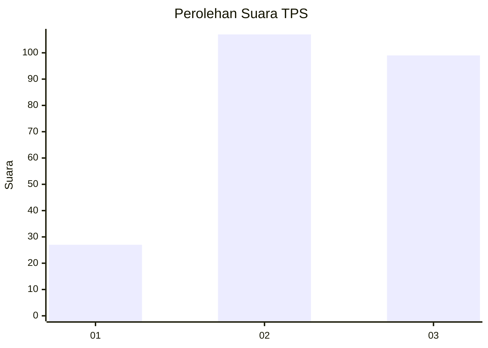
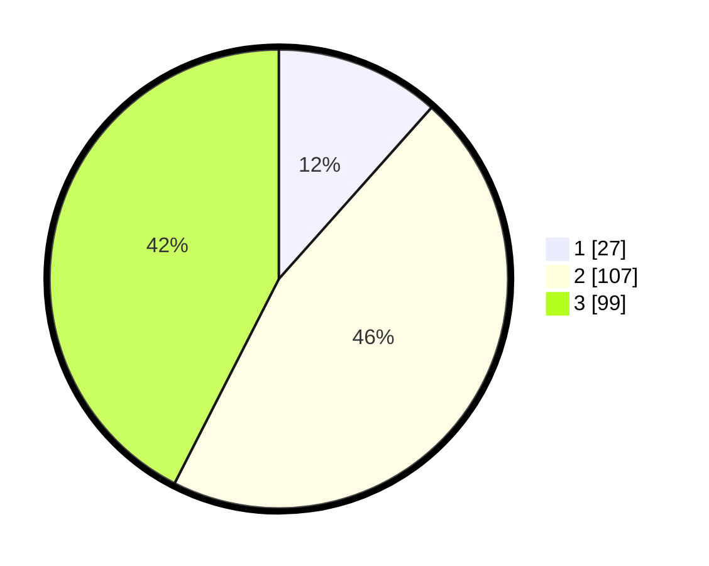

# Hasil

## Grafik

## Tabel

| No. | Nama Paslon    | Suara | Suara (raw) | Persentase |
|:--- |:-------------- | -----:| -----------:| ----------:|
| 1   | ANIES MUHAIMIN | 27    | [27][p-1]   | 11,59      |
| 2   | PRABOWO GIBRAN | 107   | [107][p-2]  | 45,92      |
| 3   | GANJAR MAHFUD  | 99    | [99][p-3]   | 42,49      |

[p-1]: https://github.com/gigit-pemilu/pemilu-2024-33-jawa-tengah/blob/main/pilpres/hitung-suara/sub/33-jawa-tengah/sub/02-banyumas/sub/21-sumbang/sub/2015-sikapat/sub/001-tps/sub/paslon-1.txt
[p-2]: https://github.com/gigit-pemilu/pemilu-2024-33-jawa-tengah/blob/main/pilpres/hitung-suara/sub/33-jawa-tengah/sub/02-banyumas/sub/21-sumbang/sub/2015-sikapat/sub/001-tps/sub/paslon-2.txt
[p-3]: https://github.com/gigit-pemilu/pemilu-2024-33-jawa-tengah/blob/main/pilpres/hitung-suara/sub/33-jawa-tengah/sub/02-banyumas/sub/21-sumbang/sub/2015-sikapat/sub/001-tps/sub/paslon-3.txt

## Foto C Plano

https://sirekap-obj-formc.kpu.go.id/7516/pemilu/ppwp/33/02/21/20/15/3302212015001-20240214-222703--9708c67d-9d5c-4a08-9a57-c773b001a1d2.jpg

https://sirekap-obj-formc.kpu.go.id/7516/pemilu/ppwp/33/02/21/20/15/3302212015001-20240214-155213--0c3687f4-afc7-4d25-94f3-80861f472262.jpg

https://sirekap-obj-formc.kpu.go.id/7516/pemilu/ppwp/33/02/21/20/15/3302212015001-20240214-223010--2f1eedfe-3e38-41b3-a016-8b0424c29755.jpg

## Metadata

| Key        | Value               |
| ---------- | ------------------- |
| Time Stamp | 2024-02-15 15:00:29 |

