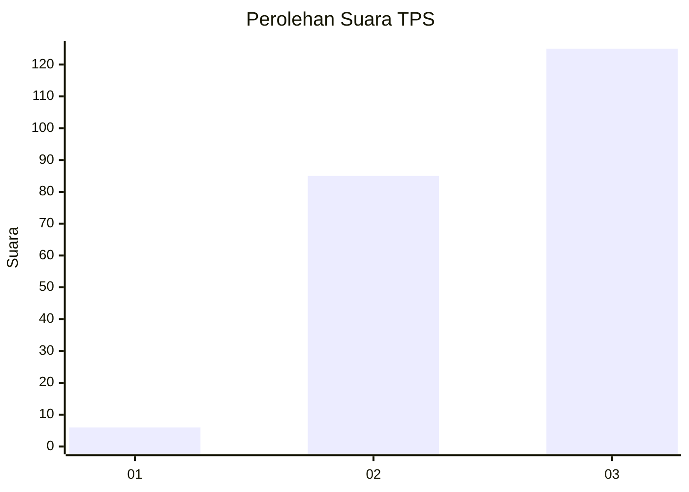
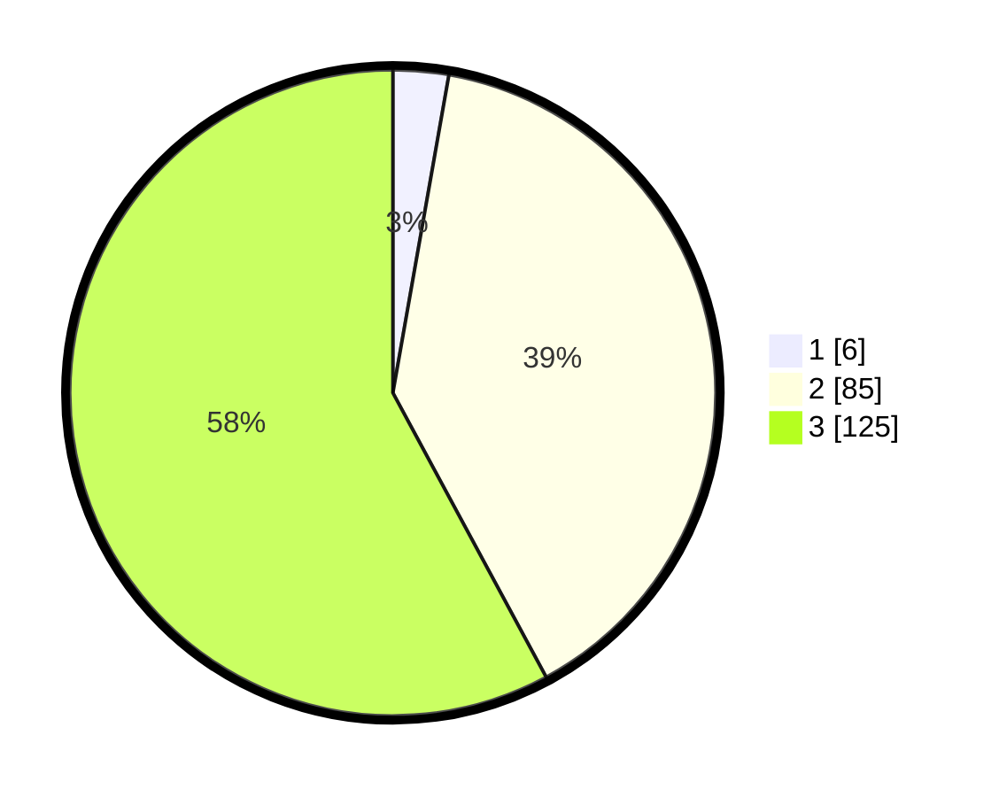

# Hasil

## Grafik

## Tabel

| No. | Nama Paslon    | Suara | Suara (raw) | Persentase |
|:--- |:-------------- | -----:| -----------:| ----------:|
| 1   | ANIES MUHAIMIN | 6     | [6][p-1]    | 2,78       |
| 2   | PRABOWO GIBRAN | 85    | [85][p-2]   | 39,35      |
| 3   | GANJAR MAHFUD  | 125   | [125][p-3]  | 57,87      |

[p-1]: https://github.com/gigit-pemilu/pemilu-2024-33-jawa-tengah/blob/main/pilpres/hitung-suara/sub/33-jawa-tengah/sub/02-banyumas/sub/21-sumbang/sub/2015-sikapat/sub/003-tps/sub/paslon-1.txt
[p-2]: https://github.com/gigit-pemilu/pemilu-2024-33-jawa-tengah/blob/main/pilpres/hitung-suara/sub/33-jawa-tengah/sub/02-banyumas/sub/21-sumbang/sub/2015-sikapat/sub/003-tps/sub/paslon-2.txt
[p-3]: https://github.com/gigit-pemilu/pemilu-2024-33-jawa-tengah/blob/main/pilpres/hitung-suara/sub/33-jawa-tengah/sub/02-banyumas/sub/21-sumbang/sub/2015-sikapat/sub/003-tps/sub/paslon-3.txt

## Foto C Plano

https://sirekap-obj-formc.kpu.go.id/db06/pemilu/ppwp/33/02/21/20/15/3302212015003-20240215-015403--d52426f2-4dc2-4d6c-8d88-70d10ed05e2a.jpg

https://sirekap-obj-formc.kpu.go.id/db06/pemilu/ppwp/33/02/21/20/15/3302212015003-20240215-015119--6d246038-8f97-496b-9bd0-767bc0525d66.jpg

https://sirekap-obj-formc.kpu.go.id/db06/pemilu/ppwp/33/02/21/20/15/3302212015003-20240215-014730--80d2fe89-4573-4500-a0ad-3c25fc48c625.jpg

## Metadata

| Key        | Value               |
| ---------- | ------------------- |
| Time Stamp | 2024-02-16 23:00:00 |

