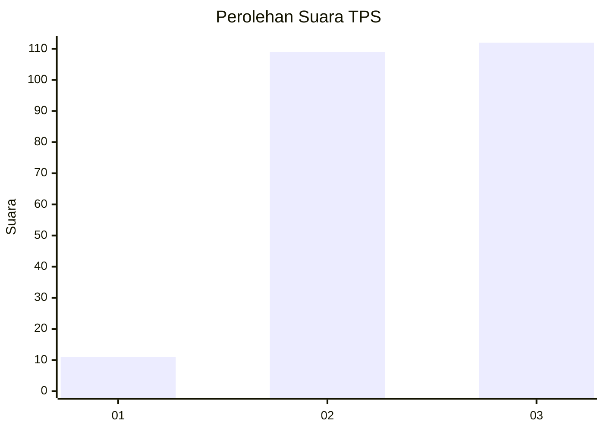
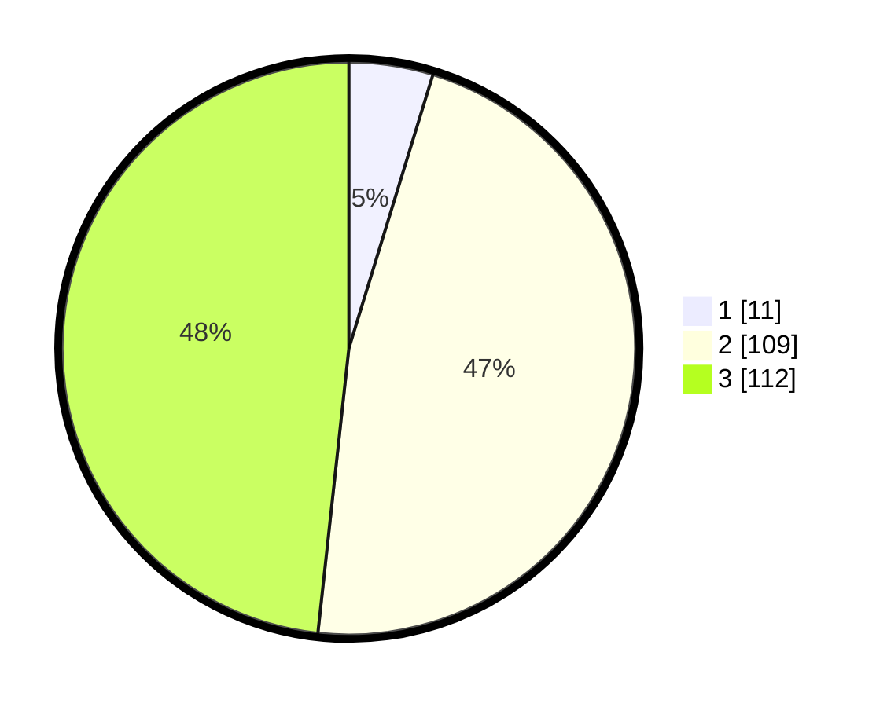

# Hasil

## Grafik

## Tabel

| No. | Nama Paslon    | Suara | Suara (raw) | Persentase |
|:--- |:-------------- | -----:| -----------:| ----------:|
| 1   | ANIES MUHAIMIN | 11    | [11][p-1]   | 4,74       |
| 2   | PRABOWO GIBRAN | 109   | [109][p-2]  | 46,98      |
| 3   | GANJAR MAHFUD  | 112   | [112][p-3]  | 48,28      |

[p-1]: https://github.com/gigit-pemilu/pemilu-2024-33-jawa-tengah/blob/main/pilpres/hitung-suara/sub/33-jawa-tengah/sub/02-banyumas/sub/21-sumbang/sub/2015-sikapat/sub/013-tps/sub/paslon-1.txt
[p-2]: https://github.com/gigit-pemilu/pemilu-2024-33-jawa-tengah/blob/main/pilpres/hitung-suara/sub/33-jawa-tengah/sub/02-banyumas/sub/21-sumbang/sub/2015-sikapat/sub/013-tps/sub/paslon-2.txt
[p-3]: https://github.com/gigit-pemilu/pemilu-2024-33-jawa-tengah/blob/main/pilpres/hitung-suara/sub/33-jawa-tengah/sub/02-banyumas/sub/21-sumbang/sub/2015-sikapat/sub/013-tps/sub/paslon-3.txt

## Foto C Plano

https://sirekap-obj-formc.kpu.go.id/5f29/pemilu/ppwp/33/02/21/20/15/3302212015013-20240215-011136--3a0130b2-0e99-4d0d-9d4e-7dcb4a803e78.jpg

https://sirekap-obj-formc.kpu.go.id/5f29/pemilu/ppwp/33/02/21/20/15/3302212015013-20240215-011326--8107eb57-8fce-496b-bb5c-f66dd2564558.jpg

https://sirekap-obj-formc.kpu.go.id/5f29/pemilu/ppwp/33/02/21/20/15/3302212015013-20240215-011517--daf0acba-7c49-40ca-8719-6641b72c1eb7.jpg

## Metadata

| Key        | Value               |
| ---------- | ------------------- |
| Time Stamp | 2024-02-25 12:00:00 |

