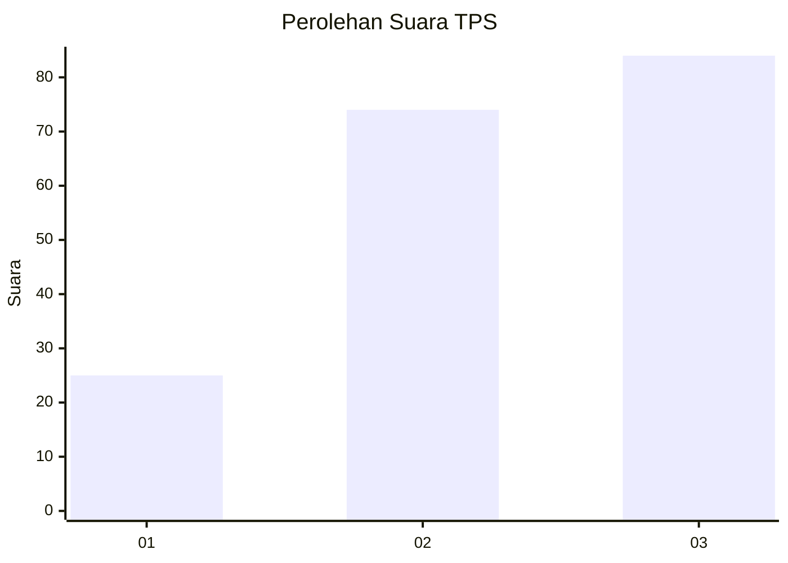
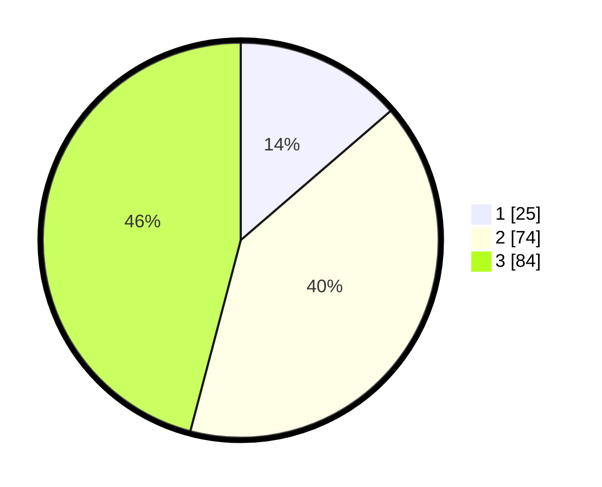

# Hasil

## Grafik

## Tabel

| No. | Nama Paslon    | Suara | Suara (raw) | Persentase |
|:--- |:-------------- | -----:| -----------:| ----------:|
| 1   | ANIES MUHAIMIN | 25    | [25][p-1]   | 13,66      |
| 2   | PRABOWO GIBRAN | 74    | [74][p-2]   | 40,44      |
| 3   | GANJAR MAHFUD  | 84    | [84][p-3]   | 45,90      |

[p-1]: https://github.com/gigit-pemilu/pemilu-2024/blob/main/pilpres/hitung-suara/sub/33-jawa-tengah/sub/02-banyumas/sub/21-sumbang/sub/2016-gandatapa/sub/004-tps/sub/paslon-1.txt
[p-2]: https://github.com/gigit-pemilu/pemilu-2024/blob/main/pilpres/hitung-suara/sub/33-jawa-tengah/sub/02-banyumas/sub/21-sumbang/sub/2016-gandatapa/sub/004-tps/sub/paslon-2.txt
[p-3]: https://github.com/gigit-pemilu/pemilu-2024/blob/main/pilpres/hitung-suara/sub/33-jawa-tengah/sub/02-banyumas/sub/21-sumbang/sub/2016-gandatapa/sub/004-tps/sub/paslon-3.txt

## Foto C Plano

https://sirekap-obj-formc.kpu.go.id/23f0/pemilu/ppwp/33/02/21/20/16/3302212016004-20240215-022959--ed310ae4-05e5-4d48-bec6-acd6bf19aaee.jpg

https://sirekap-obj-formc.kpu.go.id/23f0/pemilu/ppwp/33/02/21/20/16/3302212016004-20240215-022529--7cd5137d-586d-4e99-b9a3-01c4bb2e1b64.jpg

https://sirekap-obj-formc.kpu.go.id/23f0/pemilu/ppwp/33/02/21/20/16/3302212016004-20240215-023120--fb864c92-ce65-4f9f-9cc0-4bf1aa72b299.jpg

## Metadata

| Key        | Value               |
| ---------- | ------------------- |
| Time Stamp | 2024-02-25 11:00:00 |

