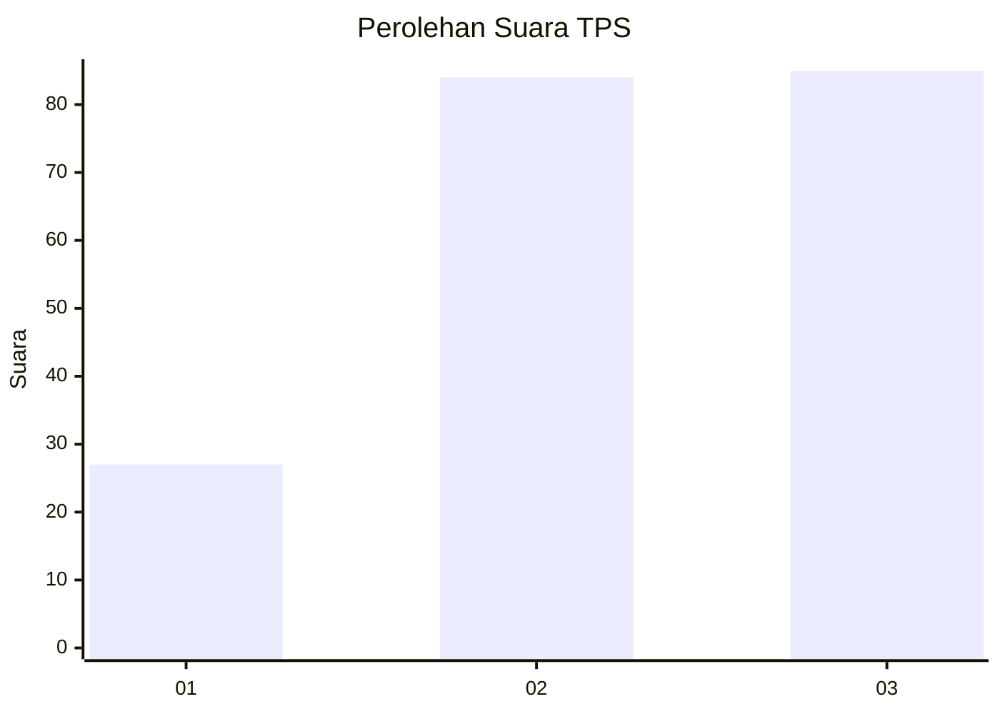
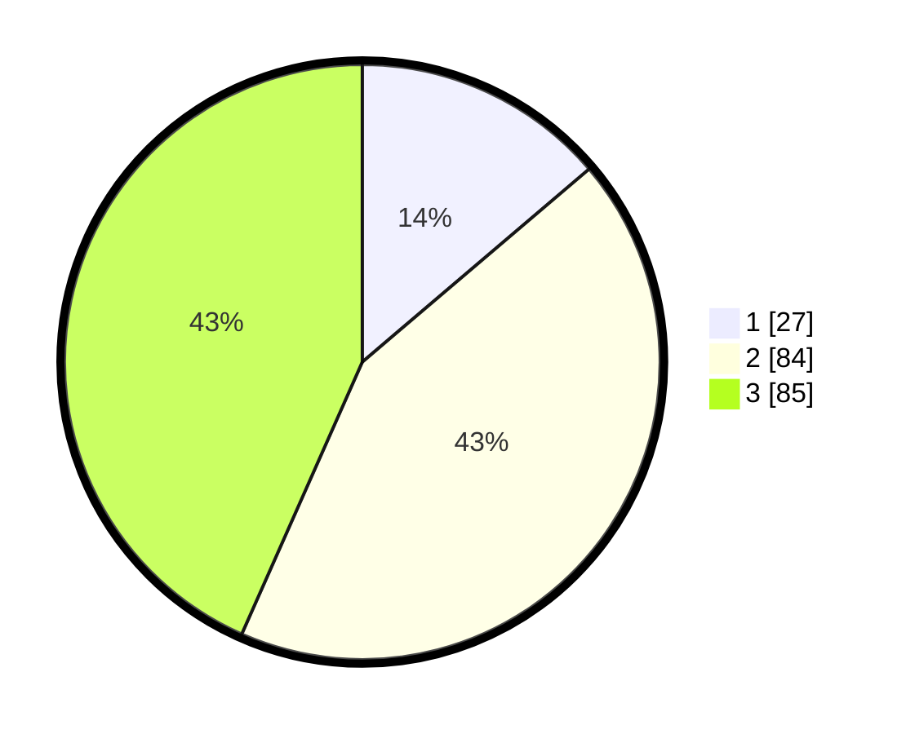

# Hasil

## Grafik

## Tabel

| No. | Nama Paslon    | Suara | Suara (raw) | Persentase |
|:--- |:-------------- | -----:| -----------:| ----------:|
| 1   | ANIES MUHAIMIN | 27    | [27][p-1]   | 13,78      |
| 2   | PRABOWO GIBRAN | 84    | [84][p-2]   | 42,86      |
| 3   | GANJAR MAHFUD  | 85    | [85][p-3]   | 43,37      |

[p-1]: https://github.com/gigit-pemilu/pemilu-2024-33-jawa-tengah/blob/main/pilpres/hitung-suara/sub/33-jawa-tengah/sub/02-banyumas/sub/21-sumbang/sub/2016-gandatapa/sub/009-tps/sub/paslon-1.txt
[p-2]: https://github.com/gigit-pemilu/pemilu-2024-33-jawa-tengah/blob/main/pilpres/hitung-suara/sub/33-jawa-tengah/sub/02-banyumas/sub/21-sumbang/sub/2016-gandatapa/sub/009-tps/sub/paslon-2.txt
[p-3]: https://github.com/gigit-pemilu/pemilu-2024-33-jawa-tengah/blob/main/pilpres/hitung-suara/sub/33-jawa-tengah/sub/02-banyumas/sub/21-sumbang/sub/2016-gandatapa/sub/009-tps/sub/paslon-3.txt

## Foto C Plano

https://sirekap-obj-formc.kpu.go.id/0b7a/pemilu/ppwp/33/02/21/20/16/3302212016009-20240215-014039--8b9ad34a-b12c-4df8-91b6-56a17b66e3ac.jpg

https://sirekap-obj-formc.kpu.go.id/0b7a/pemilu/ppwp/33/02/21/20/16/3302212016009-20240215-022707--cc38f98c-752a-4dc4-84f0-a226ceaea7f1.jpg

https://sirekap-obj-formc.kpu.go.id/0b7a/pemilu/ppwp/33/02/21/20/16/3302212016009-20240215-022231--6241dfe8-e129-4b88-9c5f-d0b4f3e74535.jpg

## Metadata

| Key        | Value               |
| ---------- | ------------------- |
| Time Stamp | 2024-02-24 22:31:28 |

