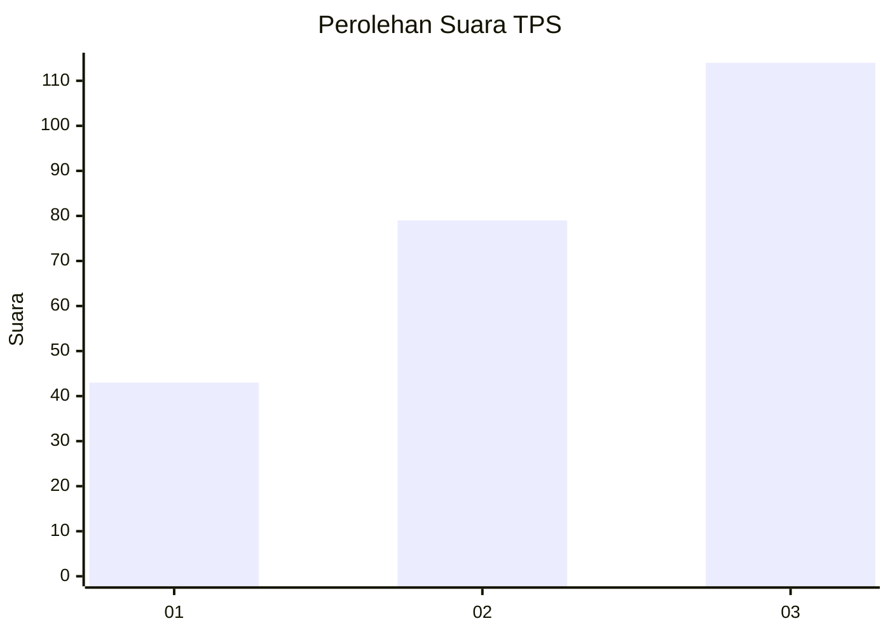
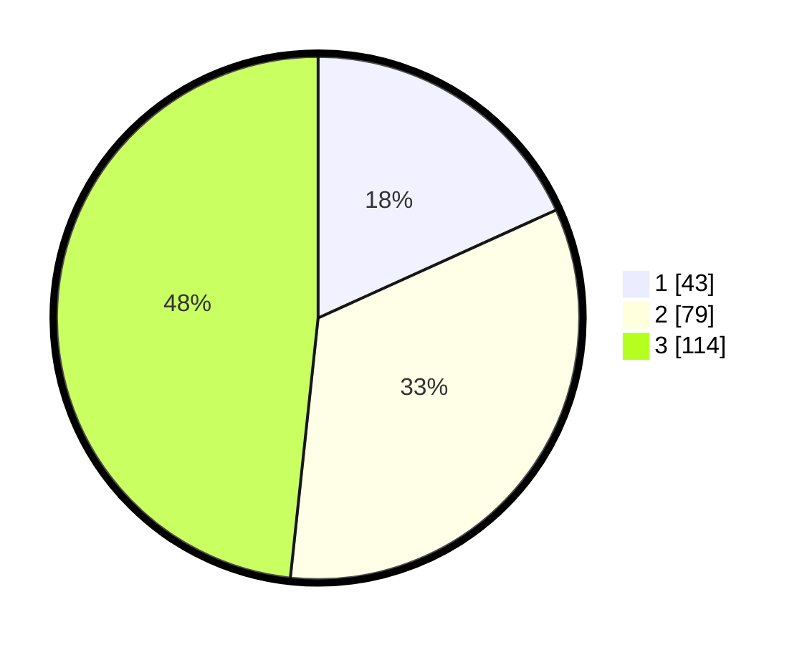

# Hasil

## Grafik

## Tabel

| No. | Nama Paslon    | Suara | Suara (raw) | Persentase |
|:--- |:-------------- | -----:| -----------:| ----------:|
| 1   | ANIES MUHAIMIN | 43    | [43][p-1]   | 18,22      |
| 2   | PRABOWO GIBRAN | 79    | [79][p-2]   | 33,47      |
| 3   | GANJAR MAHFUD  | 114   | [114][p-3]  | 48,31      |

[p-1]: https://github.com/gigit-pemilu/pemilu-2024/blob/main/pilpres/hitung-suara/sub/33-jawa-tengah/sub/02-banyumas/sub/21-sumbang/sub/2017-kotayasa/sub/020-tps/sub/paslon-1.txt
[p-2]: https://github.com/gigit-pemilu/pemilu-2024/blob/main/pilpres/hitung-suara/sub/33-jawa-tengah/sub/02-banyumas/sub/21-sumbang/sub/2017-kotayasa/sub/020-tps/sub/paslon-2.txt
[p-3]: https://github.com/gigit-pemilu/pemilu-2024/blob/main/pilpres/hitung-suara/sub/33-jawa-tengah/sub/02-banyumas/sub/21-sumbang/sub/2017-kotayasa/sub/020-tps/sub/paslon-3.txt

## Foto C Plano

https://sirekap-obj-formc.kpu.go.id/26c3/pemilu/ppwp/33/02/21/20/17/3302212017020-20240215-001357--f4429d54-f3b8-4092-8a43-9b024491f367.jpg

https://sirekap-obj-formc.kpu.go.id/26c3/pemilu/ppwp/33/02/21/20/17/3302212017020-20240215-001455--6d462c77-4afd-4bfb-a737-f6dd7953f698.jpg

https://sirekap-obj-formc.kpu.go.id/26c3/pemilu/ppwp/33/02/21/20/17/3302212017020-20240215-001652--19cc1a08-76af-4262-af2f-feed357dba55.jpg

## Metadata

| Key        | Value               |
| ---------- | ------------------- |
| Time Stamp | 2024-02-24 22:31:28 |

