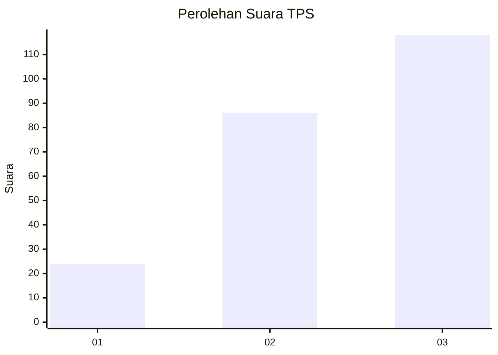
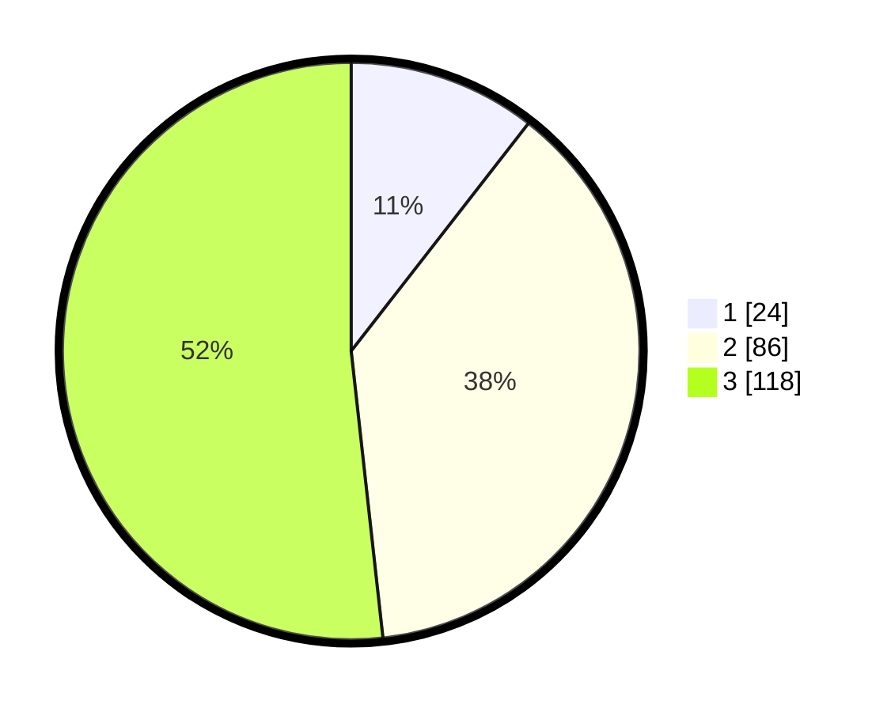

# Hasil

## Grafik

## Tabel

| No. | Nama Paslon    | Suara | Suara (raw) | Persentase |
|:--- |:-------------- | -----:| -----------:| ----------:|
| 1   | ANIES MUHAIMIN | 24    | [24][p-1]   | 10,53      |
| 2   | PRABOWO GIBRAN | 86    | [86][p-2]   | 37,72      |
| 3   | GANJAR MAHFUD  | 118   | [118][p-3]  | 51,75      |

[p-1]: https://github.com/gigit-pemilu/pemilu-2024/blob/main/pilpres/hitung-suara/sub/33-jawa-tengah/sub/02-banyumas/sub/21-sumbang/sub/2017-kotayasa/sub/021-tps/sub/paslon-1.txt
[p-2]: https://github.com/gigit-pemilu/pemilu-2024/blob/main/pilpres/hitung-suara/sub/33-jawa-tengah/sub/02-banyumas/sub/21-sumbang/sub/2017-kotayasa/sub/021-tps/sub/paslon-2.txt
[p-3]: https://github.com/gigit-pemilu/pemilu-2024/blob/main/pilpres/hitung-suara/sub/33-jawa-tengah/sub/02-banyumas/sub/21-sumbang/sub/2017-kotayasa/sub/021-tps/sub/paslon-3.txt

## Foto C Plano

https://sirekap-obj-formc.kpu.go.id/4196/pemilu/ppwp/33/02/21/20/17/3302212017021-20240215-012142--bca54038-df43-4b2d-b5dd-53261f7f845a.jpg

https://sirekap-obj-formc.kpu.go.id/4196/pemilu/ppwp/33/02/21/20/17/3302212017021-20240215-012345--ca1ae0e1-0028-47ae-8ef0-3396b8ef3ea6.jpg

https://sirekap-obj-formc.kpu.go.id/4196/pemilu/ppwp/33/02/21/20/17/3302212017021-20240215-012442--bcece1c3-3374-4763-ab41-963380c56d40.jpg

## Metadata

| Key        | Value               |
| ---------- | ------------------- |
| Time Stamp | 2024-02-24 22:31:28 |

