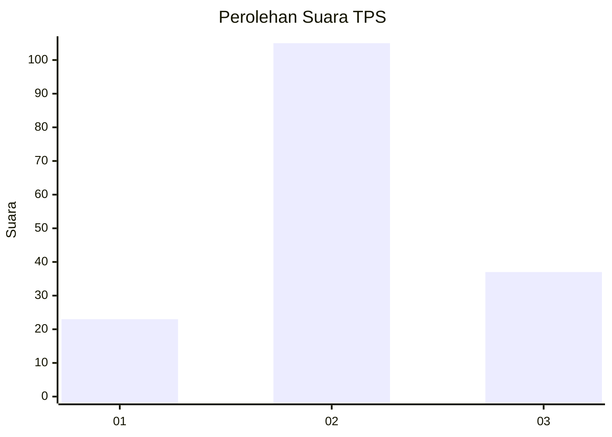
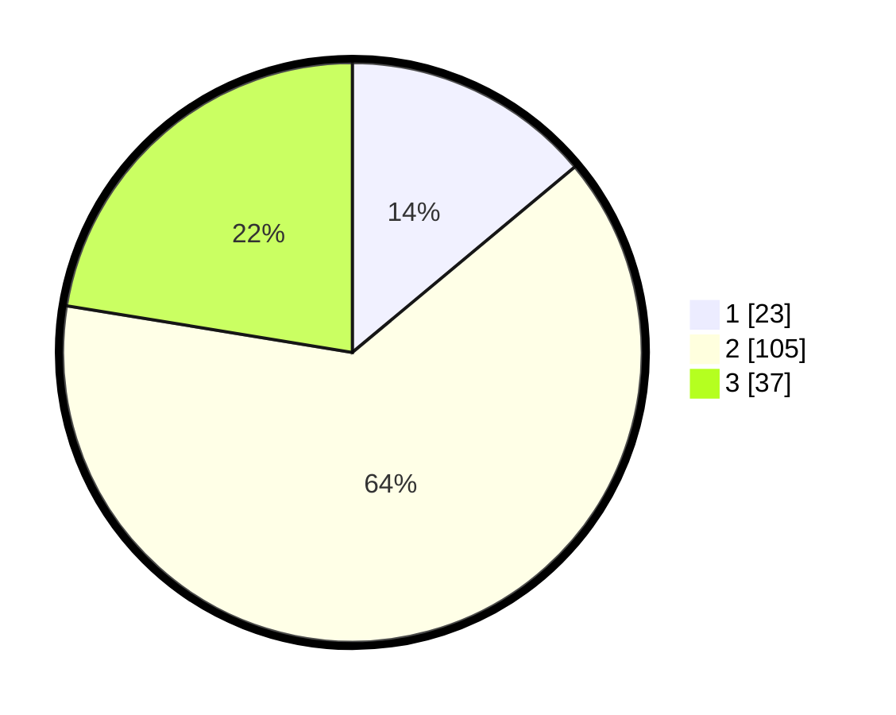

# Hasil

## Grafik

## Tabel

| No. | Nama Paslon    | Suara | Suara (raw) | Persentase |
|:--- |:-------------- | -----:| -----------:| ----------:|
| 1   | ANIES MUHAIMIN | 23    | [23][p-1]   | 13,94      |
| 2   | PRABOWO GIBRAN | 105   | [105][p-2]  | 63,64      |
| 3   | GANJAR MAHFUD  | 37    | [37][p-3]   | 22,42      |

[p-1]: https://github.com/gigit-pemilu/pemilu-2024/blob/main/pilpres/hitung-suara/sub/33-jawa-tengah/sub/02-banyumas/sub/21-sumbang/sub/2018-limpakuwus/sub/004-tps/sub/paslon-1.txt
[p-2]: https://github.com/gigit-pemilu/pemilu-2024/blob/main/pilpres/hitung-suara/sub/33-jawa-tengah/sub/02-banyumas/sub/21-sumbang/sub/2018-limpakuwus/sub/004-tps/sub/paslon-2.txt
[p-3]: https://github.com/gigit-pemilu/pemilu-2024/blob/main/pilpres/hitung-suara/sub/33-jawa-tengah/sub/02-banyumas/sub/21-sumbang/sub/2018-limpakuwus/sub/004-tps/sub/paslon-3.txt

## Foto C Plano

https://sirekap-obj-formc.kpu.go.id/a40c/pemilu/ppwp/33/02/21/20/18/3302212018004-20240214-215521--fbd1baa2-219e-4e39-807f-e2c87bb6bd18.jpg

https://sirekap-obj-formc.kpu.go.id/a40c/pemilu/ppwp/33/02/21/20/18/3302212018004-20240214-215639--fc8f5d49-006f-421d-91cf-22f40985197c.jpg

https://sirekap-obj-formc.kpu.go.id/a40c/pemilu/ppwp/33/02/21/20/18/3302212018004-20240214-215744--4753bb1f-d24a-48f4-a46c-1a5eb5dab47b.jpg

## Metadata

| Key        | Value               |
| ---------- | ------------------- |
| Time Stamp | 2024-02-16 23:00:00 |

