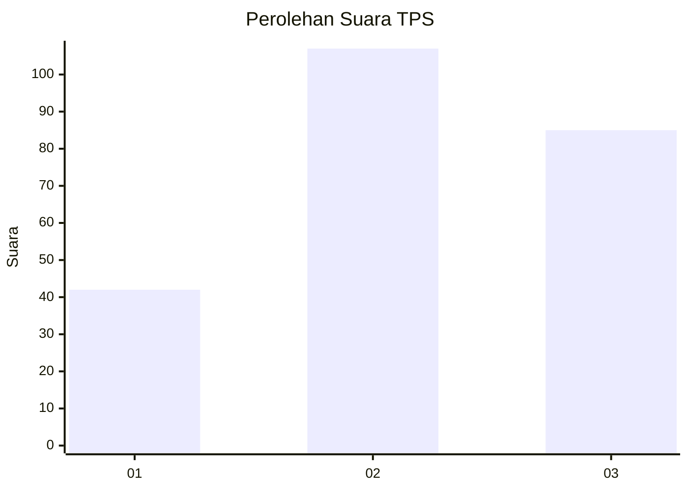
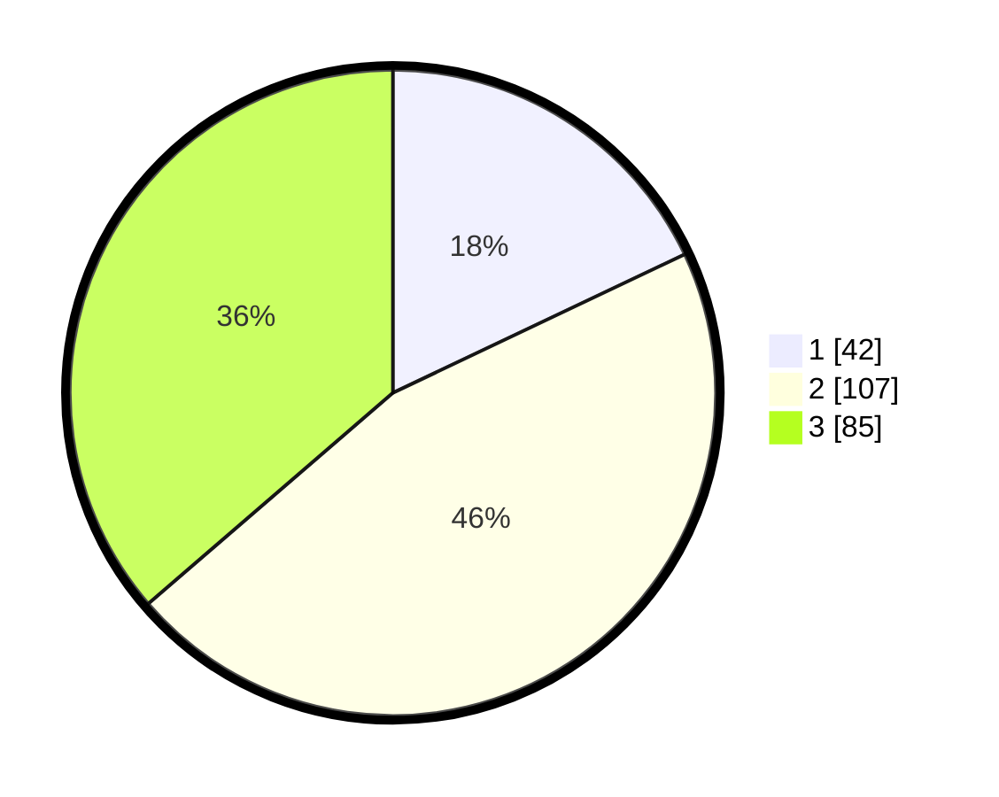

# Hasil

## Grafik

## Tabel

| No. | Nama Paslon    | Suara | Suara (raw) | Persentase |
|:--- |:-------------- | -----:| -----------:| ----------:|
| 1   | ANIES MUHAIMIN | 42    | [42][p-1]   | 17,95      |
| 2   | PRABOWO GIBRAN | 107   | [107][p-2]  | 45,73      |
| 3   | GANJAR MAHFUD  | 85    | [85][p-3]   | 36,32      |

[p-1]: https://github.com/gigit-pemilu/pemilu-2024-33-jawa-tengah/blob/main/pilpres/hitung-suara/sub/33-jawa-tengah/sub/02-banyumas/sub/22-baturraden/sub/2001-purwosari/sub/001-tps/sub/paslon-1.txt
[p-2]: https://github.com/gigit-pemilu/pemilu-2024-33-jawa-tengah/blob/main/pilpres/hitung-suara/sub/33-jawa-tengah/sub/02-banyumas/sub/22-baturraden/sub/2001-purwosari/sub/001-tps/sub/paslon-2.txt
[p-3]: https://github.com/gigit-pemilu/pemilu-2024-33-jawa-tengah/blob/main/pilpres/hitung-suara/sub/33-jawa-tengah/sub/02-banyumas/sub/22-baturraden/sub/2001-purwosari/sub/001-tps/sub/paslon-3.txt

## Foto C Plano

https://sirekap-obj-formc.kpu.go.id/dd67/pemilu/ppwp/33/02/22/20/01/3302222001001-20240215-010302--1910eee6-724a-4880-a9e7-3e7c98eddc3e.jpg

https://sirekap-obj-formc.kpu.go.id/dd67/pemilu/ppwp/33/02/22/20/01/3302222001001-20240215-010502--899257a1-b617-4814-90de-fdb5a0677737.jpg

https://sirekap-obj-formc.kpu.go.id/dd67/pemilu/ppwp/33/02/22/20/01/3302222001001-20240215-010607--f881efb9-59e3-464b-8888-5bab001254b9.jpg

## Metadata

| Key        | Value               |
| ---------- | ------------------- |
| Time Stamp | 2024-02-16 17:00:00 |

