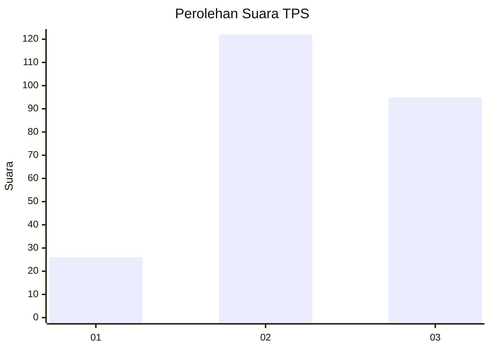
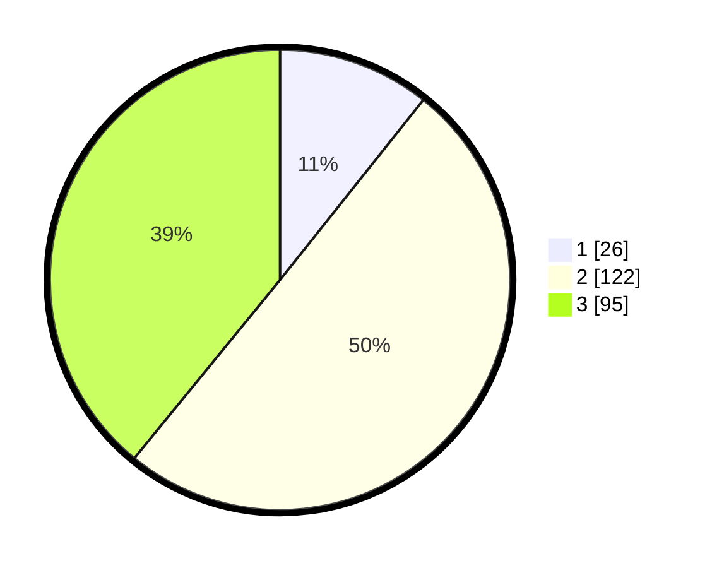

# Hasil

## Grafik

## Tabel

| No. | Nama Paslon    | Suara | Suara (raw) | Persentase |
|:--- |:-------------- | -----:| -----------:| ----------:|
| 1   | ANIES MUHAIMIN | 26    | [26][p-1]   | 10,70      |
| 2   | PRABOWO GIBRAN | 122   | [122][p-2]  | 50,21      |
| 3   | GANJAR MAHFUD  | 95    | [95][p-3]   | 39,09      |

[p-1]: https://github.com/gigit-pemilu/pemilu-2024-33-jawa-tengah/blob/main/pilpres/hitung-suara/sub/33-jawa-tengah/sub/02-banyumas/sub/22-baturraden/sub/2001-purwosari/sub/004-tps/sub/paslon-1.txt
[p-2]: https://github.com/gigit-pemilu/pemilu-2024-33-jawa-tengah/blob/main/pilpres/hitung-suara/sub/33-jawa-tengah/sub/02-banyumas/sub/22-baturraden/sub/2001-purwosari/sub/004-tps/sub/paslon-2.txt
[p-3]: https://github.com/gigit-pemilu/pemilu-2024-33-jawa-tengah/blob/main/pilpres/hitung-suara/sub/33-jawa-tengah/sub/02-banyumas/sub/22-baturraden/sub/2001-purwosari/sub/004-tps/sub/paslon-3.txt

## Foto C Plano

https://sirekap-obj-formc.kpu.go.id/7c80/pemilu/ppwp/33/02/22/20/01/3302222001004-20240215-035418--3269fc33-40fa-4505-8508-275bf26cf76f.jpg

https://sirekap-obj-formc.kpu.go.id/7c80/pemilu/ppwp/33/02/22/20/01/3302222001004-20240215-035426--bf51fcd3-1024-435a-8fab-f67235758824.jpg

https://sirekap-obj-formc.kpu.go.id/7c80/pemilu/ppwp/33/02/22/20/01/3302222001004-20240215-035433--16c86e62-729d-45fb-9048-09f03aa018af.jpg

## Metadata

| Key        | Value               |
| ---------- | ------------------- |
| Time Stamp | 2024-02-19 12:00:00 |

