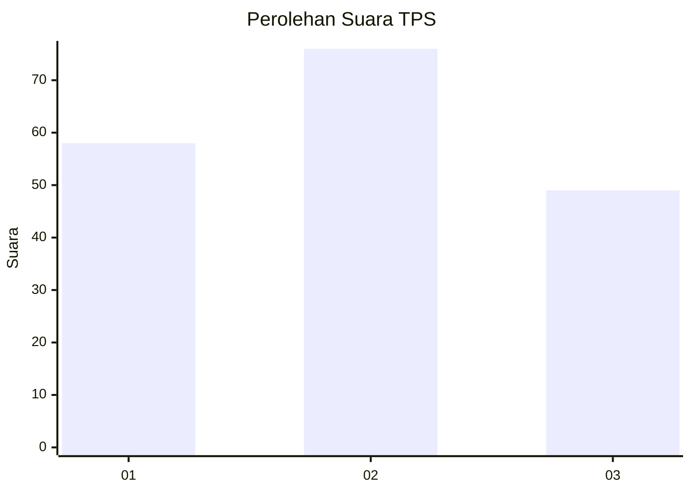
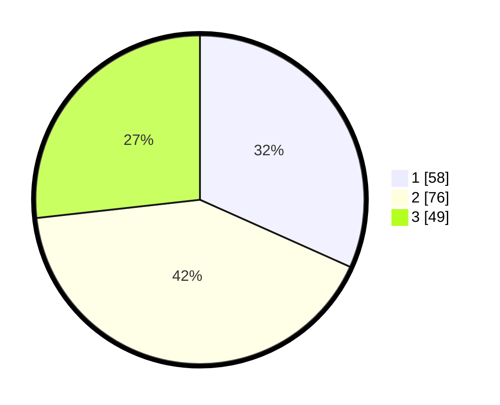

# Hasil

## Grafik

## Tabel

| No. | Nama Paslon    | Suara | Suara (raw) | Persentase |
|:--- |:-------------- | -----:| -----------:| ----------:|
| 1   | ANIES MUHAIMIN | 58    | [58][p-1]   | 31,69      |
| 2   | PRABOWO GIBRAN | 76    | [76][p-2]   | 41,53      |
| 3   | GANJAR MAHFUD  | 49    | [49][p-3]   | 26,78      |

[p-1]: https://github.com/gigit-pemilu/pemilu-2024/blob/main/pilpres/hitung-suara/sub/33-jawa-tengah/sub/02-banyumas/sub/22-baturraden/sub/2001-purwosari/sub/017-tps/sub/paslon-1.txt
[p-2]: https://github.com/gigit-pemilu/pemilu-2024/blob/main/pilpres/hitung-suara/sub/33-jawa-tengah/sub/02-banyumas/sub/22-baturraden/sub/2001-purwosari/sub/017-tps/sub/paslon-2.txt
[p-3]: https://github.com/gigit-pemilu/pemilu-2024/blob/main/pilpres/hitung-suara/sub/33-jawa-tengah/sub/02-banyumas/sub/22-baturraden/sub/2001-purwosari/sub/017-tps/sub/paslon-3.txt

## Foto C Plano

https://sirekap-obj-formc.kpu.go.id/e6e8/pemilu/ppwp/33/02/22/20/01/3302222001017-20240215-224018--9ae96607-92bb-457e-a2da-4d1f4a945ab9.jpg

https://sirekap-obj-formc.kpu.go.id/e6e8/pemilu/ppwp/33/02/22/20/01/3302222001017-20240215-224110--beaca6cd-da62-41c6-8315-c682698e5b5b.jpg

https://sirekap-obj-formc.kpu.go.id/e6e8/pemilu/ppwp/33/02/22/20/01/3302222001017-20240215-224200--a5e4d2c5-64ff-496b-97e4-f7f5306a3924.jpg

## Metadata

| Key        | Value               |
| ---------- | ------------------- |
| Time Stamp | 2024-02-16 23:00:00 |

