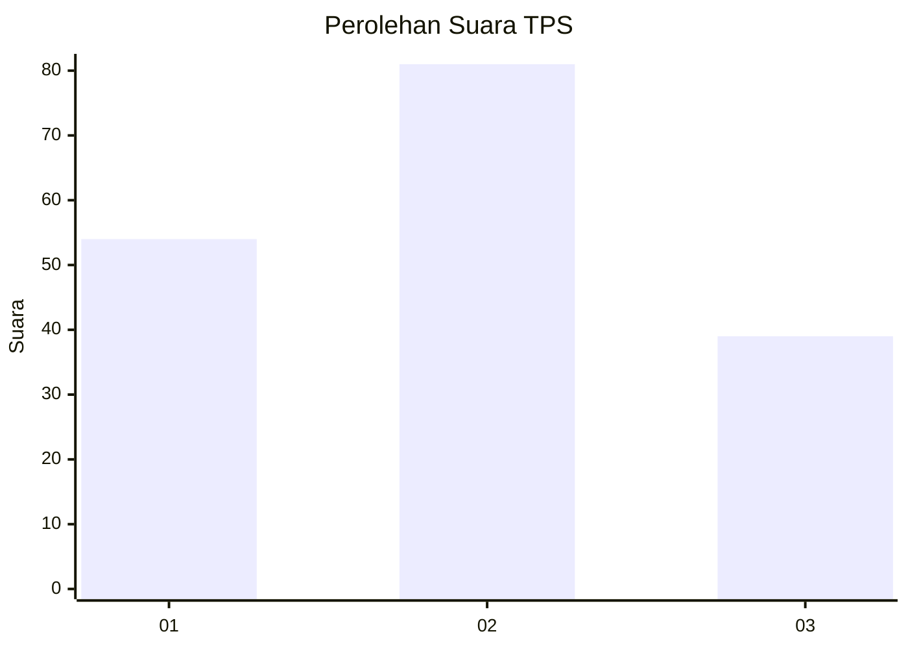
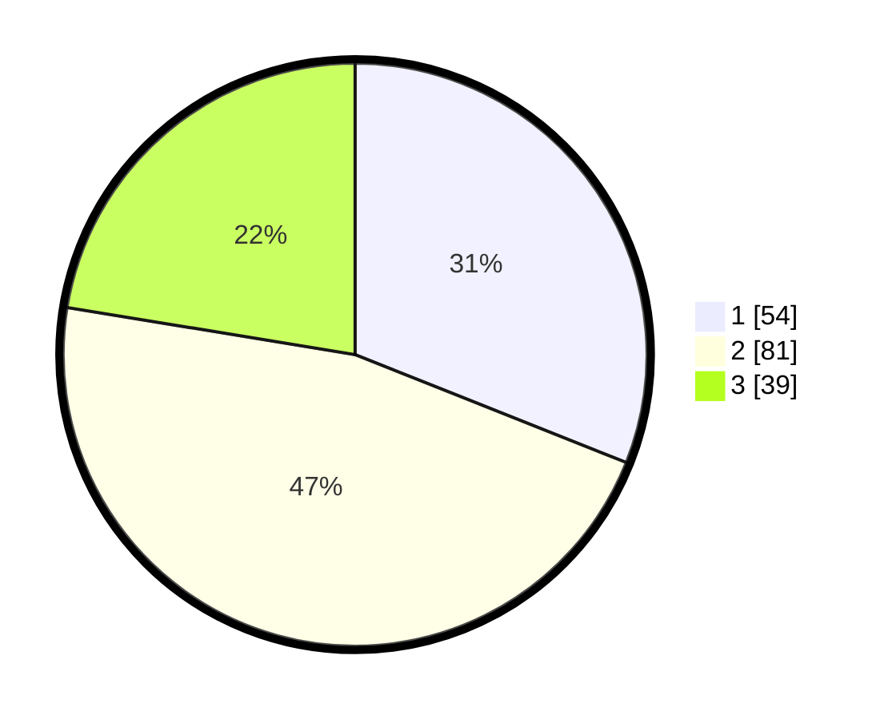

# Hasil

## Grafik

## Tabel

| No. | Nama Paslon    | Suara | Suara (raw) | Persentase |
|:--- |:-------------- | -----:| -----------:| ----------:|
| 1   | ANIES MUHAIMIN | 54    | [54][p-1]   | 31,03      |
| 2   | PRABOWO GIBRAN | 81    | [81][p-2]   | 46,55      |
| 3   | GANJAR MAHFUD  | 39    | [39][p-3]   | 22,41      |

[p-1]: https://github.com/gigit-pemilu/pemilu-2024-33-jawa-tengah/blob/main/pilpres/hitung-suara/sub/33-jawa-tengah/sub/02-banyumas/sub/22-baturraden/sub/2001-purwosari/sub/019-tps/sub/paslon-1.txt
[p-2]: https://github.com/gigit-pemilu/pemilu-2024-33-jawa-tengah/blob/main/pilpres/hitung-suara/sub/33-jawa-tengah/sub/02-banyumas/sub/22-baturraden/sub/2001-purwosari/sub/019-tps/sub/paslon-2.txt
[p-3]: https://github.com/gigit-pemilu/pemilu-2024-33-jawa-tengah/blob/main/pilpres/hitung-suara/sub/33-jawa-tengah/sub/02-banyumas/sub/22-baturraden/sub/2001-purwosari/sub/019-tps/sub/paslon-3.txt

## Foto C Plano

https://sirekap-obj-formc.kpu.go.id/49a6/pemilu/ppwp/33/02/22/20/01/3302222001019-20240214-214501--6f3c00da-df44-4953-84cf-3c5ac28d044d.jpg

https://sirekap-obj-formc.kpu.go.id/49a6/pemilu/ppwp/33/02/22/20/01/3302222001019-20240214-214606--e225452c-eec9-4b21-b2b5-86b9c6b2e22b.jpg

https://sirekap-obj-formc.kpu.go.id/49a6/pemilu/ppwp/33/02/22/20/01/3302222001019-20240215-002251--c557785e-59a3-414c-9490-673d3781e1d4.jpg

## Metadata

| Key        | Value               |
| ---------- | ------------------- |
| Time Stamp | 2024-02-19 12:00:00 |

