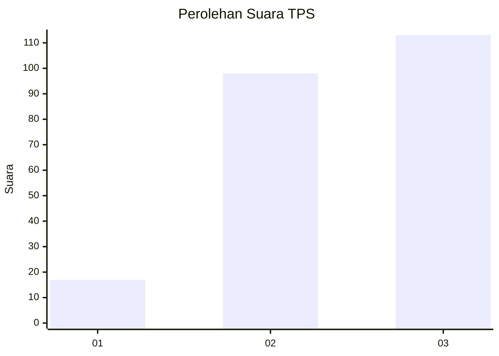
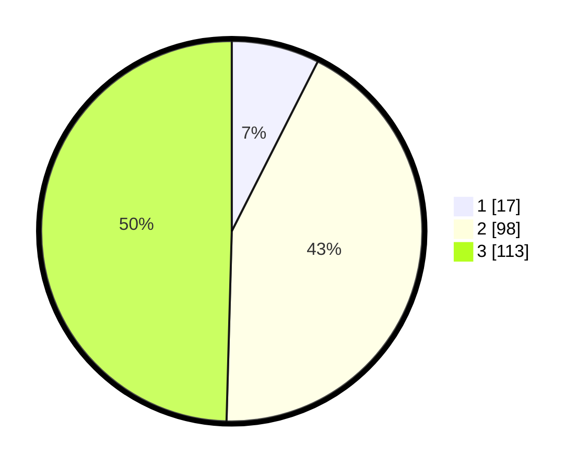

# Hasil

## Grafik

## Tabel

| No. | Nama Paslon    | Suara | Suara (raw) | Persentase |
|:--- |:-------------- | -----:| -----------:| ----------:|
| 1   | ANIES MUHAIMIN | 17    | [17][p-1]   | 7,46       |
| 2   | PRABOWO GIBRAN | 98    | [98][p-2]   | 42,98      |
| 3   | GANJAR MAHFUD  | 113   | [113][p-3]  | 49,56      |

[p-1]: https://github.com/gigit-pemilu/pemilu-2024/blob/main/pilpres/hitung-suara/sub/33-jawa-tengah/sub/02-banyumas/sub/22-baturraden/sub/2002-kutasari/sub/007-tps/sub/paslon-1.txt
[p-2]: https://github.com/gigit-pemilu/pemilu-2024/blob/main/pilpres/hitung-suara/sub/33-jawa-tengah/sub/02-banyumas/sub/22-baturraden/sub/2002-kutasari/sub/007-tps/sub/paslon-2.txt
[p-3]: https://github.com/gigit-pemilu/pemilu-2024/blob/main/pilpres/hitung-suara/sub/33-jawa-tengah/sub/02-banyumas/sub/22-baturraden/sub/2002-kutasari/sub/007-tps/sub/paslon-3.txt

## Foto C Plano

https://sirekap-obj-formc.kpu.go.id/7d76/pemilu/ppwp/33/02/22/20/02/3302222002007-20240214-231807--ba7c5b68-4007-4619-a3d4-69a0f745c734.jpg

https://sirekap-obj-formc.kpu.go.id/7d76/pemilu/ppwp/33/02/22/20/02/3302222002007-20240214-231841--b92220c6-4cc6-42cc-8a51-93a1dd261e3c.jpg

https://sirekap-obj-formc.kpu.go.id/7d76/pemilu/ppwp/33/02/22/20/02/3302222002007-20240214-231923--cb2138ee-76ca-4934-92a7-60a2911cd323.jpg

## Metadata

| Key        | Value               |
| ---------- | ------------------- |
| Time Stamp | 2024-02-15 15:00:29 |

