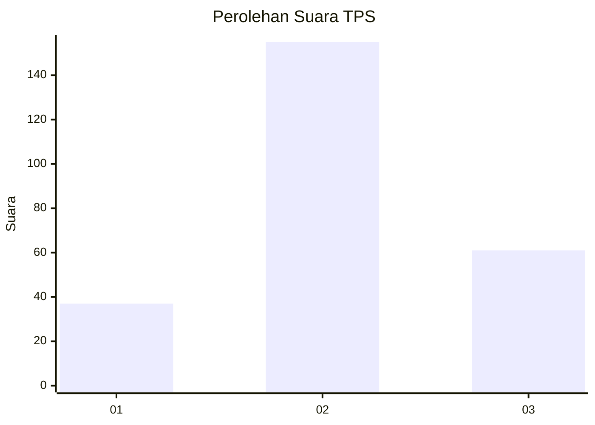
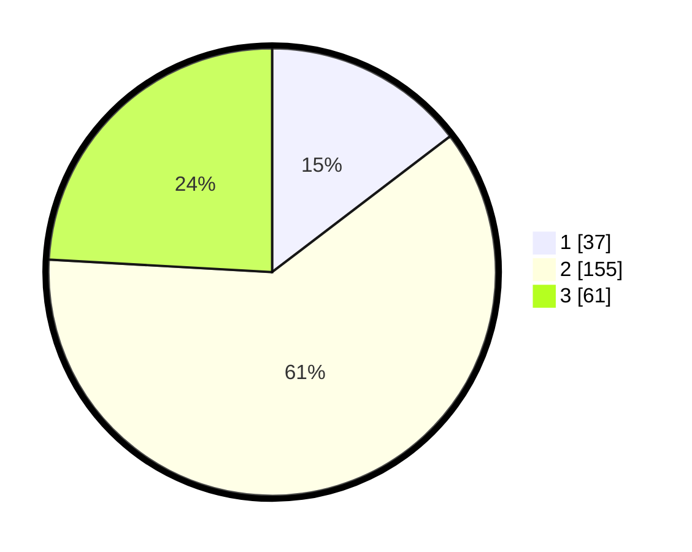

# Hasil

## Grafik

## Tabel

| No. | Nama Paslon    | Suara | Suara (raw) | Persentase |
|:--- |:-------------- | -----:| -----------:| ----------:|
| 1   | ANIES MUHAIMIN | 37    | [37][p-1]   | 14,62      |
| 2   | PRABOWO GIBRAN | 155   | [155][p-2]  | 61,26      |
| 3   | GANJAR MAHFUD  | 61    | [61][p-3]   | 24,11      |

[p-1]: https://github.com/gigit-pemilu/pemilu-2024/blob/main/pilpres/hitung-suara/sub/33-jawa-tengah/sub/02-banyumas/sub/22-baturraden/sub/2003-pandak/sub/001-tps/sub/paslon-1.txt
[p-2]: https://github.com/gigit-pemilu/pemilu-2024/blob/main/pilpres/hitung-suara/sub/33-jawa-tengah/sub/02-banyumas/sub/22-baturraden/sub/2003-pandak/sub/001-tps/sub/paslon-2.txt
[p-3]: https://github.com/gigit-pemilu/pemilu-2024/blob/main/pilpres/hitung-suara/sub/33-jawa-tengah/sub/02-banyumas/sub/22-baturraden/sub/2003-pandak/sub/001-tps/sub/paslon-3.txt

## Foto C Plano

https://sirekap-obj-formc.kpu.go.id/2d1f/pemilu/ppwp/33/02/22/20/03/3302222003001-20240214-231912--61a40678-3167-4670-8432-79df7db768ec.jpg

https://sirekap-obj-formc.kpu.go.id/2d1f/pemilu/ppwp/33/02/22/20/03/3302222003001-20240214-232622--0d11638d-2d68-4d41-a6d2-63199ca8f1b9.jpg

https://sirekap-obj-formc.kpu.go.id/2d1f/pemilu/ppwp/33/02/22/20/03/3302222003001-20240214-232715--ec75e441-9aca-4156-a233-e047a0230e21.jpg

## Metadata

| Key        | Value               |
| ---------- | ------------------- |
| Time Stamp | 2024-02-15 15:00:29 |

