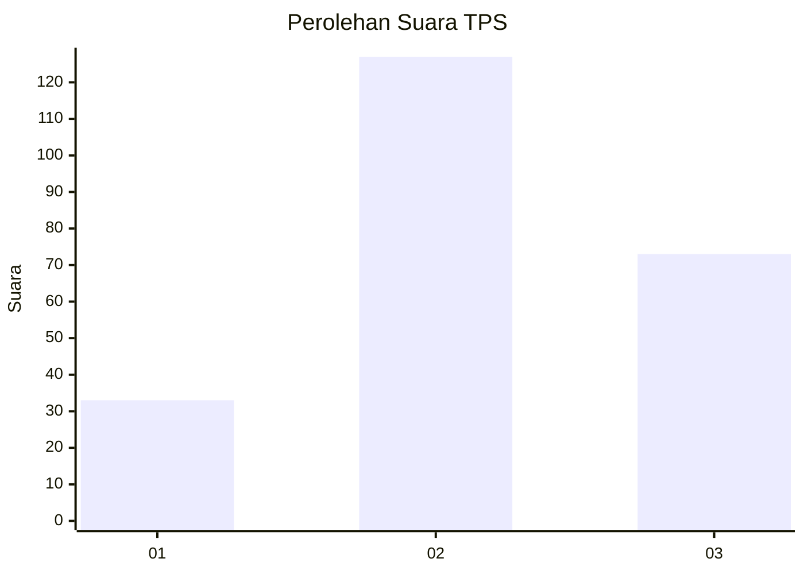
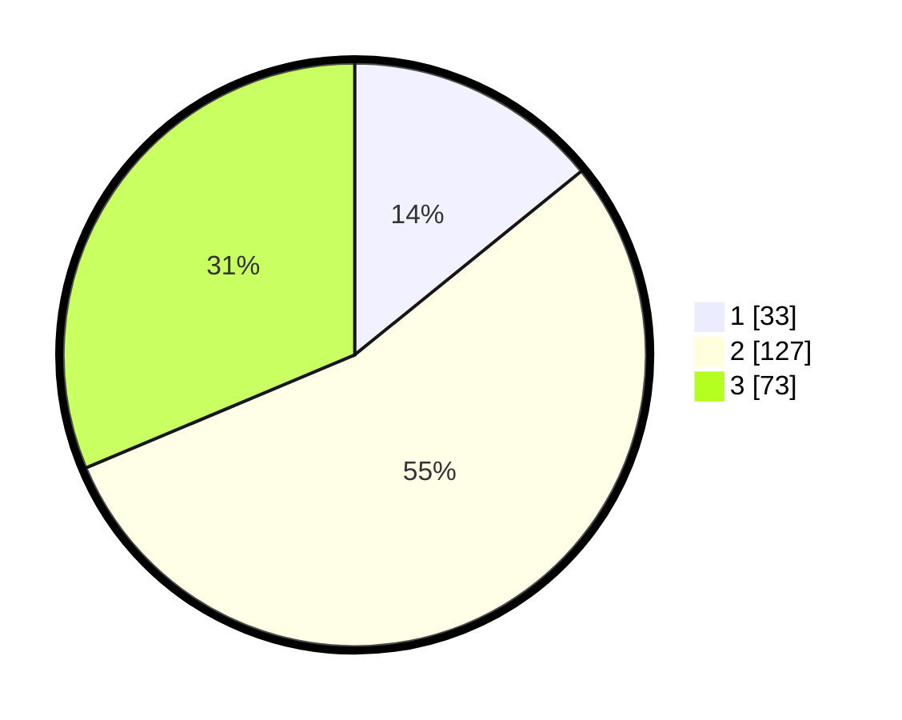

# Hasil

## Grafik

## Tabel

| No. | Nama Paslon    | Suara | Suara (raw) | Persentase |
|:--- |:-------------- | -----:| -----------:| ----------:|
| 1   | ANIES MUHAIMIN | 33    | [33][p-1]   | 14,16      |
| 2   | PRABOWO GIBRAN | 127   | [127][p-2]  | 54,51      |
| 3   | GANJAR MAHFUD  | 73    | [73][p-3]   | 31,33      |

[p-1]: https://github.com/gigit-pemilu/pemilu-2024-33-jawa-tengah/blob/main/pilpres/hitung-suara/sub/33-jawa-tengah/sub/02-banyumas/sub/22-baturraden/sub/2005-rempoah/sub/006-tps/sub/paslon-1.txt
[p-2]: https://github.com/gigit-pemilu/pemilu-2024-33-jawa-tengah/blob/main/pilpres/hitung-suara/sub/33-jawa-tengah/sub/02-banyumas/sub/22-baturraden/sub/2005-rempoah/sub/006-tps/sub/paslon-2.txt
[p-3]: https://github.com/gigit-pemilu/pemilu-2024-33-jawa-tengah/blob/main/pilpres/hitung-suara/sub/33-jawa-tengah/sub/02-banyumas/sub/22-baturraden/sub/2005-rempoah/sub/006-tps/sub/paslon-3.txt

## Foto C Plano

https://sirekap-obj-formc.kpu.go.id/a8a9/pemilu/ppwp/33/02/22/20/05/3302222005006-20240215-033816--b78a6f6a-5fa4-43b2-bb98-4fbb299ceb36.jpg

https://sirekap-obj-formc.kpu.go.id/a8a9/pemilu/ppwp/33/02/22/20/05/3302222005006-20240214-221531--14371e4e-de2b-4df0-a356-fb57310c2eb4.jpg

https://sirekap-obj-formc.kpu.go.id/a8a9/pemilu/ppwp/33/02/22/20/05/3302222005006-20240214-220131--38891229-ec42-4e3b-b3ed-3254816e360c.jpg

## Metadata

| Key        | Value               |
| ---------- | ------------------- |
| Time Stamp | 2024-02-15 15:00:29 |

