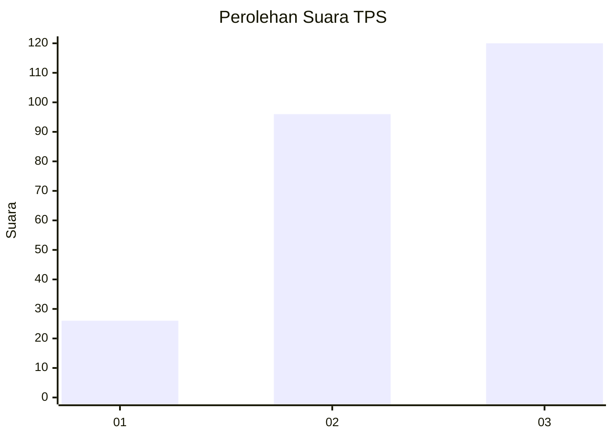
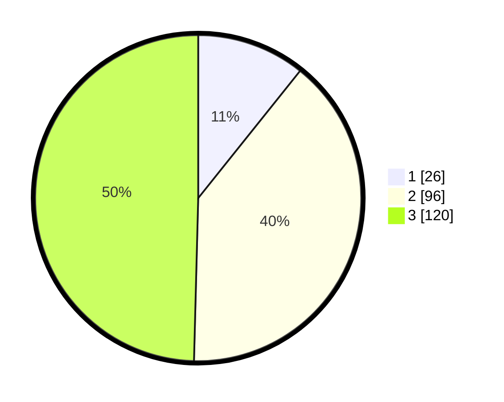

# Hasil

## Grafik

## Tabel

| No. | Nama Paslon    | Suara | Suara (raw) | Persentase |
|:--- |:-------------- | -----:| -----------:| ----------:|
| 1   | ANIES MUHAIMIN | 26    | [26][p-1]   | 10,74      |
| 2   | PRABOWO GIBRAN | 96    | [96][p-2]   | 39,67      |
| 3   | GANJAR MAHFUD  | 120   | [120][p-3]  | 49,59      |

[p-1]: https://github.com/gigit-pemilu/pemilu-2024-33-jawa-tengah/blob/main/pilpres/hitung-suara/sub/33-jawa-tengah/sub/02-banyumas/sub/22-baturraden/sub/2005-rempoah/sub/008-tps/sub/paslon-1.txt
[p-2]: https://github.com/gigit-pemilu/pemilu-2024-33-jawa-tengah/blob/main/pilpres/hitung-suara/sub/33-jawa-tengah/sub/02-banyumas/sub/22-baturraden/sub/2005-rempoah/sub/008-tps/sub/paslon-2.txt
[p-3]: https://github.com/gigit-pemilu/pemilu-2024-33-jawa-tengah/blob/main/pilpres/hitung-suara/sub/33-jawa-tengah/sub/02-banyumas/sub/22-baturraden/sub/2005-rempoah/sub/008-tps/sub/paslon-3.txt

## Foto C Plano

https://sirekap-obj-formc.kpu.go.id/525a/pemilu/ppwp/33/02/22/20/05/3302222005008-20240215-002618--30f1cbe3-70c9-45bd-9c2e-44126f830d9f.jpg

https://sirekap-obj-formc.kpu.go.id/525a/pemilu/ppwp/33/02/22/20/05/3302222005008-20240215-003025--2cab912b-a20f-4098-9c3b-9c58a3a85477.jpg

https://sirekap-obj-formc.kpu.go.id/525a/pemilu/ppwp/33/02/22/20/05/3302222005008-20240215-003226--dab2dc38-d85a-4f8d-b885-08f0a667a6a6.jpg

## Metadata

| Key        | Value               |
| ---------- | ------------------- |
| Time Stamp | 2024-02-15 20:00:44 |

