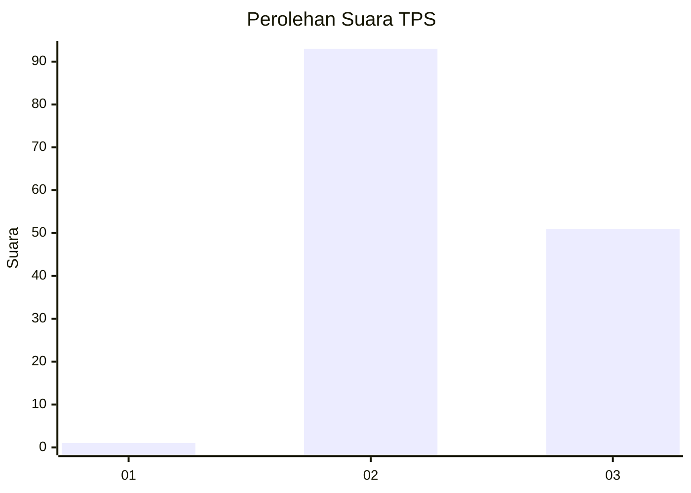
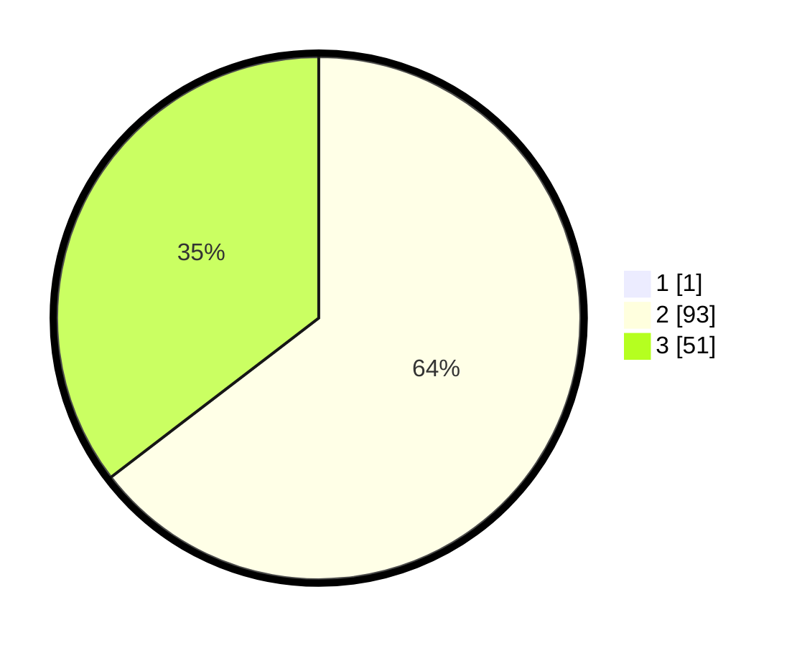

# Hasil

## Grafik

## Tabel

| No. | Nama Paslon    | Suara | Suara (raw) | Persentase |
|:--- |:-------------- | -----:| -----------:| ----------:|
| 1   | ANIES MUHAIMIN | 1     | [1][p-1]    | 0,69       |
| 2   | PRABOWO GIBRAN | 93    | [93][p-2]   | 64,14      |
| 3   | GANJAR MAHFUD  | 51    | [51][p-3]   | 35,17      |

[p-1]: https://github.com/gigit-pemilu/pemilu-2024-33-jawa-tengah/blob/main/pilpres/hitung-suara/sub/33-jawa-tengah/sub/02-banyumas/sub/22-baturraden/sub/2006-kebumen/sub/005-tps/sub/paslon-1.txt
[p-2]: https://github.com/gigit-pemilu/pemilu-2024-33-jawa-tengah/blob/main/pilpres/hitung-suara/sub/33-jawa-tengah/sub/02-banyumas/sub/22-baturraden/sub/2006-kebumen/sub/005-tps/sub/paslon-2.txt
[p-3]: https://github.com/gigit-pemilu/pemilu-2024-33-jawa-tengah/blob/main/pilpres/hitung-suara/sub/33-jawa-tengah/sub/02-banyumas/sub/22-baturraden/sub/2006-kebumen/sub/005-tps/sub/paslon-3.txt

## Foto C Plano

https://sirekap-obj-formc.kpu.go.id/4ea6/pemilu/ppwp/33/02/22/20/06/3302222006005-20240215-004827--7e6076a8-b1a3-40b0-898a-34a535b920d4.jpg

https://sirekap-obj-formc.kpu.go.id/4ea6/pemilu/ppwp/33/02/22/20/06/3302222006005-20240215-005002--da358bc2-b37f-478c-9788-66bc7ec167ab.jpg

https://sirekap-obj-formc.kpu.go.id/4ea6/pemilu/ppwp/33/02/22/20/06/3302222006005-20240215-005225--81f2aa19-2348-40cc-8895-2bbac1f0d83c.jpg

## Metadata

| Key        | Value               |
| ---------- | ------------------- |
| Time Stamp | 2024-02-15 17:30:25 |

