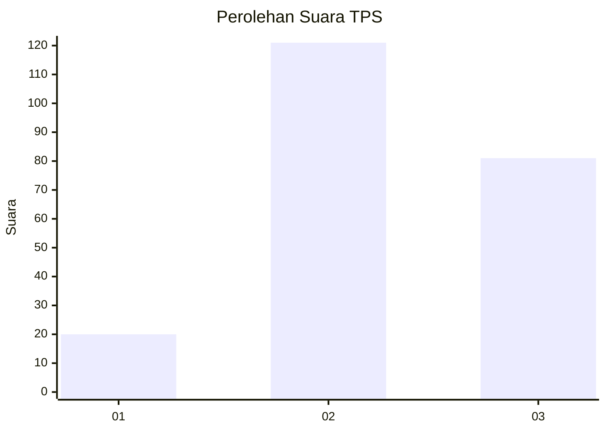
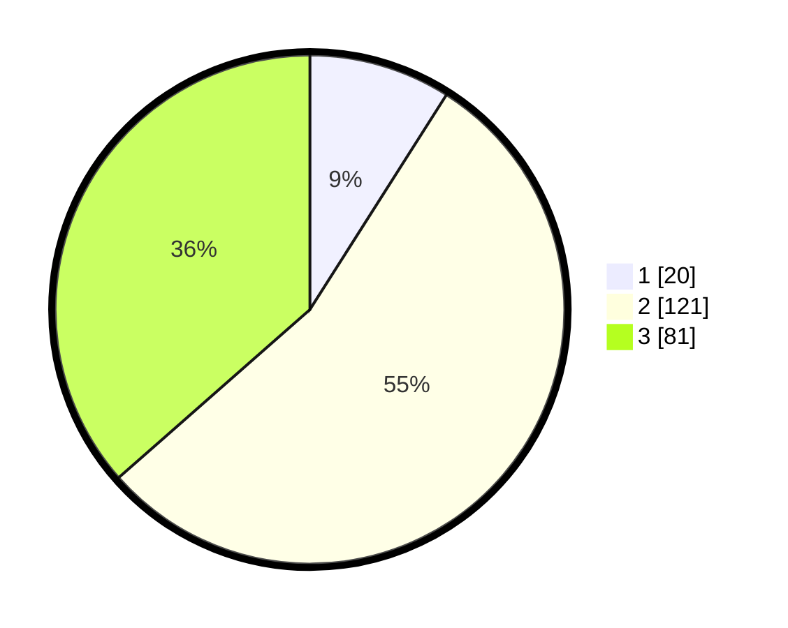

# Hasil

## Grafik

## Tabel

| No. | Nama Paslon    | Suara | Suara (raw) | Persentase |
|:--- |:-------------- | -----:| -----------:| ----------:|
| 1   | ANIES MUHAIMIN | 20    | [20][p-1]   | 9,01       |
| 2   | PRABOWO GIBRAN | 121   | [121][p-2]  | 54,50      |
| 3   | GANJAR MAHFUD  | 81    | [81][p-3]   | 36,49      |

[p-1]: https://github.com/gigit-pemilu/pemilu-2024-33-jawa-tengah/blob/main/pilpres/hitung-suara/sub/33-jawa-tengah/sub/02-banyumas/sub/22-baturraden/sub/2006-kebumen/sub/006-tps/sub/paslon-1.txt
[p-2]: https://github.com/gigit-pemilu/pemilu-2024-33-jawa-tengah/blob/main/pilpres/hitung-suara/sub/33-jawa-tengah/sub/02-banyumas/sub/22-baturraden/sub/2006-kebumen/sub/006-tps/sub/paslon-2.txt
[p-3]: https://github.com/gigit-pemilu/pemilu-2024-33-jawa-tengah/blob/main/pilpres/hitung-suara/sub/33-jawa-tengah/sub/02-banyumas/sub/22-baturraden/sub/2006-kebumen/sub/006-tps/sub/paslon-3.txt

## Foto C Plano

https://sirekap-obj-formc.kpu.go.id/c144/pemilu/ppwp/33/02/22/20/06/3302222006006-20240215-001146--e4ee61bd-bc01-4244-9549-26549db3a72a.jpg

https://sirekap-obj-formc.kpu.go.id/c144/pemilu/ppwp/33/02/22/20/06/3302222006006-20240215-000317--dd34aeae-87d8-4510-b89d-0125eab396f9.jpg

https://sirekap-obj-formc.kpu.go.id/c144/pemilu/ppwp/33/02/22/20/06/3302222006006-20240215-000548--e6cf6f1a-e1d8-49af-bb44-2cf573900578.jpg

## Metadata

| Key        | Value               |
| ---------- | ------------------- |
| Time Stamp | 2024-02-19 12:00:00 |

