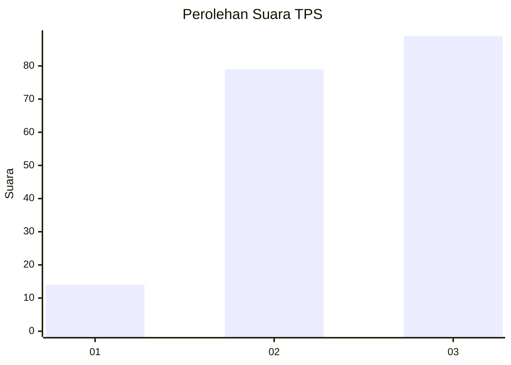
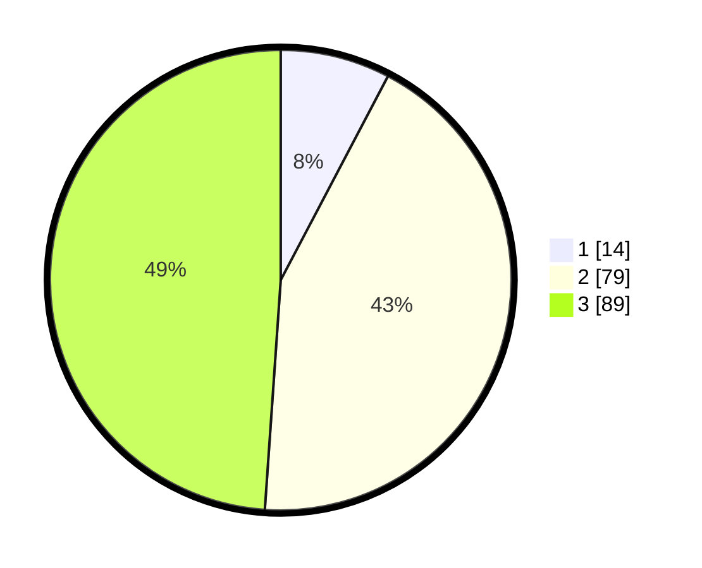

# Hasil

## Grafik

## Tabel

| No. | Nama Paslon    | Suara | Suara (raw) | Persentase |
|:--- |:-------------- | -----:| -----------:| ----------:|
| 1   | ANIES MUHAIMIN | 14    | [14][p-1]   | 7,69       |
| 2   | PRABOWO GIBRAN | 79    | [79][p-2]   | 43,41      |
| 3   | GANJAR MAHFUD  | 89    | [89][p-3]   | 48,90      |

[p-1]: https://github.com/gigit-pemilu/pemilu-2024/blob/main/pilpres/hitung-suara/sub/33-jawa-tengah/sub/02-banyumas/sub/22-baturraden/sub/2007-karang-tengah/sub/004-tps/sub/paslon-1.txt
[p-2]: https://github.com/gigit-pemilu/pemilu-2024/blob/main/pilpres/hitung-suara/sub/33-jawa-tengah/sub/02-banyumas/sub/22-baturraden/sub/2007-karang-tengah/sub/004-tps/sub/paslon-2.txt
[p-3]: https://github.com/gigit-pemilu/pemilu-2024/blob/main/pilpres/hitung-suara/sub/33-jawa-tengah/sub/02-banyumas/sub/22-baturraden/sub/2007-karang-tengah/sub/004-tps/sub/paslon-3.txt

## Foto C Plano

https://sirekap-obj-formc.kpu.go.id/a03b/pemilu/ppwp/33/02/22/20/07/3302222007004-20240214-205449--842dd2a6-5c58-4a18-b216-abfa5fbe3b03.jpg

https://sirekap-obj-formc.kpu.go.id/a03b/pemilu/ppwp/33/02/22/20/07/3302222007004-20240214-215009--3b15ce93-499b-49cf-b37e-ead7b049c7ac.jpg

https://sirekap-obj-formc.kpu.go.id/a03b/pemilu/ppwp/33/02/22/20/07/3302222007004-20240215-031934--f5a5f6db-0e75-4bfd-9d87-6ae35281297f.jpg

## Metadata

| Key        | Value               |
| ---------- | ------------------- |
| Time Stamp | 2024-02-16 23:30:00 |

