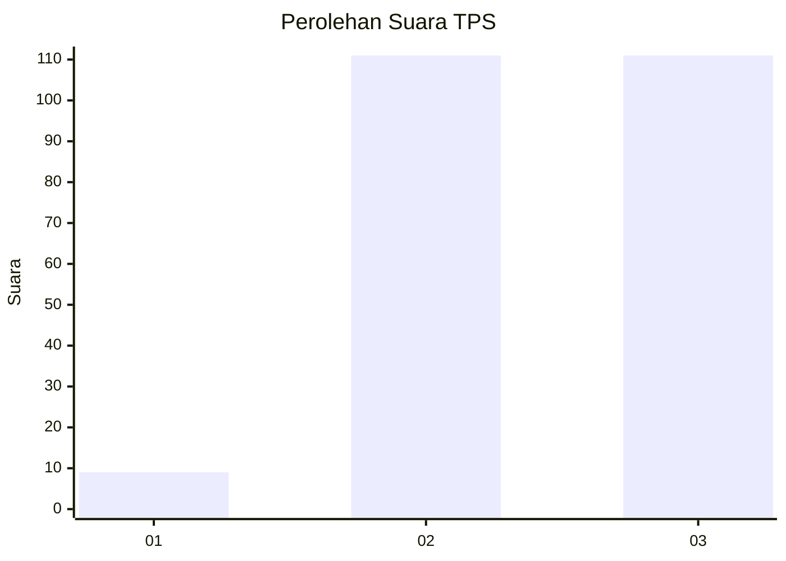
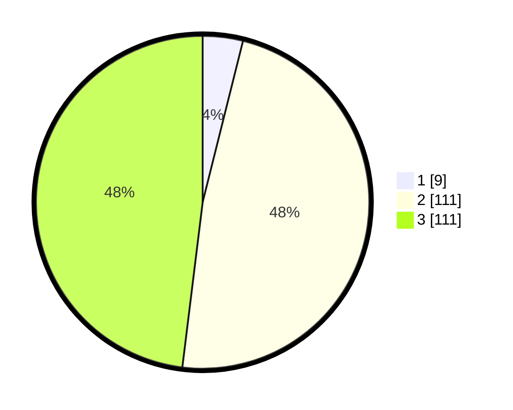

# Hasil

## Grafik

## Tabel

| No. | Nama Paslon    | Suara | Suara (raw) | Persentase |
|:--- |:-------------- | -----:| -----------:| ----------:|
| 1   | ANIES MUHAIMIN | 9     | [9][p-1]    | 3,90       |
| 2   | PRABOWO GIBRAN | 111   | [111][p-2]  | 48,05      |
| 3   | GANJAR MAHFUD  | 111   | [111][p-3]  | 48,05      |

[p-1]: https://github.com/gigit-pemilu/pemilu-2024-33-jawa-tengah/blob/main/pilpres/hitung-suara/sub/33-jawa-tengah/sub/02-banyumas/sub/22-baturraden/sub/2007-karang-tengah/sub/005-tps/sub/paslon-1.txt
[p-2]: https://github.com/gigit-pemilu/pemilu-2024-33-jawa-tengah/blob/main/pilpres/hitung-suara/sub/33-jawa-tengah/sub/02-banyumas/sub/22-baturraden/sub/2007-karang-tengah/sub/005-tps/sub/paslon-2.txt
[p-3]: https://github.com/gigit-pemilu/pemilu-2024-33-jawa-tengah/blob/main/pilpres/hitung-suara/sub/33-jawa-tengah/sub/02-banyumas/sub/22-baturraden/sub/2007-karang-tengah/sub/005-tps/sub/paslon-3.txt

## Foto C Plano

https://sirekap-obj-formc.kpu.go.id/ec76/pemilu/ppwp/33/02/22/20/07/3302222007005-20240215-000244--b696edc5-d2d8-43b5-8337-c3a8716f32c8.jpg

https://sirekap-obj-formc.kpu.go.id/ec76/pemilu/ppwp/33/02/22/20/07/3302222007005-20240215-000407--2cb3a6d4-ba22-48da-aded-900eb075d2fb.jpg

https://sirekap-obj-formc.kpu.go.id/ec76/pemilu/ppwp/33/02/22/20/07/3302222007005-20240215-000547--378d7e5f-1062-4899-9638-ef27caacc3fe.jpg

## Metadata

| Key        | Value               |
| ---------- | ------------------- |
| Time Stamp | 2024-02-16 23:45:47 |

