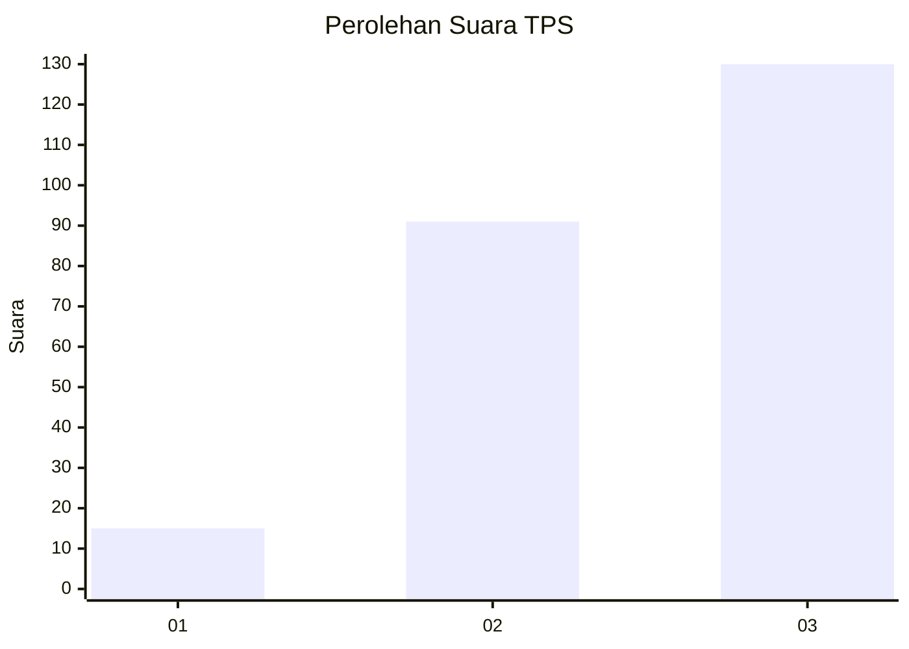
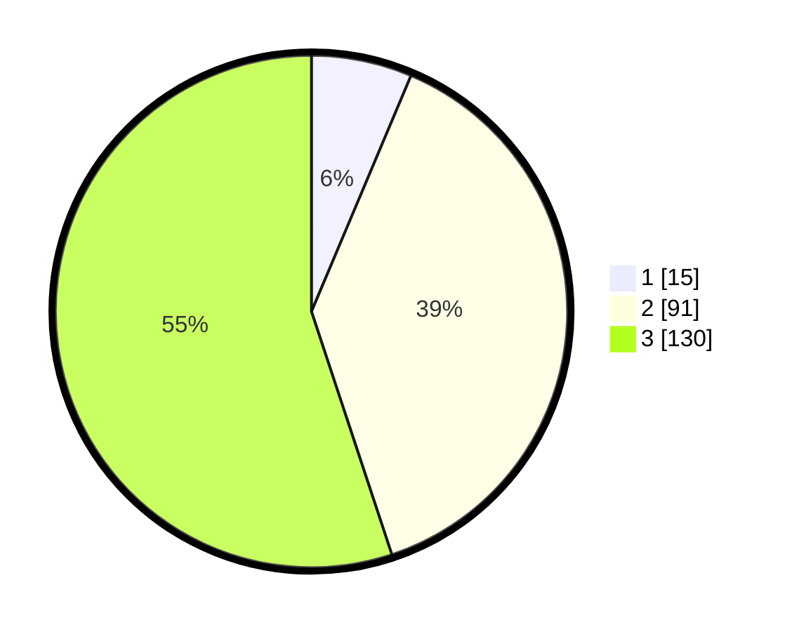

# Hasil

## Grafik

## Tabel

| No. | Nama Paslon    | Suara | Suara (raw) | Persentase |
|:--- |:-------------- | -----:| -----------:| ----------:|
| 1   | ANIES MUHAIMIN | 15    | [15][p-1]   | 6,36       |
| 2   | PRABOWO GIBRAN | 91    | [91][p-2]   | 38,56      |
| 3   | GANJAR MAHFUD  | 130   | [130][p-3]  | 55,08      |

[p-1]: https://github.com/gigit-pemilu/pemilu-2024/blob/main/pilpres/hitung-suara/sub/33-jawa-tengah/sub/02-banyumas/sub/22-baturraden/sub/2007-karang-tengah/sub/009-tps/sub/paslon-1.txt
[p-2]: https://github.com/gigit-pemilu/pemilu-2024/blob/main/pilpres/hitung-suara/sub/33-jawa-tengah/sub/02-banyumas/sub/22-baturraden/sub/2007-karang-tengah/sub/009-tps/sub/paslon-2.txt
[p-3]: https://github.com/gigit-pemilu/pemilu-2024/blob/main/pilpres/hitung-suara/sub/33-jawa-tengah/sub/02-banyumas/sub/22-baturraden/sub/2007-karang-tengah/sub/009-tps/sub/paslon-3.txt

## Foto C Plano

https://sirekap-obj-formc.kpu.go.id/bf56/pemilu/ppwp/33/02/22/20/07/3302222007009-20240215-005302--1ab20a51-0b5f-47cc-a9c0-ab077df4f45d.jpg

https://sirekap-obj-formc.kpu.go.id/bf56/pemilu/ppwp/33/02/22/20/07/3302222007009-20240215-005621--e1a3c85d-2e91-4aea-8041-649488540666.jpg

https://sirekap-obj-formc.kpu.go.id/bf56/pemilu/ppwp/33/02/22/20/07/3302222007009-20240215-005808--5a1ced23-0aab-4214-8ee7-0e44b2dc9dac.jpg

## Metadata

| Key        | Value               |
| ---------- | ------------------- |
| Time Stamp | 2024-02-16 23:45:47 |

