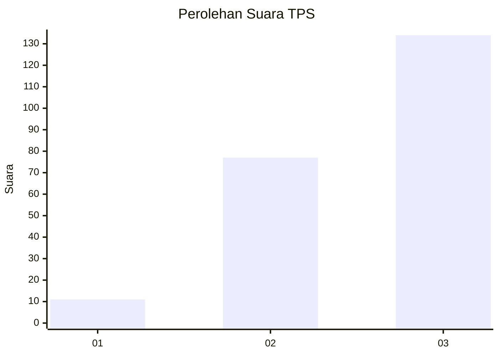
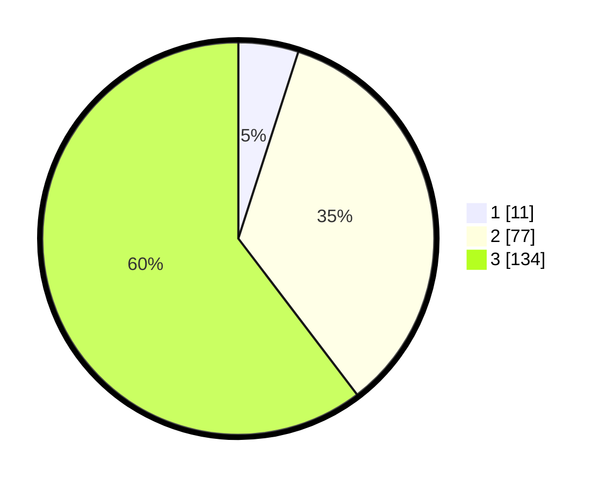

# Hasil

## Grafik

## Tabel

| No. | Nama Paslon    | Suara | Suara (raw) | Persentase |
|:--- |:-------------- | -----:| -----------:| ----------:|
| 1   | ANIES MUHAIMIN | 11    | [11][p-1]   | 4,95       |
| 2   | PRABOWO GIBRAN | 77    | [77][p-2]   | 34,68      |
| 3   | GANJAR MAHFUD  | 134   | [134][p-3]  | 60,36      |

[p-1]: https://github.com/gigit-pemilu/pemilu-2024/blob/main/pilpres/hitung-suara/sub/33-jawa-tengah/sub/02-banyumas/sub/22-baturraden/sub/2007-karang-tengah/sub/023-tps/sub/paslon-1.txt
[p-2]: https://github.com/gigit-pemilu/pemilu-2024/blob/main/pilpres/hitung-suara/sub/33-jawa-tengah/sub/02-banyumas/sub/22-baturraden/sub/2007-karang-tengah/sub/023-tps/sub/paslon-2.txt
[p-3]: https://github.com/gigit-pemilu/pemilu-2024/blob/main/pilpres/hitung-suara/sub/33-jawa-tengah/sub/02-banyumas/sub/22-baturraden/sub/2007-karang-tengah/sub/023-tps/sub/paslon-3.txt

## Foto C Plano

https://sirekap-obj-formc.kpu.go.id/50d4/pemilu/ppwp/33/02/22/20/07/3302222007023-20240214-155638--97cfbf05-af76-4958-8374-7b64420dd97c.jpg

https://sirekap-obj-formc.kpu.go.id/50d4/pemilu/ppwp/33/02/22/20/07/3302222007023-20240214-155748--52ec3c00-55ca-4f88-8663-30afd4e43d73.jpg

https://sirekap-obj-formc.kpu.go.id/50d4/pemilu/ppwp/33/02/22/20/07/3302222007023-20240214-205348--d7d7befb-511e-4756-949f-7de4b13c5927.jpg

## Metadata

| Key        | Value               |
| ---------- | ------------------- |
| Time Stamp | 2024-02-15 00:41:44 |

