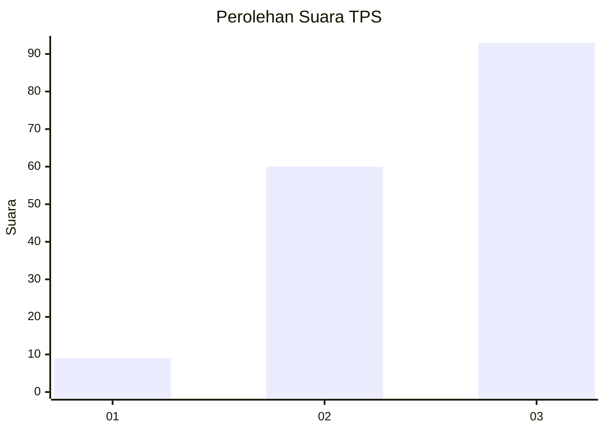
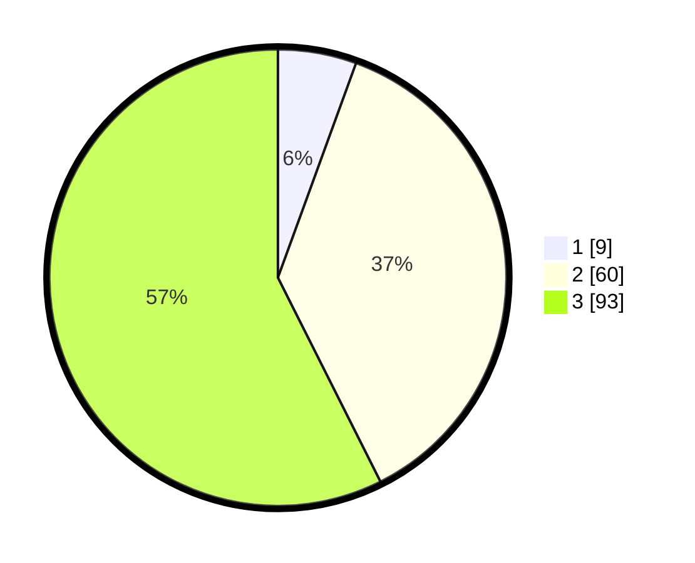

# Hasil

## Grafik

## Tabel

| No. | Nama Paslon    | Suara | Suara (raw) | Persentase |
|:--- |:-------------- | -----:| -----------:| ----------:|
| 1   | ANIES MUHAIMIN | 9     | [9][p-1]    | 5,56       |
| 2   | PRABOWO GIBRAN | 60    | [60][p-2]   | 37,04      |
| 3   | GANJAR MAHFUD  | 93    | [93][p-3]   | 57,41      |

[p-1]: https://github.com/gigit-pemilu/pemilu-2024/blob/main/pilpres/hitung-suara/sub/33-jawa-tengah/sub/02-banyumas/sub/22-baturraden/sub/2007-karang-tengah/sub/024-tps/sub/paslon-1.txt
[p-2]: https://github.com/gigit-pemilu/pemilu-2024/blob/main/pilpres/hitung-suara/sub/33-jawa-tengah/sub/02-banyumas/sub/22-baturraden/sub/2007-karang-tengah/sub/024-tps/sub/paslon-2.txt
[p-3]: https://github.com/gigit-pemilu/pemilu-2024/blob/main/pilpres/hitung-suara/sub/33-jawa-tengah/sub/02-banyumas/sub/22-baturraden/sub/2007-karang-tengah/sub/024-tps/sub/paslon-3.txt

## Foto C Plano

https://sirekap-obj-formc.kpu.go.id/ee35/pemilu/ppwp/33/02/22/20/07/3302222007024-20240214-221241--9c2323b1-d6b3-4ad6-8200-87517af45c1a.jpg

https://sirekap-obj-formc.kpu.go.id/ee35/pemilu/ppwp/33/02/22/20/07/3302222007024-20240214-221253--6db3d48e-665b-4af6-a3d0-86bd1e763bf3.jpg

https://sirekap-obj-formc.kpu.go.id/ee35/pemilu/ppwp/33/02/22/20/07/3302222007024-20240214-221304--e5e173e8-fa8a-4fdc-be3d-0225325df818.jpg

## Metadata

| Key        | Value               |
| ---------- | ------------------- |
| Time Stamp | 2024-02-19 12:00:00 |

