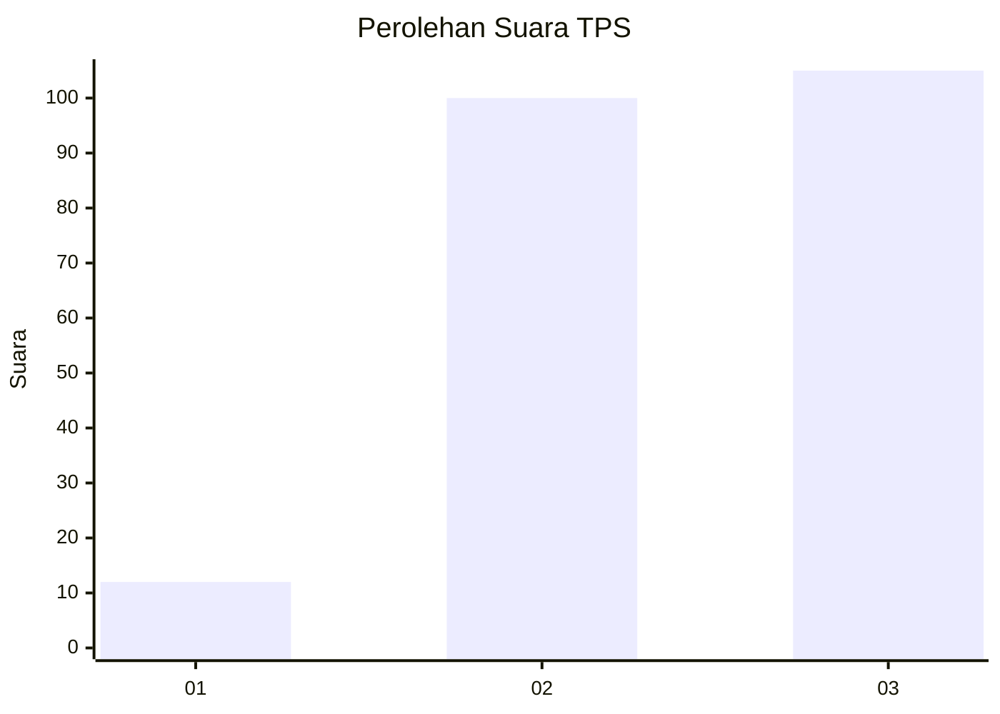
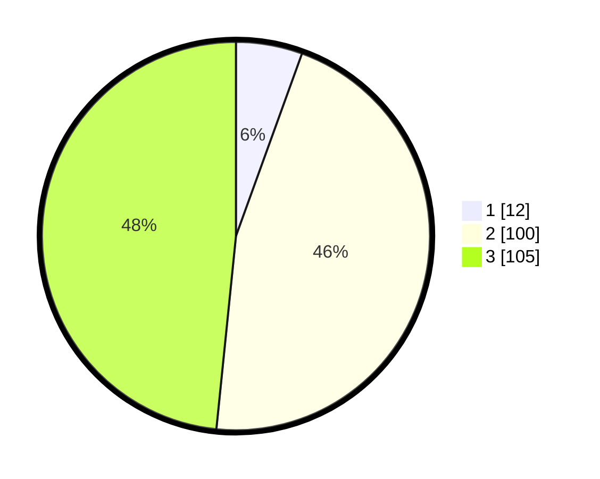

# Hasil

## Grafik

## Tabel

| No. | Nama Paslon    | Suara | Suara (raw) | Persentase |
|:--- |:-------------- | -----:| -----------:| ----------:|
| 1   | ANIES MUHAIMIN | 12    | [12][p-1]   | 5,53       |
| 2   | PRABOWO GIBRAN | 100   | [100][p-2]  | 46,08      |
| 3   | GANJAR MAHFUD  | 105   | [105][p-3]  | 48,39      |

[p-1]: https://github.com/gigit-pemilu/pemilu-2024/blob/main/pilpres/hitung-suara/sub/33-jawa-tengah/sub/02-banyumas/sub/22-baturraden/sub/2008-kemutug-kidul/sub/008-tps/sub/paslon-1.txt
[p-2]: https://github.com/gigit-pemilu/pemilu-2024/blob/main/pilpres/hitung-suara/sub/33-jawa-tengah/sub/02-banyumas/sub/22-baturraden/sub/2008-kemutug-kidul/sub/008-tps/sub/paslon-2.txt
[p-3]: https://github.com/gigit-pemilu/pemilu-2024/blob/main/pilpres/hitung-suara/sub/33-jawa-tengah/sub/02-banyumas/sub/22-baturraden/sub/2008-kemutug-kidul/sub/008-tps/sub/paslon-3.txt

## Foto C Plano

https://sirekap-obj-formc.kpu.go.id/24da/pemilu/ppwp/33/02/22/20/08/3302222008008-20240214-221110--10af1904-9206-42ae-8b85-1cc8e1385db8.jpg

https://sirekap-obj-formc.kpu.go.id/24da/pemilu/ppwp/33/02/22/20/08/3302222008008-20240214-221125--e24f10d6-301f-4e1e-adc3-16240114d28b.jpg

https://sirekap-obj-formc.kpu.go.id/24da/pemilu/ppwp/33/02/22/20/08/3302222008008-20240214-221202--7e8ddfb2-f6f6-49bc-b8e9-a5959a20ca36.jpg

## Metadata

| Key        | Value               |
| ---------- | ------------------- |
| Time Stamp | 2024-02-17 00:00:00 |

